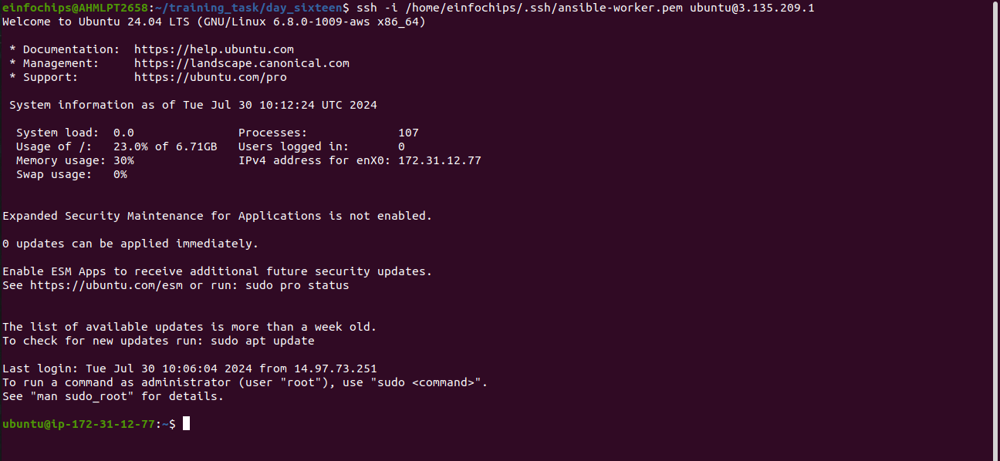
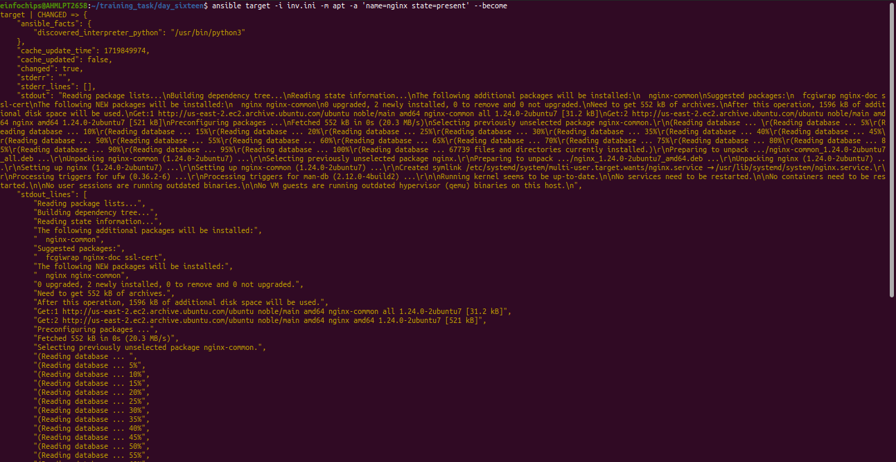
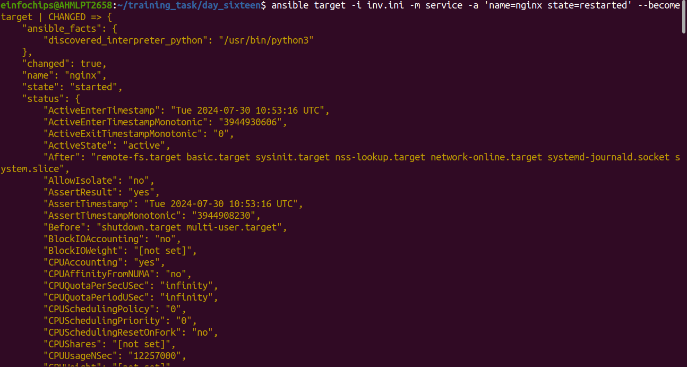
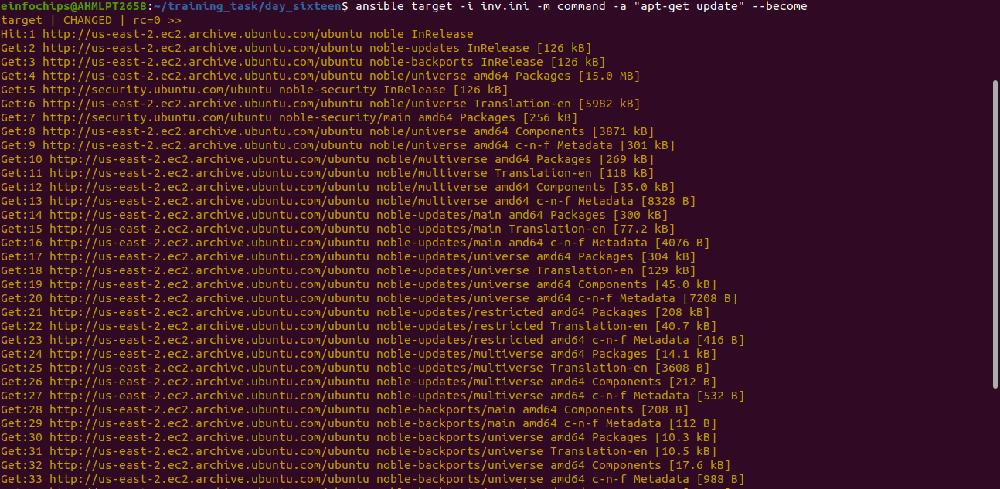
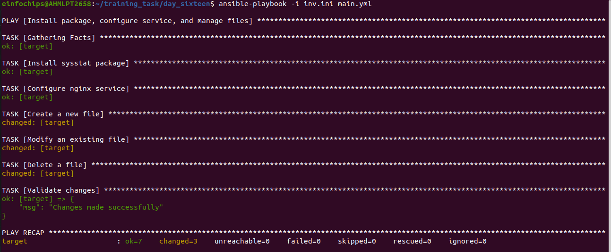
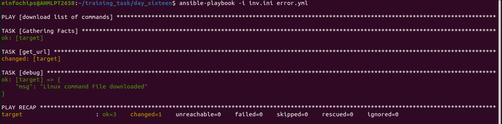

# Project 1 : Deploying Ansible

### Problem Statement: 

##### You are tasked with deploying Ansible in a multi-node environment consisting of multiple Linux servers. The goal is to set up Ansible on a control node and configure it to manage several managed nodes. This setup will be used for automating system administration tasks across the network.

### Deliverables:

1. Control Node Setup:

+ Install Ansible on the control node.

```sh
sudo apt update
```
```sh
sudo apt install ansible
```
```sh
ansible --version
```

## Output


<hr>

+ Configure SSH key-based authentication between the control node and managed nodes.

```sh
ssh -i /path/to/key/key.pem user@ip
```




2. Managed Nodes Configuration:

+ Ensure all managed nodes are properly configured to be controlled by Ansible.

+ Verify connectivity and proper setup between the control node and managed nodes.

```sh
ansible target -i inv.ini -m ping
```

+ this command is used to ping from master node to worker node to ensure that ansible is proper controlled and connectivity is verified

## Output


<hr>
<br>
<br>

# Project -2 : Ad-Hoc Ansible Commands

### Problem Statement: 

##### Your organization needs to perform frequent, one-off administrative tasks across a fleet of servers. These tasks include checking disk usage, restarting services, and updating packages. You are required to use Ansible ad-hoc commands to accomplish these tasks efficiently.


### Deliverables:
1. Task Execution:

+ Execute commands to check disk usage across all managed nodes.

```sh
ansible target -i inv.ini -m shell -a 'du -h'
```
+ where

    + -m is to define module "shell"
    
    + -a is append command to shell module wich is du -h "disk useage in human readble format"

    

+ Restart a specific service on all managed nodes.

   + first we will install nginx service using ad-hoc command

```sh
ansible target -i inv.ini -m apt -a 'name=nginx state=present' --become
```



+ now we will restart the service using below command :

```sh
ansible target -i inv.ini -m service -a 'name=nginx state=restarted' --become
```




+ Update all packages on a subset of managed nodes.

```sh
ansible target -i inv.ini -m command -a "apt-get update" --become
```




<hr>

# Project - 3 : Working with Ansible Inventories


### Problem Statement:

##### You need to manage a dynamic and diverse set of servers, which requires an organized and flexible inventory system. The project involves creating static and dynamic inventories in Ansible to categorize servers based on different attributes such as environment (development, staging, production) and roles (web servers, database servers).


### Deliverables:

1. Static Inventory:

+ Create a static inventory file with different groups for various environments and roles.

```ini
[web]
target ansible_host=3.135.2XX.X ansible_user=ubuntu ansible_ssh_private_key_file=/home/einfochips/.ssh/ansible-worker.pem

[dbserver]
web-node ansible_host=18.216.1XX.2XX ansible_user=ubuntu ansible_ssh_private_key_file=/home/einfochips/Downloads/ansible-worker.pem

[appserver]
app-node ansible_host=3.149.2X.2XX ansible_user=ubuntu ansible_ssh_private_key_file=/home/einfochips/Downloads/ansible-worker.pem
```

+ Verify that the inventory is correctly structured and accessible by Ansible.

+ to check the inventory is correctly structured we have already used the ping command in ad-hoc

```sh
ansible target -i inv.ini -m ping
```


2. Dynamic Inventory:

+ Implement a dynamic inventory script or use a dynamic inventory plugin.

+ Configure the dynamic inventory to categorize servers automatically based on predefined criteria.

[Learning of this is pending becuase sir will teach this by tommorrow]

# Project - 4: Ansible Playbooks: The Basics

### Problem Statement:

##### Your team needs to automate repetitive tasks such as installing packages, configuring services, and managing files on multiple servers. The project involves writing basic Ansible playbooks to automate these tasks, ensuring consistency and efficiency in the operations  


### Deliverables:
1. Playbook Creation:

+ Write a playbook to install a specific package on all managed nodes.

+ Create a playbook to configure a service with specific parameters.

+ Develop a playbook to manage files, such as creating, deleting, and modifying files   on managed nodes.

```yml
---
- name: Install package, configure service, and manage files
  hosts: web
  become: yes

  tasks:
  - name: Install sysstat package
    apt:
      name: sysstat
      state: latest

  - name: Configure nginx service
    service:
      name: nginx
      state: started
      enabled: yes

  - name: Create a new file
    file:
      path: /tmp/newfile.txt
      state: touch

  - name: Modify an existing file
    lineinfile:
      path: /tmp/newfile.txt
      line: "Welcome to our server"

  - name: Delete a file
    file:
      path: /tmp/newfile.txt
      state: absent

  - name: Validate changes
    debug:
      msg: "Changes made successfully"
```

2. Testing and Verification:

+ Test the playbooks to ensure they run successfully and perform the intended tasks.

+ Validate the changes made by the playbooks on the managed nodes.


## Output:




# Project 5: Ansible Playbooks - Error Handling

### Problem Statement:

##### In a complex IT environment, tasks automated by Ansible playbooks may encounter errors due to various reasons such as incorrect configurations, unavailable resources, or network issues. The project focuses on implementing error handling in Ansible playbooks to ensure resilience and proper reporting of issues.

### Deliverables:
1. Playbook with Error Handling:

+ Write a playbook that includes tasks likely to fail, such as starting a non-existent service or accessing a non-existent file.

+ Implement error handling strategies using modules like block, rescue, and always.

```yml
- name: download list of commands
  hosts: web
  become: yes
  tasks:
  - name: run error handling
    block:
    - get_url:
        url: https://iitd-plos.github.io/col100/references/Linuxppt.pdf
        dest: /home/
    - debug: msg="Linux command File downloaded"
    rescue:
    - debug: msg="linux command appears to be down."
    - get_url:
        url: https://www.loggly.com/wp-content/uploads/2015/05/Linux-Cheat-Sheet-Sponsored-By-Loggly.pdf
        dest: /home/
```

+ Here we can se the rescue gets run in this playbook which shows the error handling process

## Output 




2. Logging and Notifications:

+ Configure the playbook to log errors and notify administrators of any issues encountered during execution.

+ Use Ansible modules to send notifications via email or other communication channels.


[Sir will teach this tommorrow]