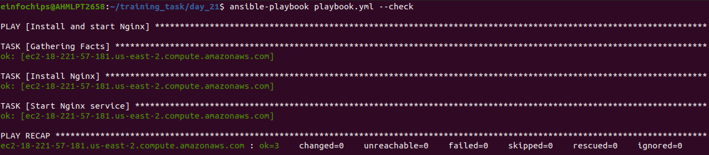

# Project 

1. ***Inventory Plugins***
    
    + Activity: Configure a dynamic inventory plugin to manage a growing number of web servers dynamically. Integrate the plugin with Ansible to automatically detect and configure servers in various environments.
    
    + Deliverable: Dynamic inventory configuration file or script, demonstrating the ability to automatically update the inventory based on real-time server data.

```yml
plugin: aws_ec2
regions:
- us-east-2
filters:
  instance-state-name:
  - running
hostnames:
- dns-name
compose:
  ansible_host: public_dns_name
```


2. Performance Tuning

    + Activity: Tune Ansible performance by adjusting settings such as parallel execution (forks), optimizing playbook tasks, and reducing playbook run time.

    + Deliverable: Optimized ansible.cfg configuration file, performance benchmarks, and documentation detailing changes made for performance improvement.

```ini
[defaults]
forks = 50

[ssh_connection]
ssh_args = -o ControlMaster=auto -o ControlPersist=60s
pipelining = True
```

+ Reduce the number of SSH operations required by enabling pipelining.

+ Increase the forks

+ Reduce SSH connection overhead by using ControlPersist for SSH connections.

3. Debugging and Troubleshooting Playbooks
    
    + Activity: Implement debugging strategies to identify and resolve issues in playbooks, including setting up verbose output and advanced error handling.
    
    + Deliverable: Debugged playbooks with enhanced error handling and logging, including a troubleshooting guide with common issues and solutions.

    + Let first create a simple playbook to run on instance

```yml
- name: Install and start Nginx
  hosts: all
  become: yes
  tasks:
  - name: Install Nginx
    apt:
      name: nginx
      state: present

  - name: Start Nginx service
    service:
      name: nginx
      state: started
      enabled: yes
```
+ Then we will run below command :

```sh
ansible-playbook playbook.yml -v
```
+ Verbose Mode
    
    + Increase the verbosity of playbook runs to get more detailed output.
    + Use the -v, -vv, -vvv, or -vvvv flags.


+ Check Mode (--check)
    
    + Perform a dry run of your playbook to see what changes would be made without actually applying them.
    
    + Useful for verifying what actions will be taken.

```sh
ansible-playbook playbook.yml --check
```



4. Exploring Advanced Modules

    + Activity: Use advanced Ansible modules such as docker_container to manage containerized applications and aws_ec2 for AWS infrastructure management, demonstrating their integration and usage.
    
    + Deliverable: Playbooks showcasing the deployment and management of Docker containers and AWS EC2 instances, along with documentation on the benefits and configurations of these advanced modules.

+ From Advance Modules in ansible we are using docker module to create a container which is defined as below:

```yml
- name: Ensure nginx container is running
  docker_container:
    name: my_nginx
    image: nginx:latest
    state: started
    ports:
      - "8080:80"
    volumes:
      - /my/local/path:/usr/share/nginx/html
```
<br>


<br>


