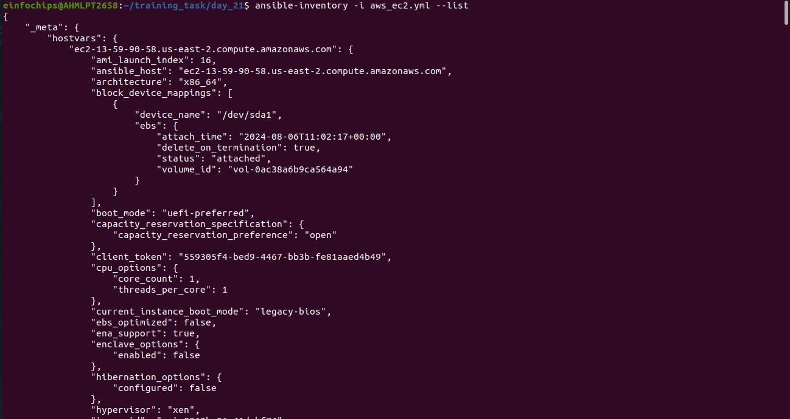

# Project Overview

#### In this capstone project, you will create a comprehensive automated deployment pipeline for a web application on an AWS EC2 instance running Ubuntu using Ansible. You will follow best practices for playbooks and roles, implement version control, document and maintain your code, break down tasks into roles, write reusable and maintainable code, and use dynamic inventory scripts. This project will culminate in a fully functional deployment, demonstrating your mastery of Ansible for infrastructure automation.

## Project Objectives


+ Set up an AWS EC2 instance as a worker node.

+ Implement Ansible playbooks and roles following best practices.

+ Use version control to manage Ansible codebase.

+ Document Ansible roles and playbooks.

+ Break down deployment tasks into reusable roles.

+ Write reusable and maintainable Ansible code.

+ Use dynamic inventory scripts to manage AWS EC2 instances.

+ Deploy a web application on the EC2 instance.

### Project Components and Milestones

+ EC2 Instances given will have a tag of Role: webserver and Name: <Participants Name> so you will be able to ping each other VMs.

### Milestone 1: Environment Setup
***Objective:*** Configure your development environment and AWS infrastructure.

***Tasks:***

+ Launch an AWS EC2 instance running Ubuntu.

+ Install Ansible and Git on your local machine or control node.

+ Step to install ansible

```sh
sudo apt-get install python3
```

```sh
python3 install pip
```

```sh
pip install ansible-core
```

```sh
ansible --version
```

+ Step to install Git

```sh
sudo apt install git
```

```sh
git --version
```


***Deliverables:***

+ AWS EC2 instance running Ubuntu.

<br>

<br>


<br>

+ Local or remote control node with Ansible and Git installed.

<br>

<br>

<br>

### Milestone 2: Create Ansible Role Structure

***Objective:*** Organize your Ansible project using best practices for playbooks and roles.

***Tasks:***

+ Use Ansible Galaxy to create roles for web-server, database, and application deployment.

+ Define the directory structure and initialize each role.

+ To create roles use below command

```sh
ansible-galaxy init roles/web-server
ansible-galaxy init roles/database
ansible-galaxy init roles/application
```

***Deliverables:***

+ Ansible role directories for webserver, database, and application.


### Milestone 3: Version Control with Git

***Objective:*** Implement version control for your Ansible project.

***Tasks:***

+ Initialize a Git repository in your project directory.

+ Commit and push initial codebase to a remote repository.

```sh
git init
```
```sh
git add .
```
```sh
git commit -m "initial codebase"
```
+ Create a .gitignore file to exclude unnecessary files.

```.gitignore
node_modules/
./vars/main.yml
```
***Deliverables:***

+ Git repository with initial Ansible codebase.

+ Remote repository link (e.g., GitHub).

### Milestone 4: Develop Ansible Roles

***Objective:*** Write Ansible roles for web server, database, and application deployment.

***Tasks:***

+ Define tasks, handlers, files, templates, and variables within each role.

+ Ensure each role is modular and reusable.

***Deliverables:***

+ Completed Ansible roles for webserver, database, and application.


### First for Frontend role

+ first in the file folder 

```html
<html>
    <head>
        <title>Task_twenty</title>
    </head>
    <body>
        <center>
            <h1>Hello from frontend</h1>
        </center>
    </body>
</html>

```

+  then in the tasks/main.yml


```yml
---
- name: Installing Nginx
  apt:
    name: nginx
    state: present
    update_cache: yes

- name: Start Nginx
  systemd:
    name: nginx
    state: started
    enabled: yes
- name: Configure Nginx

  template:
    src: index.html.j2
    dest: /var/www/html/index.html
  notify: Restart Nginx

- name: Nginx is running or not
  service:
    name: nginx
    state: started
    enabled: yes

```

+ Then in handler/main.yml

```yml

---
- name: Restart Nginx
  systemd:
    name: nginx
    state: restarted

```

+ Then for the templates/index.html.j2

```index.html.j2
<html>
    <head>
        <title>Day-Nineteen</title>
    </head>
    <body>
        <center>
            <h1>Hello from Frontend</h1>
        </center>
    </body>
</html>
```


### For the database(Mysql)

+ In tasks/main.yml

```yml
---
- name: Installing Mysql
  package:
      name: "{{item}}"
      state: present
      update_cache: yes
  loop:
    - mysql-server
    - mysql-client
    - python3-mysqldb
    - libmysqlclient-dev
    
- name: Enabling MySQL service
  service:
      name: mysql
      state: started
      enabled: yes

- name: Setting up user-password
  mysql_user:
    name: root
    password: "{{root_password}}"
    login_unix_socket: /var/run/mysqld/mysqld.sock
    host: localhost
    login_user: root
    login_password: ''
    state: present

- name: Creating admin user (remote access)
  mysql_user:
    name: "{{admin_user}}"
    password: "{{admin_password}}"
    priv: '*.*:ALL'
    host: '%'
    append_privs: yes
    login_user: root
    login_password: "{{root_password}}"
    state: present

- name: Creating Database 
  mysql_db:
    name: "{{db_name}}"
    state: present
    login_user: root
    login_password: "{{root_password}}"

- name: Enabling remote login to mysql
  lineinfile:
    path: /etc/mysql/mysql.conf.d/mysqld.cnf
    regex: '^bind-address\s*=\s*127.0.0.1'
    line: 'bind-address = 0.0.0.0'
    backup: yes
  notify:
    - Restart mysql

- name: Execute MySQL secure installation
  expect:
    command: mysql_secure_installation
    responses:
      'Enter password for user root:': "{{ root_password }}"
      'Press y\|Y for Yes, any other key for No': 'Y'
      'Please enter 0 = LOW, 1 = MEDIUM and 2 = STRONG': "{{ password_validation_policy }}"
      'Change the password for root \? \(\(Press y\|Y for Yes, any other key for No\)': 'n'
      'Remove anonymous users\? \(Press y\|Y for Yes, any other key for No\)': 'Y'
      'Disallow root login remotely\? \(Press y\|Y for Yes, any other key for No\)': 'Y'
      'Remove test database and access to it\? \(Press y\|Y for Yes, any other key for No\)': 'Y'
      'Reload privilege tables now\? \(Press y\|Y for Yes, any other key for No\)': 'Y'
  environment:
    MYSQL_PWD: "{{ root_password }}"

```

+ then in vars/main.yml for passing credentials we will modify with our requiremetns


### For the Backend (nodejs)

+ In tasks/main.yml

```yml
- name: Installing Ca-certificates
  apt:
    name: ca-certificates
    state: present
    update_cache: yes

- name: Downloading GPG key
  shell: |
    curl -o /tmp/nodesource.gpg.key https://deb.nodesource.com/gpgkey/nodesource.gpg.key
  args:
    warn: false

- name: Adding GPG key
  apt_key:
    file: "/tmp/nodesource.gpg.key"
    state: present

- name: Installing Node.js LTS repository
  apt_repository:
    repo: "deb https://deb.nodesource.com/node_{{ NODEJS_VERSION }}.x {{ ansible_distribution_release }} main"
    state: present
    update_cache: yes

- name: Install Node.js and npm
  apt:
    name:
    - nodejs
    state: present
```

+ In vars/main.yml

```yml
---
NODEJS_VERSION: "16"
ansible_distribution_release: "focal"
```


### Milestone 5: Dynamic Inventory Script

***Objective:*** Use dynamic inventory scripts to manage AWS EC2 instances.

***Tasks:***

+ Write a Python script that queries AWS to get the list of EC2 instances.

+ Format the output as an Ansible inventory.

***Deliverables:***

+ Dynamic inventory script to fetch EC2 instance details.


```py
#!/usr/bin/env python3

import json
import boto3

def get_inventory():
    ec2 = boto3.client('ec2', region_name='ap-south-1')
    response = ec2.describe_instances(Filters=[{'Name': 'tag:Role', 'Values': ['webserver']}, {'Name': 'tag:Name', 'Values': ['Yaksh']}])

    inventory = {
        'all': {
            'hosts': [],
            'vars': {}
        },
        '_meta': {
            'hostvars': {}
        }
    }

    ssh_key_file = '~/.ssh/My_key.pem'
    user = 'ubuntu'

    for reservation in response['Reservations']:
        for instance in reservation['Instances']:
            public_dns = instance.get('PublicDnsName', instance['InstanceId'])
            inventory['all']['hosts'].append(public_dns)
            inventory['_meta']['hostvars'][public_dns] = {
                'ansible_host': instance.get('PublicIpAddress', instance['InstanceId']),
                'ansible_user': user,
                'ansible_ssh_private_key_file': ssh_key_file
            }

    return inventory

if __name__ == '__main__':
    print(json.dumps(get_inventory(), indent=2))
```


### Milestone 6: Playbook Development and Deployment
***Objective:*** Create and execute an Ansible playbook to deploy the web application.

***Tasks:***

+ Develop a master playbook that includes all roles.

+ Define inventory and variable files for different environments.

+ Execute the playbook to deploy the web application on the EC2 instance.

***Deliverables:***

+ Ansible playbook for web application deployment.

+ Successfully deployed web application on the EC2 instance.


<br>


<br>


<br>
