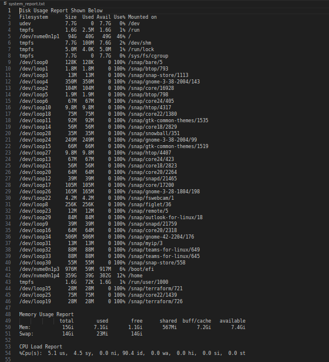
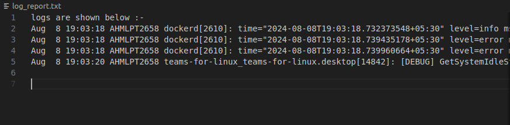
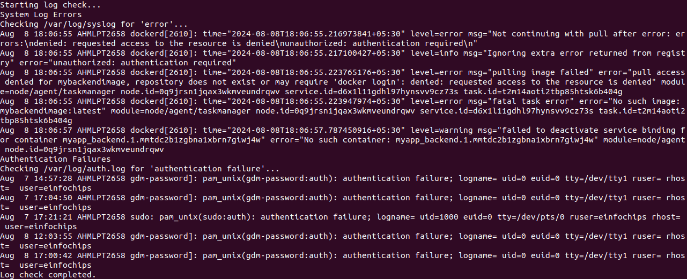
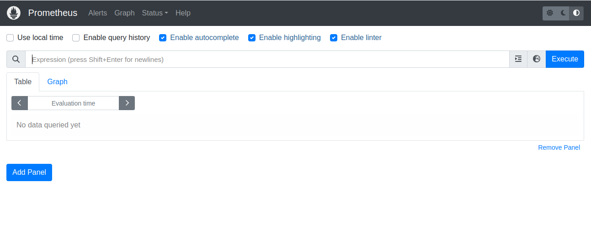
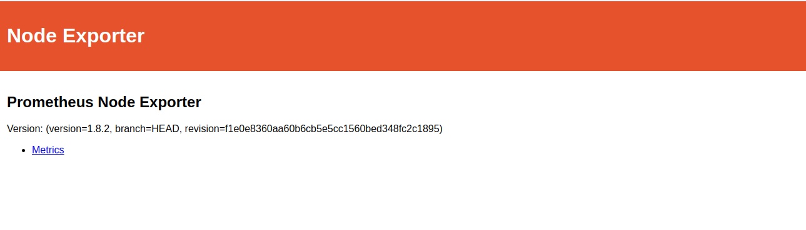
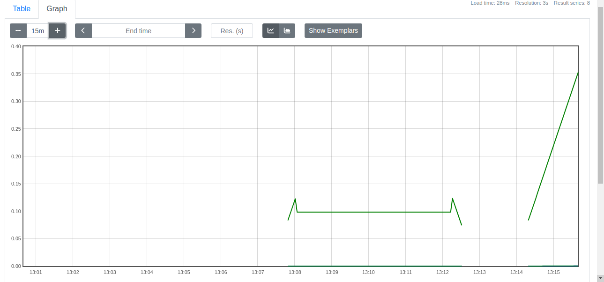
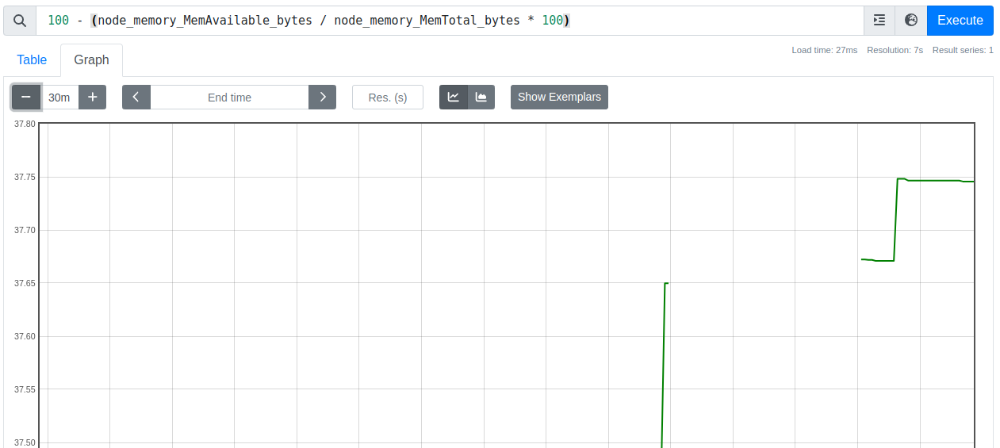

# Project :

### Project Overview:
+ The goal of this capstone project is to combine shell scripting with system monitoring and log management practices. You will create a set of automated tools using shell scripts to manage logs, monitor system performance using Prometheus and Node Exporter, and generate insights using PromQL queries. The project will require a systematic approach, covering scripting fundamentals, log management, and monitoring setup.

### Project Deliverables:
1. Shell Scripts for Basic Operations:
    + Task: Write shell scripts to perform basic system operations, such as checking disk usage, memory usage, and CPU load.

    + Deliverable:

        + A collection of scripts that output system performance metrics.

        + Scripts should include error handling and logging.

```sh
#!/bin/bash

# Define the output file 
OUTPUT_FILE="system_report.txt"

# Functions Of disk_usage , Check Memory and check CPU load

check_disk_usage() {
    echo "Disk Usage Report Shown Below :-"
    df -h
    echo
}

check_memory_usage() {
    echo "Memory Usage Report :- "    
    free -h
    echo
}

check_cpu_load() {
    echo "CPU Load Report :-"
    top -bn1 | grep "Cpu(s)"
    echo
}

# Write the results to the output file if specified

if [ -n "$OUTPUT_FILE" ]; then
    {
        check_disk_usage
        check_memory_usage
        check_cpu_load
    } > "$OUTPUT_FILE"  
    echo "Report saved to $OUTPUT_FILE"

fi
```

## Output :


<br>

2. Log Management Script:

    + Task: Develop a script to automate log management tasks such as log rotation and archiving. This script should include the ability to compress old logs and delete logs older than a specified number of days.

    + Deliverable:
        
        + A shell script that performs log rotation based on predefined conditions (e.g., log size, log age).
        + A report generated by the script detailing which logs were rotated, compressed, or deleted.

```sh
#!/bin/bash

# Define the output file 

OUTPUT_FILE="log_report.txt"

# Functions Of disk_usage , Check Memory and check CPU load
check_log() {
    echo "logs are shown below :-"
    cat /var/log/syslog | tail -n 4
    echo
}

# Write the results to the output file if specified
if [ -n "$OUTPUT_FILE" ]; then
    {
        check_log
    } > "$OUTPUT_FILE" 

    echo "Report saved to $OUTPUT_FILE"
fi

```
## Output



3. Advanced Shell Scripting - Loops, Conditions, Functions, and Error Handling:

    + Task: Refactor the previous scripts to include loops, conditionals, and functions for modularity. Implement error handling to manage potential issues during script execution.
    
    + Deliverable:
        
        + Modular shell scripts that use functions for repeatable tasks.
        
        + Error-handling mechanisms in place for scenarios like missing files, insufficient permissions, etc.
        
        + Logs that track script execution and any errors encountered.

```sh
#!/bin/bash

# Define the output file 

OUTPUT_FILE="log_report.txt"

# Functions Of disk_usage , Check Memory and check CPU load
check_log() {
    echo "logs are shown below :-"
    cat /var/log/syslog | tail -n 4
    echo
}

# Write the results to the output file if specified
if [ -n "$OUTPUT_FILE" ]; then
    {
        check_log
    } > "$OUTPUT_FILE" 

    echo "Report saved to $OUTPUT_FILE"
fi
```

+ As We have used all factor which was mentioned to this task in previous task itself so it will remain same in this.

4. Log Checking and Troubleshooting:

    + Task: Write a script that reads through system and application logs, identifies common issues (e.g., out of memory, failed service starts), and provides troubleshooting steps based on log analysis.

    + Deliverable:
        
        + A script that parses logs for errors or warnings and outputs possible root causes.
        + Documentation on the types of logs checked and the issues identified.        
        + A troubleshooting guide based on common errors found in the logs.

```sh
#!/bin/bash

SYSLOG_FILE="/var/log/syslog"
AUTH_LOG_FILE="/var/log/auth.log"

check_logs() {
    local file=$1
    local keyword=$2
    echo "Checking $file for '$keyword'..."
    grep "$keyword" "$file" | tail -n 5
}

echo "Starting log check..."
echo "System Log Errors "
check_logs $SYSLOG_FILE "error"

echo "Authentication Failures "
check_logs $AUTH_LOG_FILE "authentication failure"

echo "Log check completed."
```

## Output




5. Installation and Setup of Prometheus and Node Exporter:
    
    + Task: Install and configure Prometheus and Node Exporter on the system. Ensure that Node Exporter is properly configured to collect system metrics.
    
    + Deliverable:
        
        + A documented installation and configuration process for Prometheus and Node Exporter.
        
        + A running instance of Prometheus scraping metrics from Node Exporter.

### Steps to install Prometheus

+ First download the zip file from

```sh
wget https://github.com/prometheus/prometheus/releases/download/v2.53.1/prometheus-2.53.1.linux-amd64.tar.gz
```


+ then to unzip it run

```sh
tar -xvf prometheus-2.53.1.linux-amd64.tar.gz
```

+ Then change directory

```sh
cd prometheus-2.53.1.linux-amd64/
```

+ And try to run Prometheus

```sh
./prometheus 
```

## Output




### Steps to install Node-Exporter

+ First Download the Zip

```sh
wget https://github.com/prometheus/node_exporter/releases/download/v1.8.2/node_exporter-1.8.2.linux-amd64.tar.gz
```

+ Unzip the file using:

```sh
tar -xvf node_exporter-1.8.2.linux-amd64.tar.gz
```

+ Change the directory path

```sh
cd node_exporter-1.8.2.linux-amd64/
```

+ And try to run

```sh
./node_exporter 
```

## Output



6. Prometheus Query Language (PromQL) Basic Queries:
    
    + Task: Create a series of PromQL queries to monitor system performance, such as CPU usage, memory usage, and disk I/O.
    
    + Deliverable:
        
        + A set of PromQL queries that can be used to monitor key system metrics.
        
        + A dashboard setup guide or configuration that visualizes these metrics in Prometheus or Grafana.


+ add a sample node_exporter job

```yml
  # sample node_exporter job
  - job_name: "node"
    static_configs:
      - targets: ["localhost:9100"]
```

+ The Run the query

## Output

```
rate(node_cpu_seconds_total[5m])
```




```
100 - (node_memory_MemAvailable_bytes / node_memory_MemTotal_bytes * 100)
```



