# Project 

## Project Breakdown

***1. Configuring Jobs and Targets***

### Task: 

+ Set up a Prometheus server to monitor multiple services running on different nodes.

### Deliverables:

+ Configure Prometheus with jobs for monitoring different services like web servers, databases, and system metrics.

+ Define static and dynamic targets using file-based and service discovery methods (e.g., Consul or Kubernetes).

+ Config this within your Prometheus.yml

```yml
global:
  scrape_interval: 10s

scrape_configs:
  - job_name: 'node'
    static_configs:
      - targets: ['localhost:9100']
  - job_name: 'webserver'
    static_configs:
      - targets: ['localhost:8080']
  - job_name: 'database'
    static_configs:
      - targets: ['localhost:5432']
```


## Output

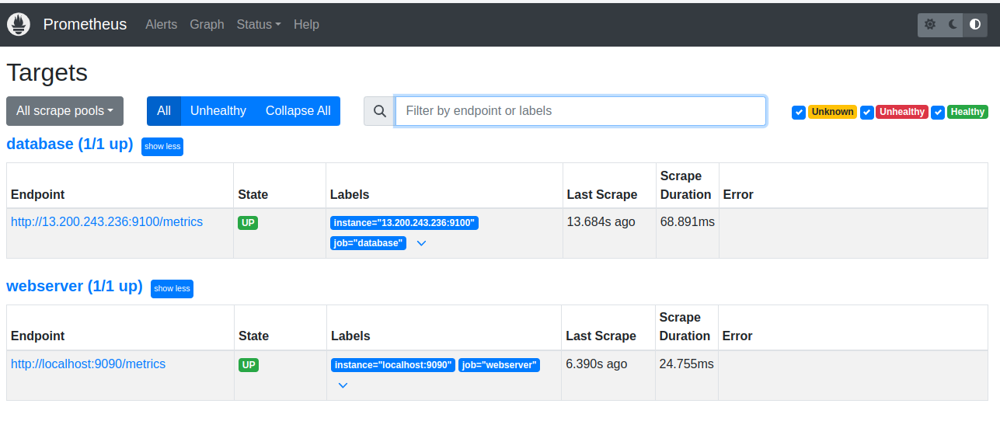

<br>
<hr>

***2. Using Exporters (Node Exporter)***

### Task: 

+ Use Node Exporter to monitor system-level metrics like CPU, memory, disk usage, and network statistics.

### Deliverables:

+ Install and configure Node Exporter on all nodes.

+ Ensure Node Exporter metrics are being correctly scraped by Prometheus.


### Steps to install Node-Exporter

+ First Download the Zip

```sh
wget https://github.com/prometheus/node_exporter/releases/download/v1.8.2/node_exporter-1.8.2.linux-amd64.tar.gz
```

+ Unzip the file using:

```sh
tar -xvf node_exporter-1.8.2.linux-amd64.tar.gz
```

+ Change the directory path

```sh
cd node_exporter-1.8.2.linux-amd64/
```

+ And try to run

```sh
./node_exporter 
```


## Output

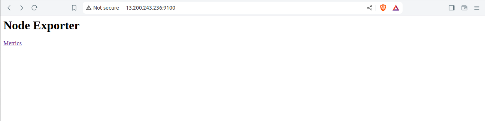

<br>
<hr>


***3. Hands-on Exercise: Setting Up Exporters***

### Task: 

+ Configure at least two different types of exporters (e.g., Node Exporter and MySQL Exporter) and integrate them with Prometheus.

### Deliverables:

+ Demonstrate successful data collection from both exporters.

+ Create a basic Prometheus dashboard to visualize key metrics from these exporters.

+ (optional)

```yml
  - job_name: 'consul_services'
    consul_sd_configs:
    - server: 'localhost:8500'
      services: ['web', 'database']
```

***4. Introduction to PromQL***

### Task: 

+ Learn and implement basic PromQL queries to extract meaningful data from the metrics collected.

### Deliverables:

+ Write basic queries to retrieve metrics like average CPU usage, memory consumption, and disk I/O over time.


+ Average CPU usage

```sql
avg(rate(node_cpu_seconds_total{mode="user"}[5m])) by (instance)
```

## Output

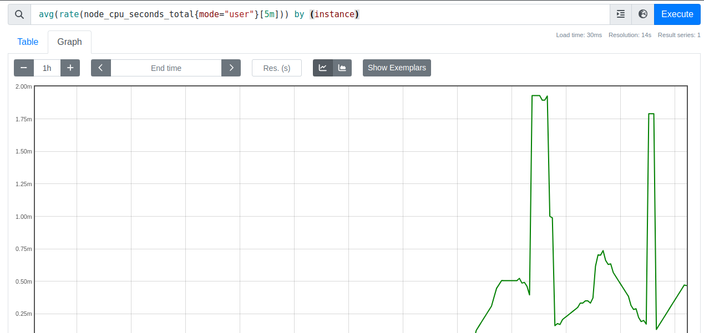

<br>
<hr>

+ Memory Consumption

```sql
node_memory_MemTotal_bytes - node_memory_MemFree_bytes
```

## Output

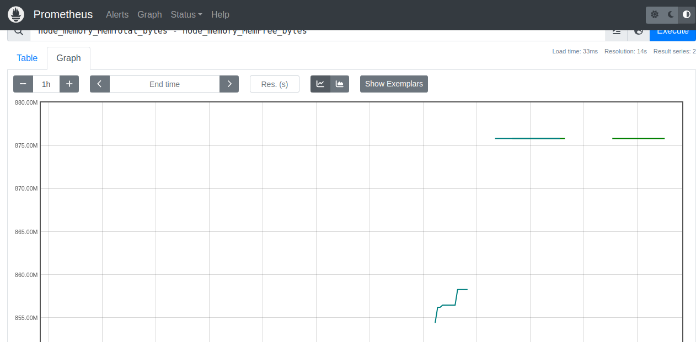

<br>
<hr>

+ Disk I/O usage

```sql
avg(rate(node_disk_written_bytes_total[5m])) by (instance)
```
## Output

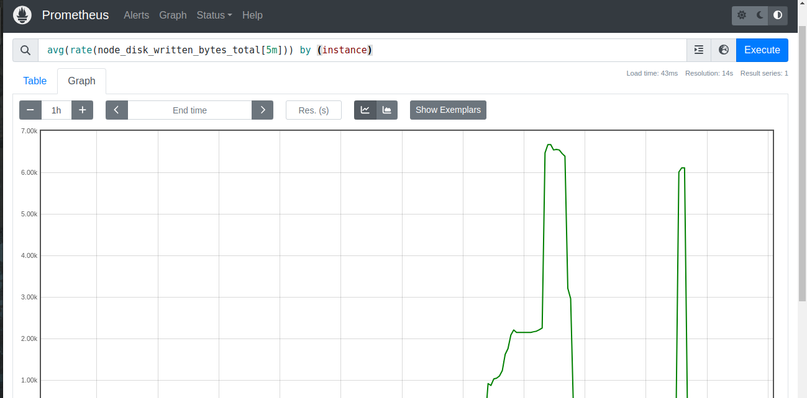

<br>

<hr>

***5. Basic Queries (Selectors, Functions, Operators)***

### Task: 

+ Create PromQL queries using selectors, functions, and operators to filter and manipulate time-series data.

### Deliverables:

+ Write PromQL queries to calculate the 95th percentile of CPU usage.

+ Use functions like rate(), increase(), and histogram_quantile() to perform more complex analysis.

+ for Rate function

```sql
rate(node_cpu_seconds_total[5m])
```
## Output

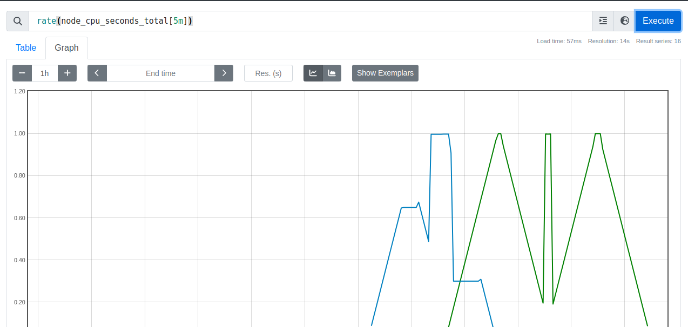

<br>
<hr>


+ For increase()

```sql
increase(node_cpu_seconds_total[1h])
```

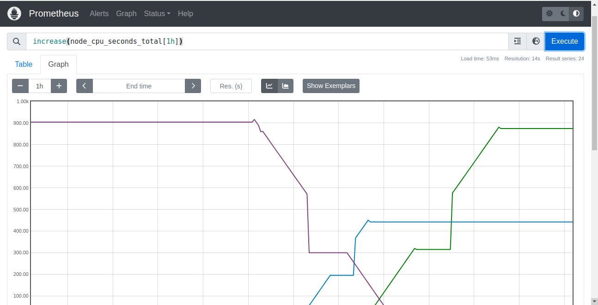

<br>
<hr>

***6. Advanced Queries and Aggregations***

### Task: 

+ Perform advanced data aggregation using PromQL.

### Deliverables:

+ Write queries to calculate the total memory usage across all nodes.

+ Aggregate data to find the maximum disk space usage among all nodes.


**Graph of total memory usage across all nodes**

```sql
sum(node_memory_MemTotal_bytes - node_memory_MemFree_bytes)
```

## Output

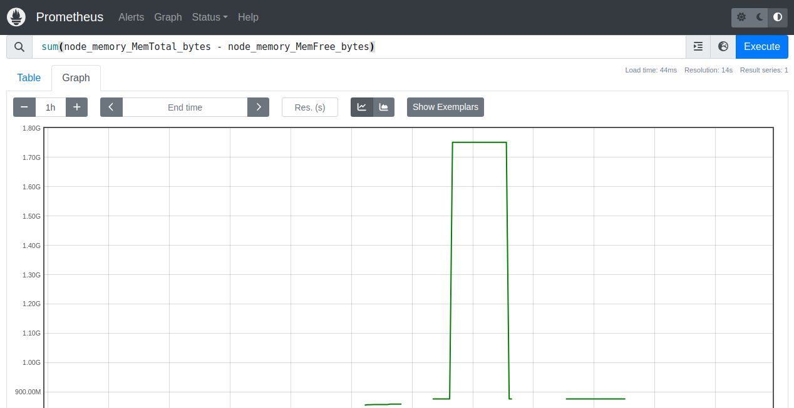
<br>
<hr>

**Graph of maximum disk space usage among all nodes**

```sql
max(node_filesystem_size_bytes - node_filesystem_free_bytes)
```


## Output

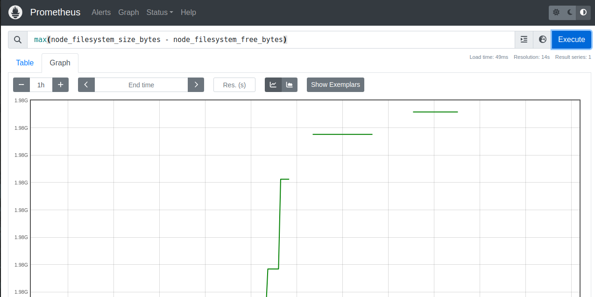
<br>
<hr>

***7. Configuring Alertmanager***

### Task: 

+ Set up Alertmanager to handle alerts generated by Prometheus.

### Deliverables:

+ Configure Alertmanager with Prometheus.
+ Create routing rules to manage alert notifications based on severity and service type.


+ First installation of an alertmanager will

+ installing the alertmanager

```sh
wget https://github.com/prometheus/alertmanager/releases/download/v0.27.0/alertmanager-0.27.0.linux-amd64.tar.gz
```

+ unzip the files

```sh
tar -xvf alertmanager-0.27.0.linux-amd64.tar.gz 
cd alertmanager-0.27.0.linux-amd64/
```

```sh
./alertmanager
```

## Output

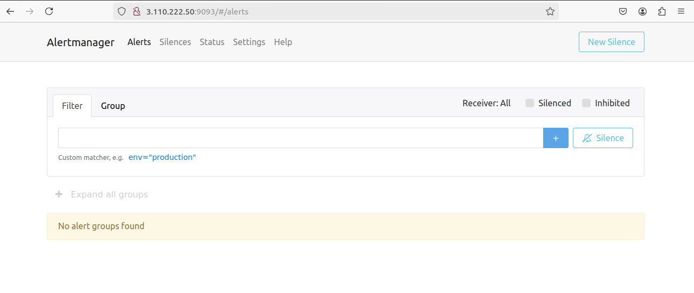

<br>
<hr>

***8. Writing Alerting Rules***

### Task: 

+ Write custom alerting rules in Prometheus to trigger alerts based on specific conditions.

### Deliverables:

+ Create alerting rules for high CPU usage, memory leaks, and disk space running low.

+ Ensure alerts are correctly generated and sent to Alertmanager.


```yml
# Alertmanager configuration
alerting:
  alertmanagers:
    - static_configs:
        - targets:
          - localhost:9093

# Load rules once and periodically evaluate them according to the global 'evaluation_interval'.
rule_files:
  # - "first_rules.yml"
  # - "second_rules.yml"
  - "alert_rule.yml"
 
```


***9. Setting Up Notification Channels (Email, Slack, etc.)***

### Task: 

+ Integrate Alertmanager with multiple notification channels like Email and Slack.

### Deliverables:

+ Set up Email notifications for critical alerts.

+ Integrate Slack for real-time alerts and notifications.

+ Rules for alertmanger.yml

```yml
route:
  receiver: admin

receivers:
- name: admin
  slack_configs:
  - channel: "#test"
    api_url: "<api-url-link>"
```

## Output 

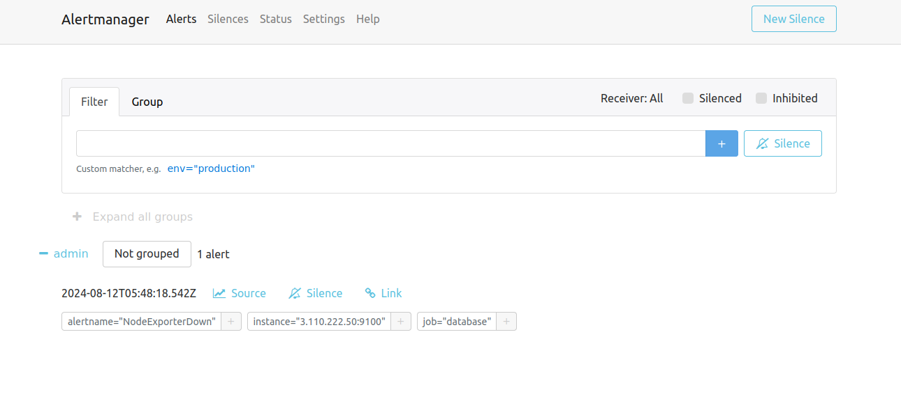

<br>
<hr>

***10. Hands-on Exercise: Creating Alerts***

### Task: 

+ Test the entire alerting pipeline by creating and triggering custom alerts.

### Deliverables:

+ Simulate a scenario where a node exceeds 90% CPU usage and ensure alerts are triggered and sent to both Email and Slack.

+ Validate the alerts in both notification channels.


```yml
groups:
- name: example
  rules:
    - record: job:node_cpu_seconds:avg_idle
      expr: avg without(cpu)(rate(node_cpu_seconds_total{mode="idle"}[5m]))

    - alert: NodeExporterDown
      expr: up{job="node"} == 0 
```

## Output

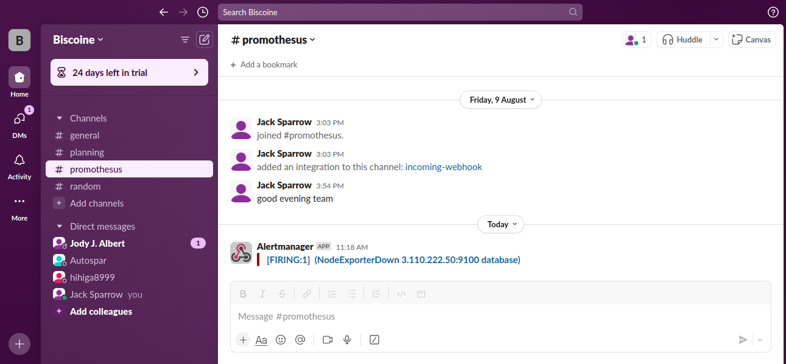
<br>