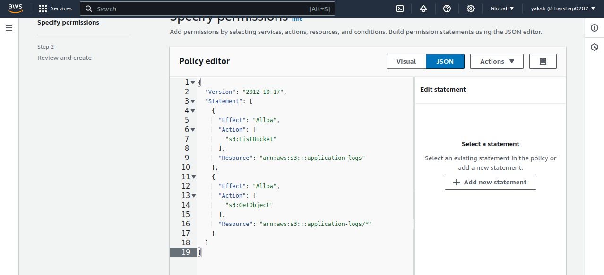
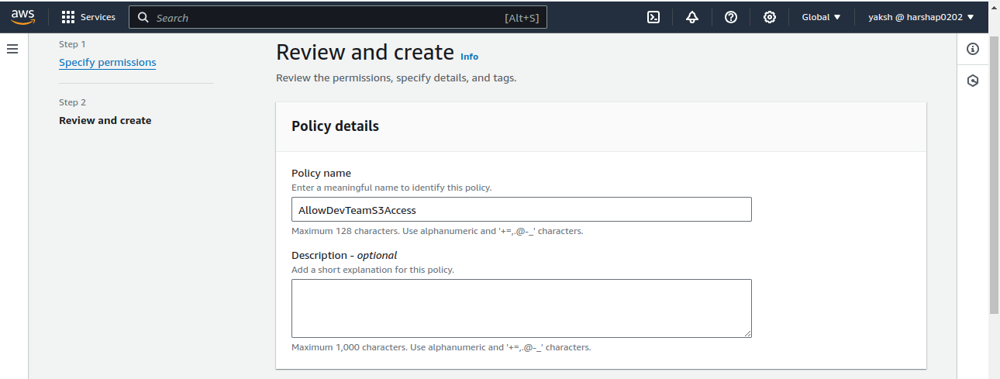
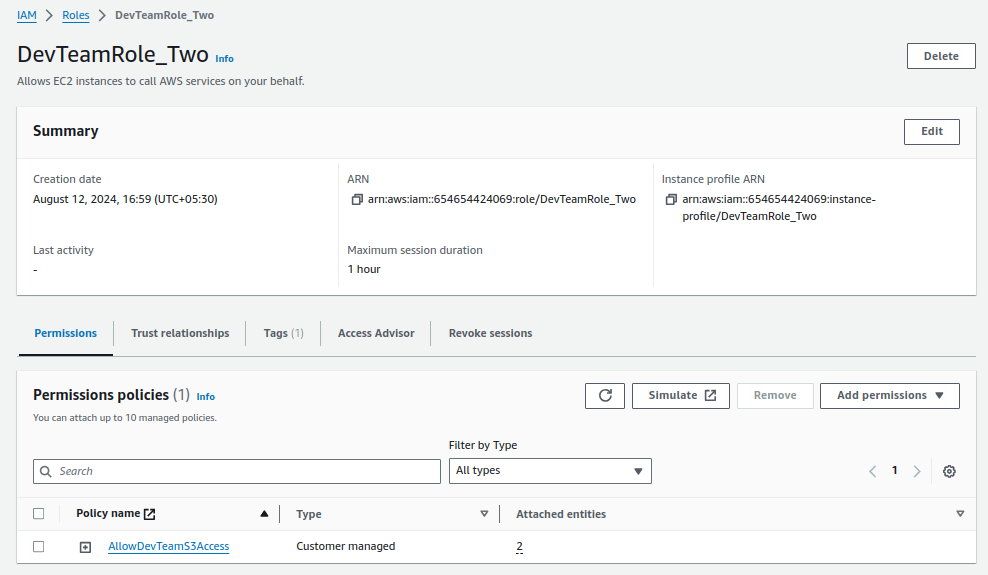
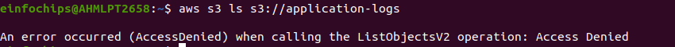
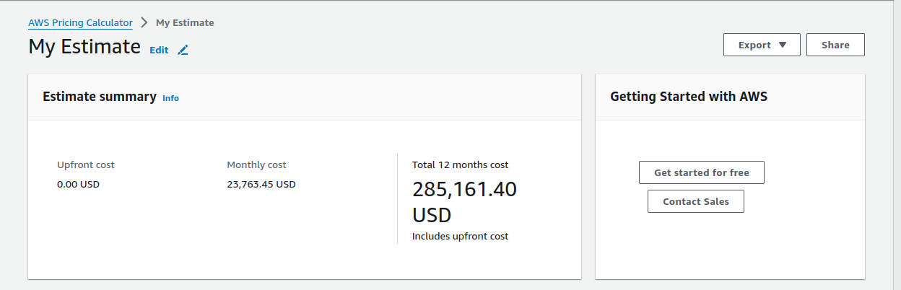

# Project 

## Objective: 
```
Participants will create a custom AWS IAM policy that meets a specific condition: allowing access to a designated S3 bucket only for a particular IAM role, without including conditions. They will then estimate the cost for deploying a multi-tier architecture solution using AWS Pricing Calculator.
```
### Part 1: Implementing a Custom IAM Policy for S3 Access

### Scenario:

+ You have a scenario where a development team needs access to an S3 bucket containing logs generated by an application. Only a specific IAM role, "DevTeamRole," should have permission to list and read objects in this bucket, while no other actions should be allowed. The participants will implement this policy to meet this requirement.

### Steps:
### 1. Understand the Requirements:
    
+ Review the scenario where only the "DevTeamRole" is allowed to access the S3 bucket named application-logs.

+ The policy should only permit s3:ListBucket and s3:GetObject actions on this bucket.

### 2. Create a New IAM Policy:

+ Navigate to the IAM console and create a new custom policy.

+ Define the policy to allow s3:ListBucket and s3:GetObject actions.

+ Specify the ARN of the application-logs bucket and any specific objects within the bucket as resources.


+ Sign in to AWS Management Console: Go to the IAM Console.

+ Navigate to Policies:
    
    + Click on "Policies" in the left navigation pane.
    
    + Click "Create policy."

+ Name the policy <span style="color:lightgreen">" AllowDevTeamS3Access "

```json
{
  "Version": "2012-10-17",
  "Statement": [
    {
      "Effect": "Allow",
      "Action": [
        "s3:ListBucket"
      ],
      "Resource": "arn:aws:s3:::application-logs"
    },
    {
      "Effect": "Allow",
      "Action": [
        "s3:GetObject"
      ],
      "Resource": "arn:aws:s3:::application-logs/*"
    }
  ]
}
```


## Output



<br>

<br>



<br>

### 3. Attach the Policy to the IAM Role:

+ Attach the custom policy to the "DevTeamRole" role.

+ Ensure that no other users or roles are granted access to this bucket by this policy.

## Output




### 4.Test the Policy:

+ Attempt to access the S3 bucket using the "DevTeamRole" to ensure only the allowed actions (list and read) are permitted.

+ Document the results of the test, ensuring that actions outside of the allowed scope (e.g., delete, write) are correctly denied.

```sh
aws s3 ls s3://application-logs
```

## Output



<br>

### Part 2: Estimating a Multi-Tier Architecture Solution

### Scenario:

```
You need to design and estimate the cost for a scalable web application that includes a load balancer, a set of EC2 instances for the application tier, and an RDS database for the data tier. The solution must support a user base of up to 100,000 concurrent users.
```

### Steps:

### 1. Define the Architecture:

+ Identify the components required: an Application Load Balancer, EC2 instances for the application servers, and an RDS instance for the database.
+ Consider the expected traffic and choose appropriate EC2 instance types and RDS configurations.

### 2.Select AWS Services:

+ Choose an Application Load Balancer to distribute incoming traffic.

+ Select EC2 instance types (e.g., t3.medium) that can handle the application load.

+ Choose an RDS instance type (e.g., db.m5.large) to support the database.

### 3. Estimate Costs Using AWS Pricing Calculator:

+ Navigate to the AWS Pricing Calculator.

+ Add the Application Load Balancer, EC2 instances, and RDS instance to the estimate.

+ Configure each service based on the expected load and required specifications (e.g., storage, data transfer).


### 4. Document and Analyze the Estimate:

+ Review the total estimated monthly cost.

+ Identify any areas where cost-saving measures could be applied (e.g., reserved instances, using Auto Scaling to optimize EC2 usage).

### 5. Prepare a Report:

+ Compile the architecture design and cost estimate into a report.

+ Provide recommendations on how to maintain performance while optimizing costs, considering the expected growth and scalability needs of the application.


## Output


<br>




<br>