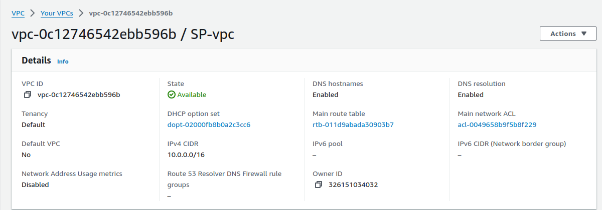
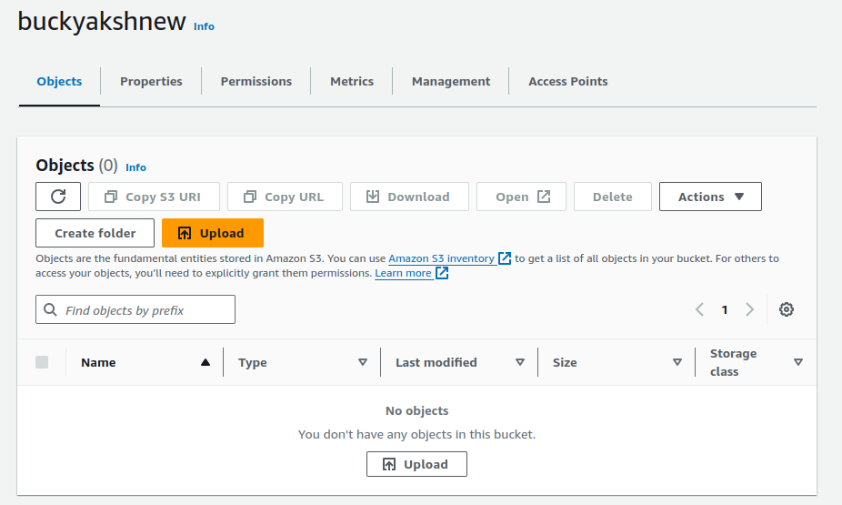
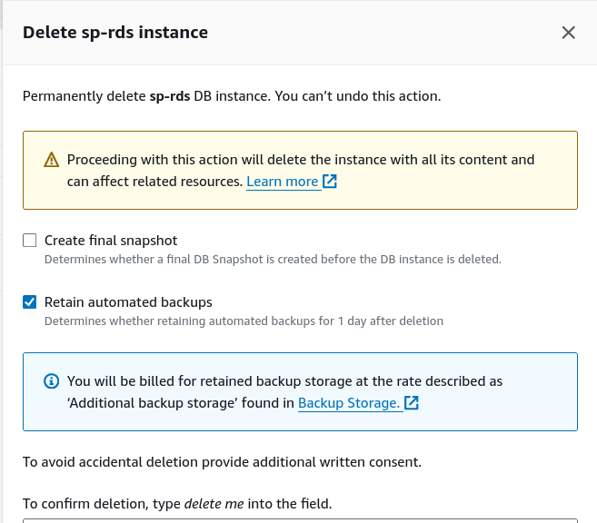

# Assessment Project: End-to-End Deployment and Management of a Scalable E-Commerce Platform on AWS

## Objective:

+ To evaluate your proficiency in designing, deploying, and managing a comprehensive and scalable e-commerce platform on AWS. 

+ The project will integrate multiple AWS services, including S3, EC2, Auto Scaling, Load Balancer, VPC (without NAT Gateway), and RDS. 

+ The platform must be highly available, secure, and optimized for performance.

## Project Steps and Deliverables:

### 1. VPC Design and Implementation :

**1.  Design a Custom VPC:**
    
+ Create a VPC with four subnets: two public subnets (for EC2 instances and Load Balancers) and two private subnets (for RDS and backend services).




+ Set up an Internet Gateway to allow internet access for the public subnets.
- Configure routing tables to enable communication between the subnets, ensuring that the private subnets can only communicate with the public subnets.


**2. Security Configuration:**

+ Create security groups to control inbound and outbound traffic for EC2 instances, Load Balancer, and RDS.

+ Implement network ACLs to add an additional layer of security at the subnet level.


### 2. S3 Bucket Configuration for Static Content :

**1. Create and Configure S3 Buckets:**

+ Create an S3 bucket named shopmax-static-content-chirag for hosting static assets (e.g., images, CSS, JavaScript).



+ Set appropriate bucket policies to allow public read access to the static content.


+ Enable versioning and logging on the bucket for better management and auditability.


### 3. EC2 Instance Setup and Web Server Configuration :

**1. Launch EC2 Instances:**

+ Launch a pair of EC2 instances (t2.micro ONLY) in the public subnets using an Amazon Linux 2 AMI.


+ SSH into the instances and install a web server (Apache or Nginx) along with necessary application dependencies.

**2. Deploy the Application:**

+ Deploy the  application on instances.


+ Configure the web server to serve dynamic content and integrate with the static content hosted on S3.

```sh
sudo mkdir -p /var/www/html/web
sudo cp *html /var/www/html/web/
cd /var/www/html/web

# change the configuration file of apache2 by using below steps

cd /etc/apache2/sites-available
sudo cp 000-default.conf web.conf
```
+ web.conf file

```cnfg
<VirtualHost *:80>
    ServerAdmin webmaster@localhost
    DocumentRoot /var/www/html/web

    ErrorLog ${APACHE_LOG_DIR}/web_error.log
    CustomLog ${APACHE_LOG_DIR}/web_access.log combined

    <Directory /var/www/html/web>
        Options Indexes FollowSymLinks
        AllowOverride All
        Require all granted
    </Directory>
</VirtualHost>
```

```sh
# after changing the config file use below commands

sudo a2dissite 000-default.conf
sudo a2ensite web.conf
sudo systemctl daemon-reload
sudo systemctl enable apache2
sudo systemctl restart apache2
```
```html
<span style="color:">


Change the paths of the css, js files and paths of all the images in all of the .html files with the path of objects in the s3 bucket 

<b>shopmax-static-content-sp<b>
</span>
```
### 4. RDS Setup and Database Configuration :

**1. Provision an RDS MySQL Instance:**

+ Launch an RDS instance (Free Tier Template Type, t3.micro ONLY) in the private subnets, ensuring that it is not publicly accessible.


+ Configure the database schema to support the e-commerce application (e.g., tables for users, orders, products).
    
+ Set up automated backups to ensure high availability.
    


**2. Database Security:**

+ Implement security measures such as encryption at rest and in transit.

+ Restrict database access to only the EC2 instances in the public subnets via security groups.


### 5. Load Balancer and Auto Scaling Configuration :

**1. Set Up an Application Load Balancer (ALB):**

+ Deploy an ALB in the public subnets to distribute traffic across the EC2 instances.
    
+ Create a target group and register the EC2 instances, ensuring health checks are configured properly.


**2. Configure Auto Scaling:**

+ Before creating Auto Scaling group create launch template of Amazon Linux 2 AMI with t2 micro instance type


+ Create an Auto Scaling group that launches additional EC2 instances based on traffic patterns (e.g., CPU utilization). (Desired: 2, minimum:1 and maximum: 2 instances)


+ Define scaling policies to automatically add or remove instances based on demand.


**3. Testing the Setup:**

+ Simulate traffic to test the scalability and fault tolerance of the infrastructure.
    
+ Verify that the ALB is evenly distributing traffic and that the Auto Scaling group is working as expected.


### 6. Testing, Validation, and Optimization :

**1. Full Application Test:**

- Access the e-commerce application via the ALB DNS name and ensure that both static and dynamic content is being served correctly.

<!-- for /app1/ -->


### Cleanup:    

+ Terminate all the resources created i.e VPC, EC2 instances, Templates, target group, security group, private key-pair, RDS instances, Auto scaling group, Application Load Balancer

**1. EC2 instances:**


**2. Auto Scaling group:**


**3. Application Load Balancer:**


**4. Target Groups:**


**5. Instance Templates:**


**6. RDS Database:**



**7. S3 bucket:**


**8. VPC, Route Tables, Subnets, Internet Gateway and Security Groups:**

