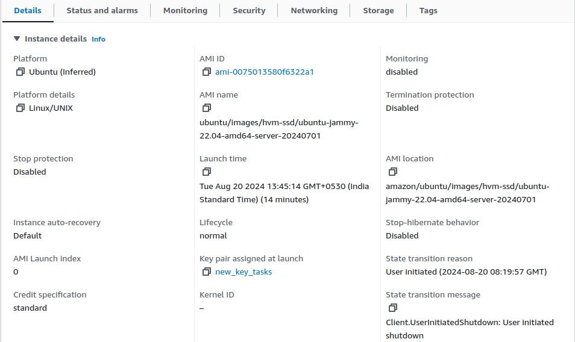
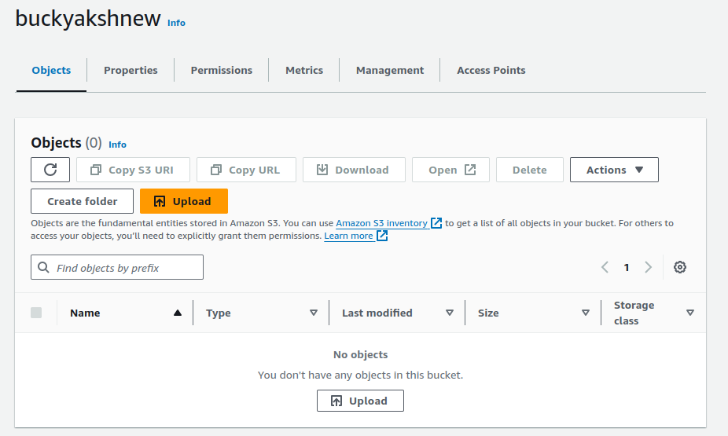
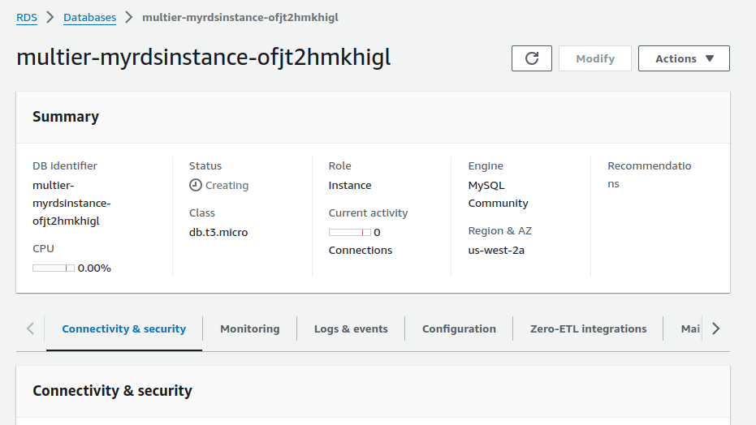
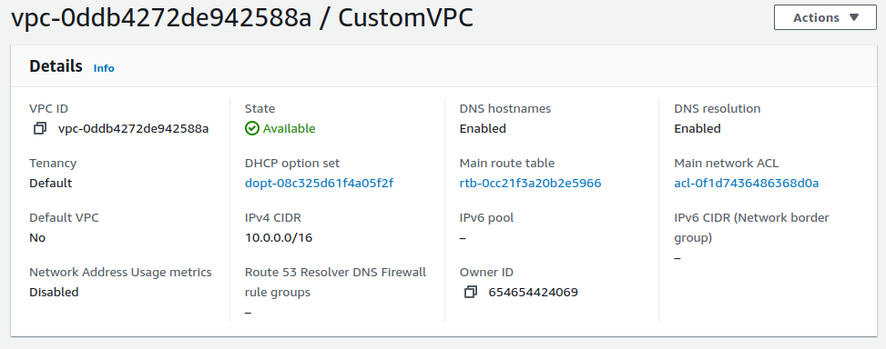
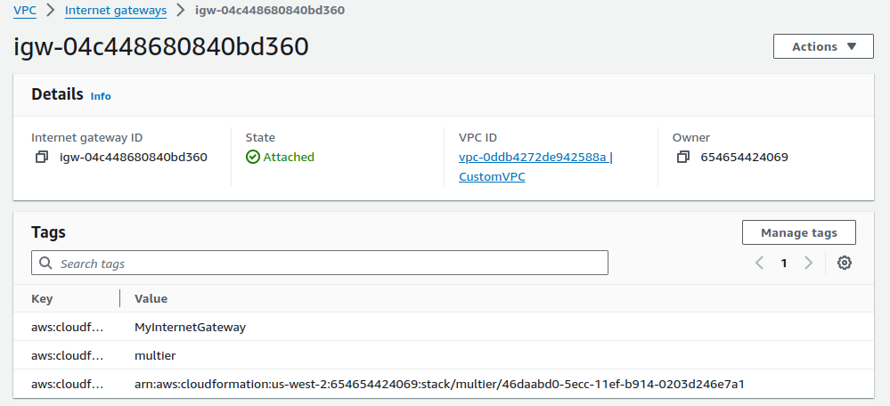
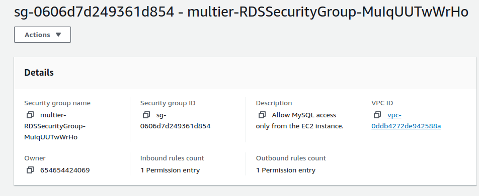
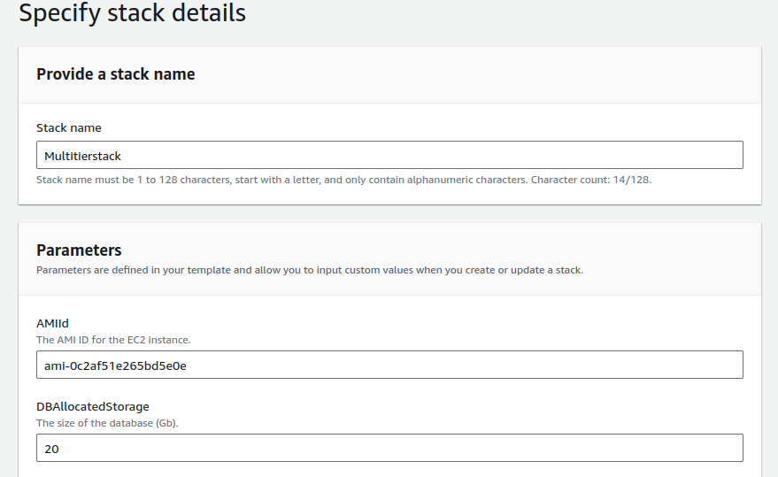
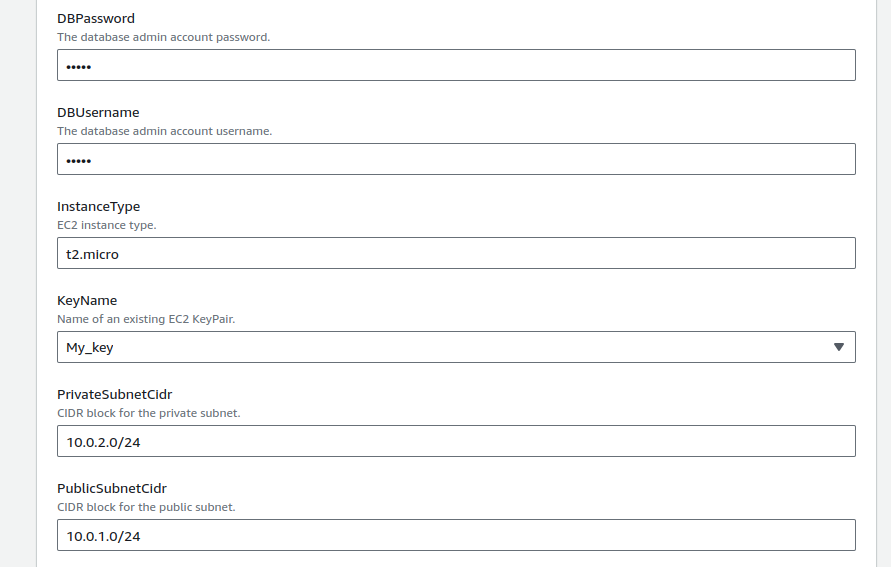
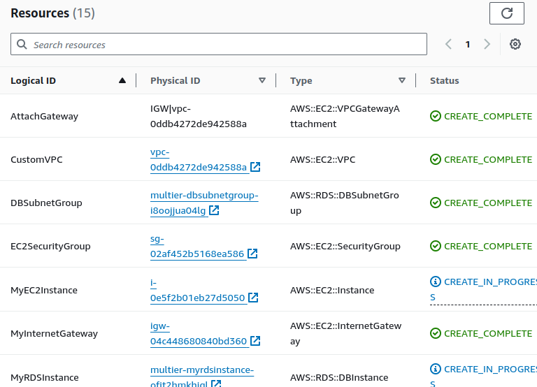

# Project: 

## Deploying a Multi-Tier Architecture Application using CloudFormation

### Project Objective:

+ This project will test your ability to deploy a multi-tier architecture application using AWS CloudFormation. The deployment should include an EC2 instance, an S3 bucket, a MySQL DB instance in RDS, and a VPC, all within the specified constraints.

### Project Overview: 

+ You are required to design and deploy a multi-tier application using AWS CloudFormation. The architecture will include the following components:

1. EC2 Instance: Serve as the web server.



2. S3 Bucket: Store static assets or configuration files.



3. RDS MySQL DB Instance: Serve as the database backend.



4. VPC: Ensure secure communication between the components.



### Specifications:

+ EC2 Instance: Use a t2.micro instance type, located in the public subnet, with SSH access allowed from a specific IP range.

+ RDS MySQL DB Instance: Use a t3.micro instance type, located in a private subnet.

+ S3 Bucket: Use for storing configuration files or assets for the web server.

+ VPC: Create a VPC with public and private subnets. No NAT Gateway or Elastic IP should be used. Internet access for the EC2 instance should be provided via an Internet Gateway attached to the VPC.

+ CloudFormation Template: Participants must create a CloudFormation template to automate the deployment process.


### Key Tasks:

### 1. Create a CloudFormation Template:
  + VPC and Subnets:
        
    + Define a VPC with one public and one private subnet.
        
    + Attach an Internet Gateway to the VPC for public subnet access.


<br>



   + Security Groups:
        
     + Create a security group for the EC2 instance, allowing SSH and HTTP access from a specific IP range.
        
     + Create a security group for the RDS instance, allowing MySQL access from the EC2 instance only.

   + EC2 Instance:
        
        + Launch a t2.micro EC2 instance in the public subnet.
        
        + Configure the instance to access the S3 bucket and connect to the RDS instance.


<br>


  + S3 Bucket:
    
       + Create an S3 bucket for storing static assets or configuration files.
    
       + Ensure the EC2 instance has the necessary IAM role and permissions to access the S3 bucket.
 


+ RDS MySQL DB Instance:
    
    + Launch a t3.micro MySQL database in the private subnet.
    
    + Configure the security group to allow access only from the EC2 instance.


<br>



<br>

### 2. Deploy the Application:
    
+ Deploy the CloudFormation stack using the template created.


```yml
AWSTemplateFormatVersion: '2010-09-09'
Description: AWS CloudFormation Template to create a VPC, EC2 instance, RDS MySQL database, and S3 bucket without SSH access.

Parameters:
  VpcCidr:
    Type: String
    Default: 10.0.0.0/16
    Description: CIDR block for the VPC.

  PublicSubnetCidr:
    Type: String
    Default: 10.0.1.0/24
    Description: CIDR block for the public subnet.

  PrivateSubnetCidr:
    Type: String
    Default: 10.0.2.0/24
    Description: CIDR block for the private subnet.


  InstanceType:
    Type: String
    Default: t2.micro
    Description: EC2 instance type.

  KeyName:
    Type: AWS::EC2::KeyPair::KeyName
    Description: Name of an existing EC2 KeyPair.

  DBUsername:
    Type: String
    Default: admin
    NoEcho: true
    Description: The database admin account username.

  DBPassword:
    Type: String
    NoEcho: true
    Description: The database admin account password.
    MinLength: 6
    MaxLength: 41
    AllowedPattern: '[a-zA-Z0-9]*'
    ConstraintDescription: Must contain only alphanumeric characters.

  DBAllocatedStorage:
    Type: Number
    Default: 20
    Description: The size of the database (Gb).

  AMIId:
    Type: String
    Description: The AMI ID for the EC2 instance.
    Default: 'ami-0c2af51e265bd5e0e' # Replace with a region-specific AMI

  S3BucketName:
    Type: String
    Description: Unique name for the S3 bucket.

Resources:
  # VPC
  CustomVPC:
    Type: AWS::EC2::VPC
    Properties:
      CidrBlock: !Ref VpcCidr
      EnableDnsSupport: 'true'
      EnableDnsHostnames: 'true'
      Tags:
      - Key: Name
        Value: CustomVPC

  # Internet Gateway
  MyInternetGateway:
    Type: AWS::EC2::InternetGateway

  # Attach Internet Gateway to VPC
  AttachGateway:
    Type: AWS::EC2::VPCGatewayAttachment
    Properties:
      VpcId: !Ref CustomVPC
      InternetGatewayId: !Ref MyInternetGateway

  # Public Subnet
  PublicSubnet:
    Type: AWS::EC2::Subnet
    Properties:
      VpcId: !Ref CustomVPC
      CidrBlock: !Ref PublicSubnetCidr
      AvailabilityZone: !Select [0, !GetAZs '']
      MapPublicIpOnLaunch: 'true'
      Tags:
      - Key: Name
        Value: PublicSubnet

  # Private Subnet
  PrivateSubnet:
    Type: AWS::EC2::Subnet
    Properties:
      VpcId: !Ref CustomVPC
      CidrBlock: !Ref PrivateSubnetCidr
      AvailabilityZone: !Select [0, !GetAZs '']
      Tags:
      - Key: Name
        Value: PrivateSubnet

    # Private Subnet 2
  PrivateSubnet2:
    Type: AWS::EC2::Subnet
    Properties:
      VpcId: !Ref CustomVPC
      CidrBlock: 10.0.3.0/24 # Adjust the CIDR block for the second subnet
      AvailabilityZone: !Select [1, !GetAZs '']
      Tags:
      - Key: Name
        Value: PrivateSubnet2

  # Route Table for Public Subnet
  PublicRouteTable:
    Type: AWS::EC2::RouteTable
    Properties:
      VpcId: !Ref CustomVPC
      Tags:
      - Key: Name
        Value: PublicRouteTable

  # Route to Internet Gateway for Public Subnet
  PublicRoute:
    Type: AWS::EC2::Route
    Properties:
      RouteTableId: !Ref PublicRouteTable
      DestinationCidrBlock: 0.0.0.0/0
      GatewayId: !Ref MyInternetGateway

  # Associate Public Subnet with Route Table
  PublicSubnetRouteTableAssociation:
    Type: AWS::EC2::SubnetRouteTableAssociation
    Properties:
      SubnetId: !Ref PublicSubnet
      RouteTableId: !Ref PublicRouteTable

  # Security Group for EC2 instance
  EC2SecurityGroup:
    Type: AWS::EC2::SecurityGroup
    Properties:
      GroupDescription: Enable HTTP access on the inbound.
      VpcId: !Ref CustomVPC
      SecurityGroupIngress:
      - IpProtocol: tcp
        FromPort: '80'
        ToPort: '80'
        CidrIp: 0.0.0.0/0

  # Security Group for RDS instance
  RDSSecurityGroup:
    Type: AWS::EC2::SecurityGroup
    Properties:
      GroupDescription: Allow MySQL access only from the EC2 instance.
      VpcId: !Ref CustomVPC
      SecurityGroupIngress:
      - IpProtocol: tcp
        FromPort: '3306'
        ToPort: '3306'
        SourceSecurityGroupId: !Ref EC2SecurityGroup

  # EC2 Instance
  MyEC2Instance:
    Type: AWS::EC2::Instance
    Properties:
      InstanceType: !Ref InstanceType
      KeyName: !Ref KeyName
      SecurityGroupIds:
      - !Ref EC2SecurityGroup
      SubnetId: !Ref PublicSubnet
      # IamInstanceProfile: !Ref EC2InstanceProfile
      ImageId: !Ref AMIId
      UserData: !Base64
        Fn::Sub: |
          #!/bin/bash
          apt update -y
          apt install -y apache2 mysql-client
          systemctl start apache2
          systemctl enable apache2

  # S3 Bucket
  MyS3Bucket:
    Type: AWS::S3::Bucket
    Properties:
      BucketName: !Ref S3BucketName

  #IAM Role for EC2 to Access S3
  EC2Role:
    Type: AWS::IAM::Role
    Properties:
      AssumeRolePolicyDocument:
        Version: '2012-10-17'
        Statement:
        - Effect: Allow
          Principal:
            Service: ec2.amazonaws.com
          Action: sts:AssumeRole
      Policies:
      - PolicyName: S3AccessPolicy
        PolicyDocument:
          Version: '2012-10-17'
          Statement:
          - Effect: Allow
            Action: s3:*
            Resource: !Sub arn:aws:s3:::${MyS3Bucket}/*

  #IAM Instance Profile for EC2
  EC2InstanceProfile:
    Type: AWS::IAM::InstanceProfile
    Properties:
      Roles:
      - !Ref EC2Role

  # RDS MySQL DB Instance
  MyRDSInstance:
    Type: AWS::RDS::DBInstance
    Properties:
      DBInstanceClass: db.t3.micro
      Engine: MySQL
      MasterUsername: !Ref DBUsername
      MasterUserPassword: !Ref DBPassword
      AllocatedStorage: !Ref DBAllocatedStorage
      DBSubnetGroupName: !Ref DBSubnetGroup
      VPCSecurityGroups:
      - !Ref RDSSecurityGroup

  # DB Subnet Group
  DBSubnetGroup:
    Type: AWS::RDS::DBSubnetGroup
    Properties:
      DBSubnetGroupDescription: Subnet group for RDS
      SubnetIds:
      - !Ref PrivateSubnet
      - !Ref PrivateSubnet2
```

+ Verify that all components are correctly configured and operational.



<br>



+ Ensure the EC2 instance can communicate with the RDS instance and access the S3 bucket.



### 3. Testing:
    
+ Test the deployed application by accessing it via the EC2 instance's public IP or DNS.
    
+ Verify the connectivity between the EC2 instance and the RDS instance.
    
+ Confirm that the EC2 instance can read from and write to the S3 bucket.

