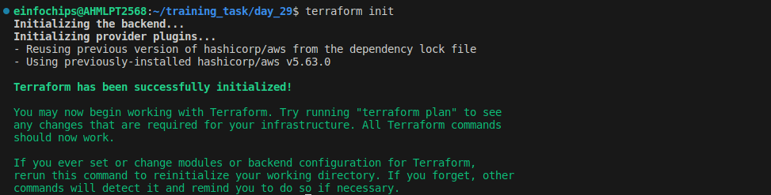
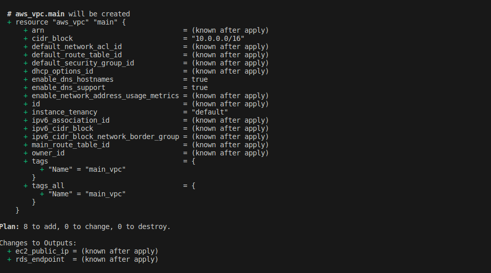
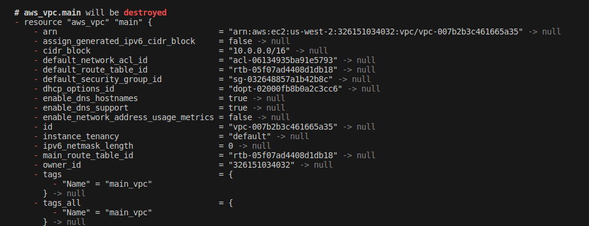
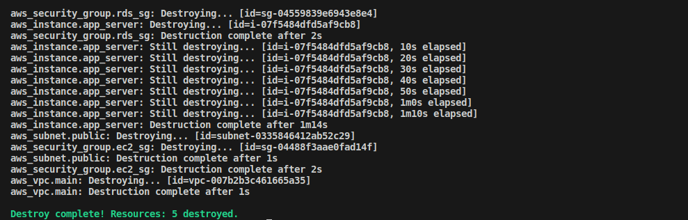

# Project: 

## Deploying a Multi-Tier Architecture Application on AWS using Terraform

### Project Objective:

+ This project will assess your ability to deploy a multi-tier architecture application on AWS using Terraform.The deployment will involve using Terraform variables, outputs, and change sets.The multi-tier architecture will include an EC2 instance, an RDS MySQL DB instance, and an S3 bucket.

### Project Overview:

+ You are required to write Terraform configuration files to automate the deployment of a multi-tier application on AWS. The architecture should consist of:

1. EC2 Instance: A t2.micro instance serving as the application server.
2. RDS MySQL DB Instance: A t3.micro instance for the database backend.
3. S3 Bucket: For storing static assets or configuration files.

### Specifications:

+ **EC2 Instance:** Use the t2.micro instance type with a public IP, allowing HTTP and SSH access.

+ **RDS MySQL DB Instance:** Use the t3.micro instance type with a publicly accessible endpoint.

+ **S3 Bucket:** Use for storing static assets, configuration files, or backups.

+ **Terraform Configuration:**


+ Utilize Terraform variables to parameterize the deployment (e.g., instance type, database name).

+ Use Terraform outputs to display important information (e.g., EC2 public IP, RDS endpoint).

+ Implement change sets to demonstrate how Terraform manages infrastructure changes.

+ **No Terraform Modules:** Focus solely on the core Terraform configurations without custom or external modules.

### Key Tasks:

### 1. Setup Terraform Configuration:

+ Provider Configuration:
    
    + Configure the AWS provider to specify the region for deployment.
    
    + Ensure the region is parameterized using a Terraform variable.

```hcl
provider "aws" {
  region = var.aws_region
}
```


+ VPC and Security Groups:
    
    + Create a VPC with a public subnet for the EC2 instance.
    
    + Define security groups allowing HTTP and SSH access to the EC2 instance, and MySQL access to the RDS instance.

```hcl
resource "aws_vpc" "main" {
  cidr_block = "10.0.0.0/16"
  enable_dns_support = true
  enable_dns_hostnames = true
  tags = {
    Name = "main_vpc"
  }
}

resource "aws_subnet" "public" {
  vpc_id                  = aws_vpc.main.id
  cidr_block              = "10.0.1.0/24"
  availability_zone       = "us-west-2a" 
  map_public_ip_on_launch = true
  tags = {
    Name = "public_subnet"
  }
}
```

+ for security groups

```hcl
resource "aws_security_group" "ec2_sg" {
  vpc_id = aws_vpc.main.id

  ingress {
    from_port   = 22
    to_port     = 22
    protocol    = "tcp"
    cidr_blocks = ["0.0.0.0/0"]
  }

  ingress {
    from_port   = 80
    to_port     = 80
    protocol    = "tcp"
    cidr_blocks = ["0.0.0.0/0"]
  }

  egress {
    from_port   = 0
    to_port     = 0
    protocol    = "-1"
    cidr_blocks = ["0.0.0.0/0"]
  }

  tags = {
    Name = "ec2_sg"
  }
}
```

+ EC2 Instance:
    
    + Define the EC2 instance using a t2.micro instance type.
    
    + Configure the instance to allow SSH and HTTP access.
    
    + Use Terraform variables to define instance parameters like AMI ID and instance type.

```hcl
resource "aws_instance" "app_server" {  
  ami           = var.ami_id
  instance_type = var.instance_type
  subnet_id     = aws_subnet.public.id
  vpc_security_group_ids = [aws_security_group.ec2_sg.id]
  
  tags = {
    Name = "app_server"
  }

  provisioner "remote-exec" {
    inline = [
      "echo 'Hello from EC2' > /var/www/html/index.html"
    ]

    connection {
      type        = "ssh"
      user        = "ubuntu"
      private_key = file(var.ssh_key_path)  
      host        = self.public_ip
    }
  }
}
```


+ RDS MySQL DB Instance:
    
    + Create a t3.micro MySQL DB instance within the same VPC.
    
    + Use Terraform variables to define DB parameters like DB name, username, and password.
    
    + Ensure the DB instance is publicly accessible, and configure security groups to allow access from the EC2 instance.


```hcl
resource "aws_db_instance" "mysql" {
  identifier        = "mydb"
  engine            = "mysql"
  instance_class    = "db.t3.micro"
  db_name           = var.db_name
  username          = var.db_username
  password          = var.db_password
  
  allocated_storage = 20
  
  publicly_accessible = false
  
  vpc_security_group_ids = [aws_security_group.rds_sg.id]
  
  db_subnet_group_name  = aws_db_subnet_group.main.name

  tags = {
    Name = "mydb"
  }
}

resource "aws_db_subnet_group" "main" {
  name        = "main"
  subnet_ids   = [aws_subnet.public.id]  
  tags = {
    Name = "main_db_subnet_group"
  }
}

```

+ For RDS Security Group

```hcl
resource "aws_security_group" "rds_sg" {
  vpc_id = aws_vpc.main.id

  ingress {
    from_port   = 3306
    to_port     = 3306
    protocol    = "tcp"
    security_groups = [aws_security_group.ec2_sg.id]
  }

  egress {
    from_port   = 0
    to_port     = 0
    protocol    = "-1"
    cidr_blocks = ["0.0.0.0/0"]
  }

  tags = {
    Name = "rds_sg"
  }
}

```
+ S3 Bucket:

    + Create an S3 bucket for storing static files or configurations.

    + Allow the EC2 instance to access the S3 bucket by assigning the appropriate IAM role and policy.

```hcl
resource "aws_s3_bucket" "static_assets" {
  bucket = "my-static-assets-bucket"
  tags = {
    Name = "static_assets"
  }
}
```

+ Outputs:

    + Define Terraform outputs to display the EC2 instance’s public IP address, the RDS instance’s endpoint, and the S3 bucket name.

```hcl
output "ec2_public_ip" {
  value = aws_instance.app_server.public_ip
}

output "rds_endpoint" {
  value = aws_db_instance.mysql.endpoint
}
```


### 2. Apply and Manage Infrastructure:

+ Initial Deployment:

    + Run terraform init to initialize the configuration.

    + Use terraform plan to review the infrastructure changes before applying.

    + Deploy the infrastructure using terraform apply, and ensure that the application server, database, and S3 bucket are set up correctly.

+ Change Sets:
    
    + Make a minor change in the Terraform configuration, such as modifying an EC2 instance tag or changing an S3 bucket policy.
    
    + Use terraform plan to generate a change set, showing what will be modified.
    
    + Apply the change set using terraform apply and observe how Terraform updates the infrastructure without disrupting existing resources.




### 3. Testing and Validation:

+ Validate the setup by:
    
    + Accessing the EC2 instance via SSH and HTTP.
    
    + Connecting to the MySQL DB instance from the EC2 instance.
    
    + Verifying that the EC2 instance can read and write to the S3 bucket.

+ Check the Terraform outputs to ensure they correctly display the relevant information.




### 4. Resource Termination:

+ Once the deployment is complete and validated, run terraform destroy to tear down all the resources created by Terraform.

+ Confirm that all AWS resources (EC2 instance, RDS DB, S3 bucket, VPC) are properly deleted.




<br>

