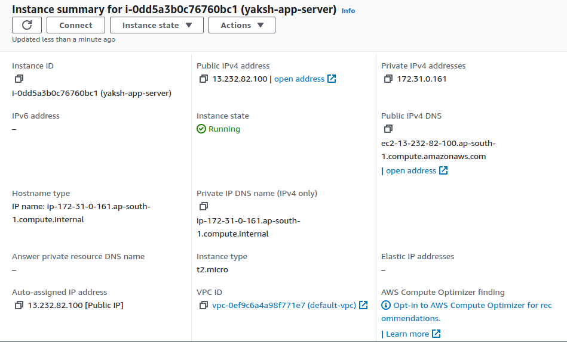
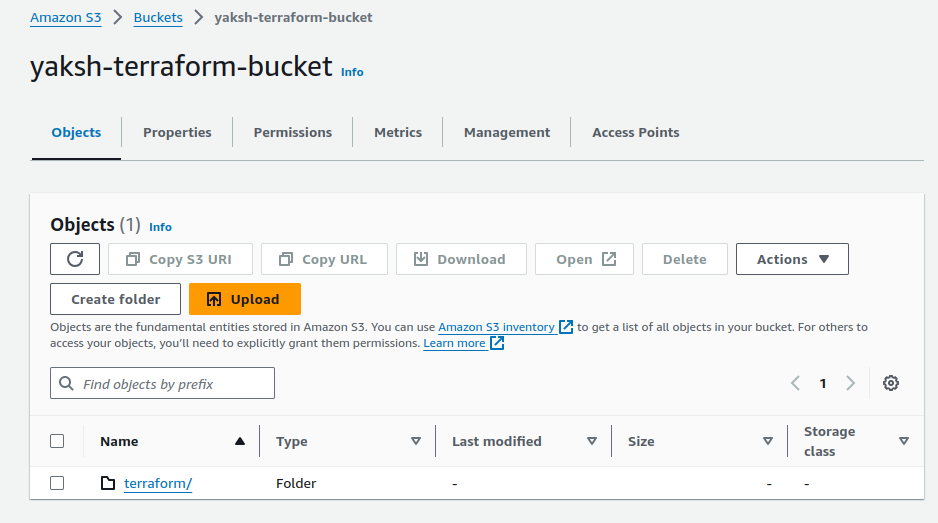
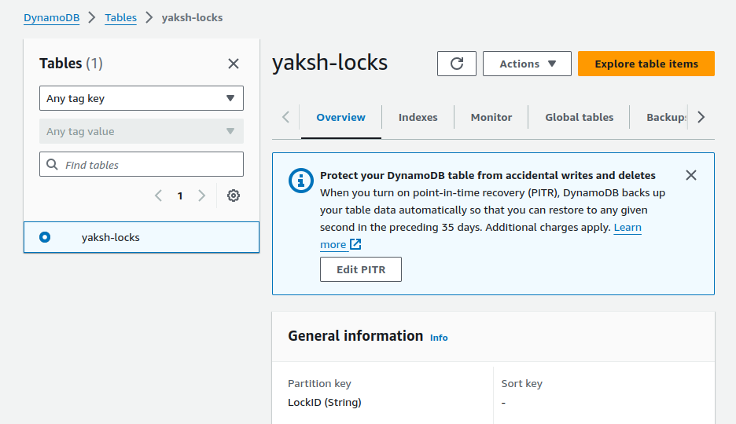
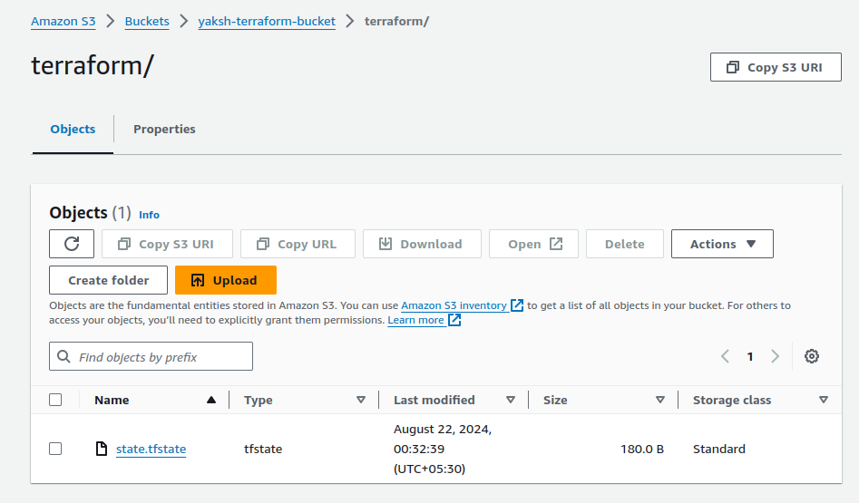
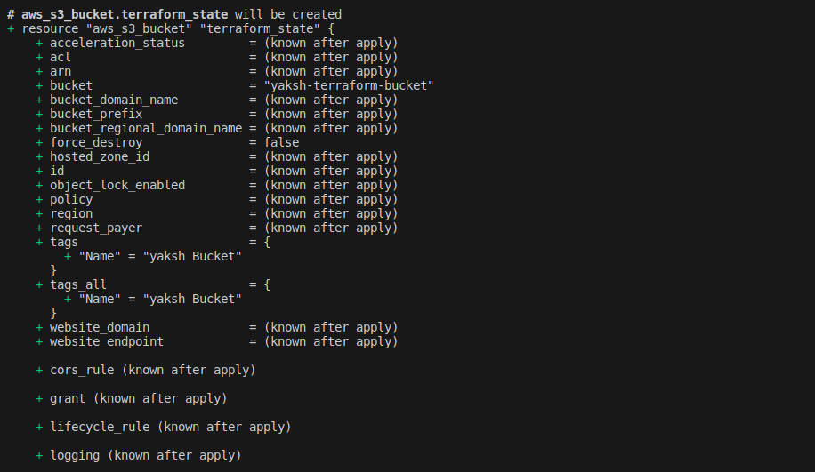

# Project: 

**Advanced Terraform with Modules, Functions, State Locks, Remote State Management, and Variable Configuration**

## Project Objective:

+ This project will test your skills in using Terraform modules, functions, variables, state locks, and remote state management. 

+ The project requires deploying infrastructure on AWS using a custom Terraform module and managing the state remotely in an S3 bucket, while testing the locking mechanism with DynamoDB. 

+ Participants will also configure variables and outputs using functions.

### Project Overview:


+ You will create a Terraform configuration that uses a custom module to deploy a multi-component infrastructure on AWS. The state files will be stored remotely in an S3 bucket, and DynamoDB will handle state locking. Additionally, the project will involve creating a flexible and reusable Terraform module, using input variables (tfvars) and Terraform functions to parameterize configurations.

**Specifications:**

+ Terraform Modules: Create a reusable module that can deploy both an EC2 instance and an S3 bucket.

+ Terraform Functions: Use Terraform built-in functions to manipulate and compute variable values (e.g., length, join, lookup).

+ State Management: Store the Terraform state in an S3 bucket and configure DynamoDB for state locking to prevent concurrent changes.

+ Variable Configuration (tfvars): Parameterize the infrastructure using variables for instance type, region, and other configurable options.

+ Outputs: Use outputs to display important information such as EC2 instance details and the S3 bucket name after deployment.

### Key Tasks:

### 1. Remote State Management:

+ **S3 Bucket for State:**

    + Create an S3 bucket using Terraform (this can be separate from the custom module).

    + Configure Terraform to store the state file in the S3 bucket.

+ State Locking with DynamoDB:

Create a DynamoDB table using Terraform (or manually if required) to store the state lock information.
Configure Terraform to use this DynamoDB table for state locking.

```hcl
resource "aws_s3_bucket" "terraform_state" {
  bucket = "yaksh-terraform-bucket"

  tags = {
    Name = "yaksh Bucket"
  }
}

resource "aws_dynamodb_table" "terraform_locks" {
  name         = "yaksh-locks"
  billing_mode = "PAY_PER_REQUEST"
  hash_key     = "LockID"

  attribute {
    name = "LockID"
    type = "S"
  }

  tags = {
    Name = "State Lock Table"
  }
}

output "s3_bucket_name" {
  value = aws_s3_bucket.terraform_state.bucket
}

output "dynamodb_table_name" {
  value = aws_dynamodb_table.terraform_locks.name
}
```

### 2. Terraform Module Creation:

+ **Custom Module:**

    + Create a Terraform module to deploy the following AWS resources:

        + EC2 instance: Use an AMI for the region and allow SSH access using a security group.

        + S3 bucket: Create an S3 bucket for application data.

```css
project/
  ├── creation/
  │   ├── modules/
  │   |   ├── main.tf
  │   |   ├── variables.tf
  │   |   └── outputs.tf
  |   ├── main.tf  
  |   ├── variables.tf
  |   ├── outputs.tf 
  |   ├── backend.tf  
  |
  ├── state_save/
  |   └── main.tf
  |
```


+ Use Terraform variables (txvars) to parameterize important aspects such as:
    
    + Instance Type: Allow the instance type to be configurable (e.g., t2.micro).
    
    + Region: Parameterize the AWS region so that the module can be reused across regions.
    
    + Bucket Name: Use a variable to set the S3 bucket name.


```hcl

resource "aws_security_group" "allow_ssh" {
  name        = "allow_ssh"
  description = "Allow SSH access"

  ingress {
    from_port   = 22
    to_port     = 22
    protocol    = "tcp"
    cidr_blocks = ["0.0.0.0/0"]
  }
}

resource "aws_instance" "app_server" {
  ami           = var.ami_id
  instance_type = var.instance_type
  security_groups = [aws_security_group.allow_ssh.name]

  tags = {
    Name = join("-", [var.instance_name, "server"])
  }
}

resource "aws_s3_bucket" "app_bucket" {
  bucket = var.bucket_name

  tags = {
    Name = join("-", [var.bucket_name, "bucket"])
  }
}

```
**Terraform Functions:**

+ Use Terraform functions in your module to manipulate and process the variables. For example:
    
    + Use join to combine strings for resource names.
    
    + Use lookup to set default values if a variable is not provided.
    
    + Use length to count the number of instances or resources.


### 3. Input Variables and Configuration (txvars):
+ Define input variables to make the infrastructure flexible:
    
    + EC2 instance type.
    
    + S3 bucket name.
    
    + AWS region.
    
    + Any other variable relevant to the infrastructure.

+ Use the default argument for variables where appropriate.

```hcl
variable "bucket" {
    type = string
    default = "yaksh-terraform-bucket"
}

variable "instance_name" {
    type = string
    default = "yaksh-app"
}

variable "instance_type" {
    type = string
    default = "t2.micro"
}

variable "region" {
    type = string
    default = "ap-south-1"
}
```

### 4. Output Configuration:

+ Set up Terraform outputs to display key information after the infrastructure is created:
    
    + EC2 Public IP: Output the public IP of the EC2 instance.

    
 
    + S3 Bucket Name: Output the name of the S3 bucket created.

    
    
    + Region: Output the region where the resources were deployed.

### 5. Testing State Locking and Remote State:

+ State Locking:
    
    + Attempt to run terraform apply from two different terminals simultaneously to test state locking.
    
    + Confirm that DynamoDB properly handles the state lock, preventing concurrent updates.



+ Remote State Management:

    + Verify that Terraform state is being stored in the S3 bucket and that updates are reflected in the remote state file.




### 6. Apply and Modify Infrastructure:

+ Initial Deployment:
    
    + Use terraform plan and terraform apply to deploy the infrastructure.
    
    + Verify that the EC2 instance, S3 bucket, and all configurations are properly set up.



+ Infrastructure Changes:
    
    + Modify one of the variables (e.g., change the instance type or add tags) and re-run terraform apply.
    
    + Observe how Terraform plans and applies only the necessary changes, with state locking in effect.

