# Docker Tasks


## Docker Project 1

### Project Overview

#### In this project, you'll go through all three lifecycles of Docker: pulling an image and creating a container, modifying the container and creating a new image, and finally, creating a Dockerfile to build and deploy a web application.

### Part 1: Creating a Container from a Pulled Image

#### Objective: Pull the official Nginx image from Docker Hub and run it as a container.

### Step 1: Pull the Nginx Image

```bash
docker pull nginx
```
### Output

---

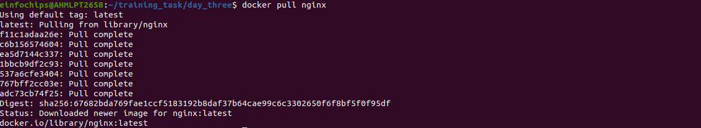

---

### step 2: Run the Nginx Container:

```bash
docker run --name my-nginx -d -p 8080:80 nginx
```

+ --name my-nginx: Assigns a name to the container.
+ -d: Runs the container in detached mode.
+ -p 8080:80: Maps port 8080 on your host to port 80 in the container.

### Output
---

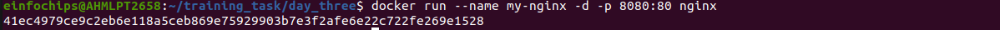

---

### Step 3: Verify the Container is Running:

```bash
docker ps
```

### Output
---

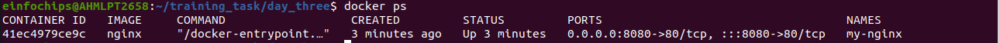

---

+ Visit http://localhost:8080 in your browser. You should see the Nginx welcome page

### Output
---

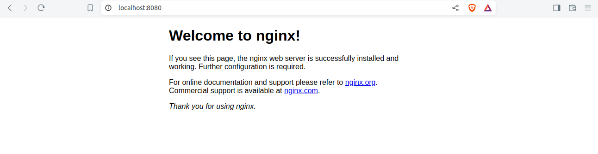

---


### Part 2: Modifying the Container and Creating a New Image

#### Objective: Modify the running Nginx container to serve a custom HTML page and create a new image from this modified container.

### Step 1: Access the Running Container

```bash
docker exec -it my-nginx /bin/bash
```

### Step 2: Create a Custom HTML Page

```bash
echo `<html><body><h1>Hello from Docker!</h1></body></html>` > /usr/share/nginx/html/index.html
```

### Step 3: Exit the Container

```bash
exit
```

### Step 4: Commit the Changes to Create a New Image

```bash
docker commit my-nginx custom-nginx
```


### Step 5:Run a Container from the New Image

```bash
docker run --name my-custom-nginx -d -p 8081:80 custom-nginx
```

### Step 6 : Verify the New Container:

+ Visit http://localhost:8081 in your browser. You should see your custom HTML page.


### Output

---

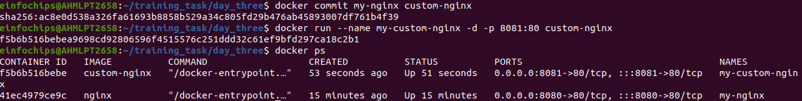


---


---


### Part 3: Creating a Dockerfile to Build and Deploy a Web Application

#### Objective: Write a Dockerfile to create an image for a simple web application and run it as a container.

### Step 1: Create a Project Directory:

```bash
mkdir my-webapp
cd my-webapp
```

### Step 2: Create a Simple Web Application

+ Create an index.html file:

```html
<!DOCTYPE html>
<html>
<body>
    <h1>Hello from My Web App!</h1>
</body>
</html>
```

+ Save this file in the my-webapp directory.


### Step 3: Write the Dockerfile

+ Create a Dockerfile in the my-webapp directory with the following content

```Dockerfile
# Use the official Nginx base image
FROM nginx:latest

# Copy the custom HTML file to the appropriate location
COPY index.html /usr/share/nginx/html/

# Expose port 80
EXPOSE 80
```

### Step 4: Build the Docker Image

```bash 
docker build -t my-webapp-image .
```

### Output:

---

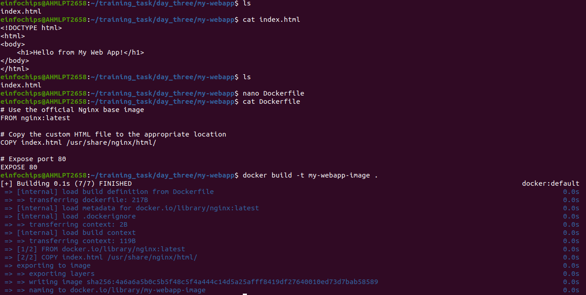

---

### Step 5: Run a Container from the Built Image

```bash 
docker run --name my-webapp-container -d -p 8082:80 my-webapp-image
```

+ Verify the Web Application

+ Visit http://localhost:8082 in your browser. You should see your custom web application.


### Output

---

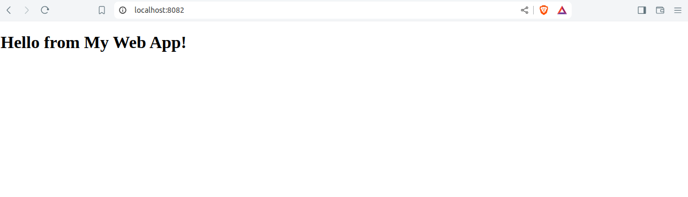

---


### Part 4: Cleaning Up

#### Objective: Remove all created containers and images to clean up your environment

### Step 1: Stop and Remove the Containers

```bash
docker stop my-nginx my-custom-nginx my-webapp-container
docker rm my-nginx my-custom-nginx my-webapp-container
```

### Step 2: Remove the Images:

```bash
docker rmi nginx custom-nginx my-webapp-image
```

### Output

---


---

## Docker Project 2

### Project Overview

#### In this advanced project, you'll build a full-stack application using Docker. The application will consist of a front-end web server (Nginx), a back-end application server (Node.js with Express), and a PostgreSQL database. You will also set up a persistent volume for the database and handle inter-container communication. This project will take more time and involve more detailed steps to ensure thorough understanding.


### Part 1: Setting Up the Project Structure

#### Objective: Create a structured project directory with necessary configuration files.

### Step 1: Create the Project Directory

```bash
mkdir fullstack-docker-app
cd fullstack-docker-app
```

### Step 2: Create Subdirectories for Each Service

```bash
mkdir frontend backend database
```

### Step 3: Create Shared Network and Volume

+ Docker allows communication between containers through a shared network

```bash
docker network create fullstack-network
```

### Step 4: Create a volume for the PostgreSQL database.

```bash
docker volume create pgdata
```

### Output:

---

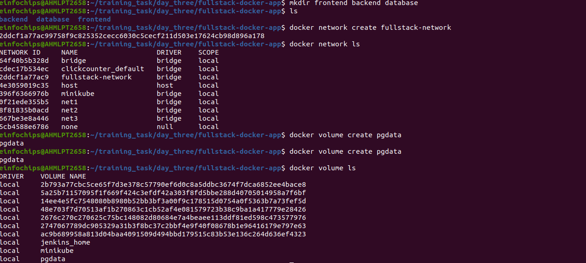

---


### Part 2: Setting Up the Database


#### Objective: Set up a PostgreSQL database with Docker


### Step 1: Create a Dockerfile for PostgreSQL

+ In the database directory, create a file named Dockerfile with the following content:

```Dockerfile
FROM postgres:latest
ENV POSTGRES_USER=user
ENV POSTGRES_PASSWORD=password
ENV POSTGRES_DB=mydatabase
```
### Step 2: Build the PostgreSQL Image

```bash
cd database
docker build -t my-postgres-db .
cd ..
```


### Output:

---

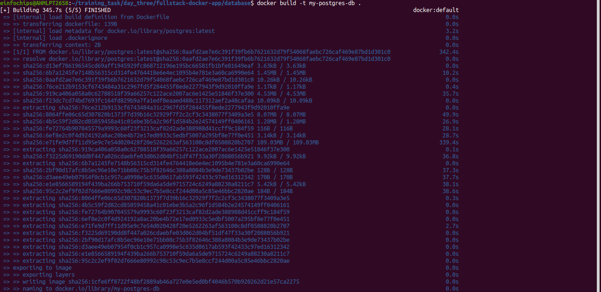

---

### Step 3: Run the PostgreSQL Container:

```bash
docker run --name postgres-container --network fullstack-network -v pgdata:/var/lib/postgresql/data -d my-postgres-db
```


### Part 3: Setting Up the Backend (Node.js with Express)

#### Objective: Create a Node.js application with Express and set it up with Docker.


### Step 1: Initialize the Node.js Application

```bash
cd backend
npm init -y
```

### Step 2 : Install Express and pg (PostgreSQL client for Node.js):
```bash
npm install express pg
```

### Output

---

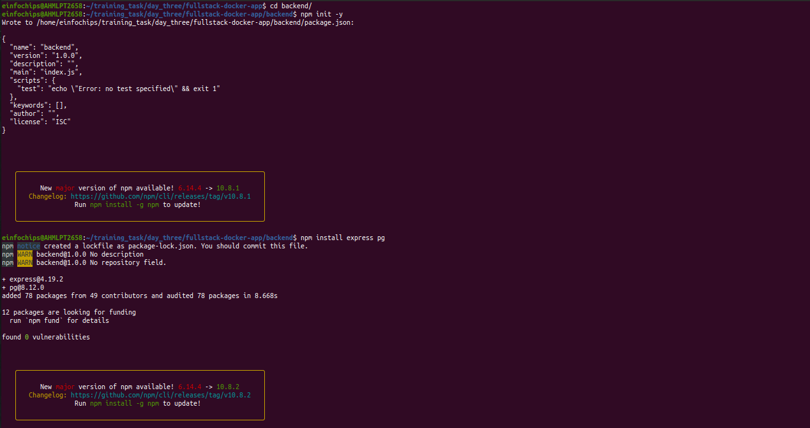

---


### Step 3: Create the Application Code

+ In the backend directory, create a file named index.js with the following content


```js
const express = require('express');
const { Pool } = require('pg');
const app = express();
const port = 3000;

const pool = new Pool({
    user: 'user',
    host: 'postgres-container',
    database: 'mydatabase',
    password: 'password',
    port: 5432,
});

app.get('/', (req, res) => {
    res.send('Hello from Node.js and Docker!');
});

app.get('/data', async (req, res) => {
    const client = await pool.connect();
    const result = await client.query('SELECT NOW()');
    client.release();
    res.send(result.rows);
});

app.listen(port, () => {
    console.log(`App running on http://localhost:${port}`);
});
```


### Step 4: Create a Dockerfile for the Backend


+ In the backend directory, create a file named Dockerfile with the following content:

```Dockerfile
FROM node:latest

WORKDIR /usr/src/app

COPY package*.json ./
RUN npm install

COPY . .

EXPOSE 3000
CMD ["node", "index.js"]
```


### Step 5: Build the Backend Image:

```bash
docker build -t my-node-app .
cd ..
```

### Step 6: Run the Backend Container

```bash
docker run --name backend-container --network fullstack-network -d my-node-app
```

### Part 4: Setting Up the Frontend (Nginx)
#### Objective: Create a simple static front-end and set it up with Docker.


### Step 1: Create a Simple HTML Page

+ In the frontend directory, create a file named index.html with the following content:

```html
<!DOCTYPE html>
<html>
<body>
    <h1>Hello from Nginx and Docker!</h1>
    <p>This is a simple static front-end served by Nginx.</p>
</body>
</html>
```
### Step 2: Create a Dockerfile for the Frontend:

+ In the frontend directory, create a file named Dockerfile with the following content:

```Dockerfile
FROM nginx:latest
COPY index.html /usr/share/nginx/html/index.html
```

+ Build the Frontend Image:

```bash
cd frontend
docker build -t my-nginx-app .
cd ..
```
### Step 3: Run the Frontend Container

```bash
docker run --name frontend-container --network fullstack-network -p 8080:80 -d my-nginx-app
```


### Output

---

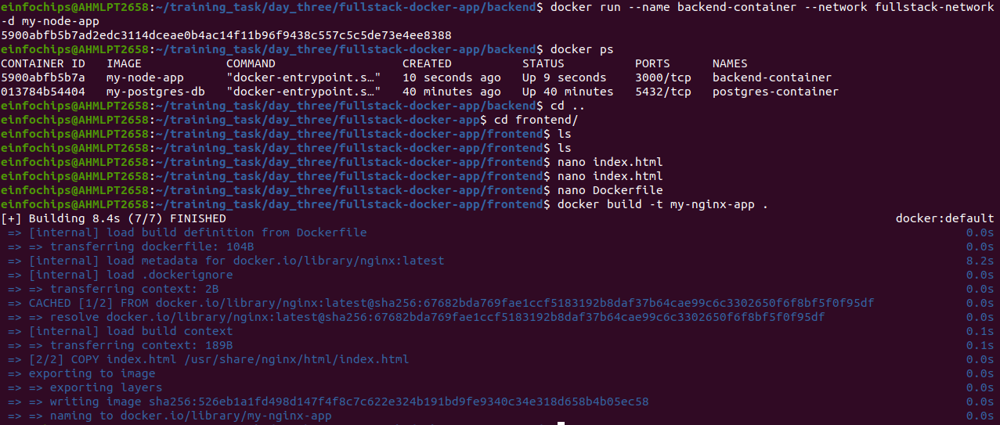

---


### Part 5: Connecting the Backend and Database
#### Objective: Ensure the backend can communicate with the database and handle data requests.

### Step 1: Update Backend Code to Fetch Data from PostgreSQL

+ Ensure that the index.js code in the backend handles /data endpoint correctly as written above.

### Step 2: Verify Backend Communication:

+ Access the backend container:
```bash
docker exec -it backend-container /bin/bash
```

+ Test the connection to the database using psql:
```bash

apt-get update && apt-get install -y postgresql-client

psql -h postgres-container -U user -d mydatabase -c "SELECT NOW();"
```


+ Exit the container:

```bash
exit
```


### Step 3: Test the Backend API

+  Visit http://localhost:3000 to see the basic message.

+ Visit http://localhost:3000/data to see the current date and time fetched from PostgreSQL.


### Output

---

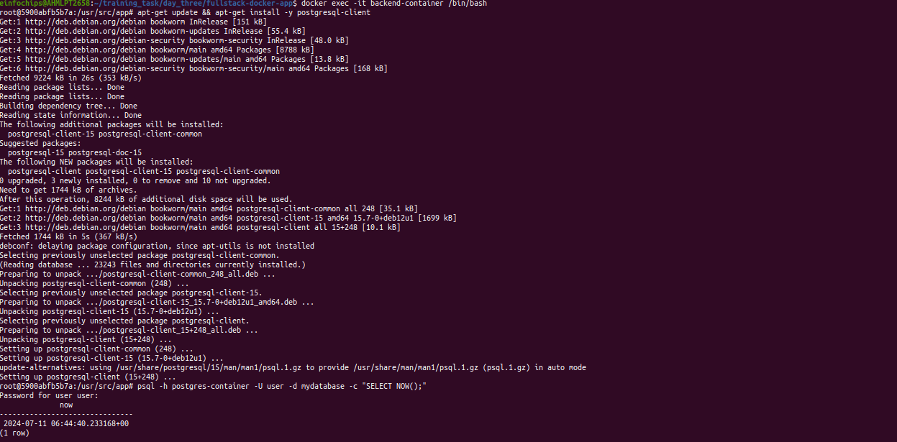

---


### Objective: Ensure all components are working together and verify the full-stack application.

### Step 1:
+ Access the Frontend:
+ Visit http://localhost:8080 in your browser. You should see the Nginx welcome 
page with the custom HTML.

+ Verify Full Integration: Update the index.html to include a link to the backend:

### Output

---

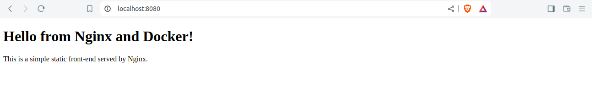

---


```html
<!DOCTYPE html>
<html>
<body>
    <h1>Hello from Nginx and Docker!</h1>
    <p>This is a simple static front-end served by Nginx.</p>
    <a href="http://localhost:3000/data">Fetch Data from Backend</a>
</body>
</html>
```

+ Rebuild and Run the Updated Frontend Container:
```bash
cd frontend
docker build -t my-nginx-app .
docker stop frontend-container
docker rm frontend-container
docker run --name frontend-container --network fullstack-network -p 8080:80 -d my-nginx-app
cd ..
```

+ Final Verification:
+ Visit http://localhost:8080 and click the link to fetch data from the backend.


### Output

---

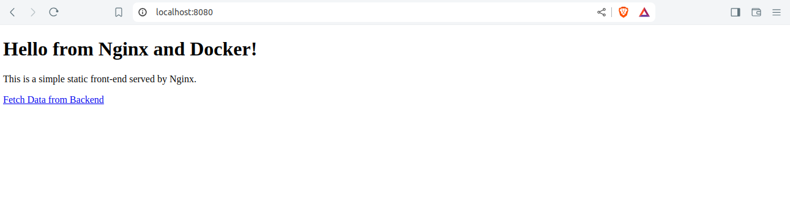

---

### Part 7: Cleaning Up

#### Objective: Remove all created containers, images, networks, and volumes to clean up your environment.

### Steps:

+ Stop and Remove the Containers:
```bash
docker stop frontend-container backend-container postgres-container
docker rm frontend-container backend-container postgres-container
```

+ Remove the Images:
```bash
docker rmi my-nginx-app my-node-app my-postgres-db
```

+ Remove the Network and Volume:

```bash
docker network rm fullstack-network
docker volume rm pgdata
```

### Output

---

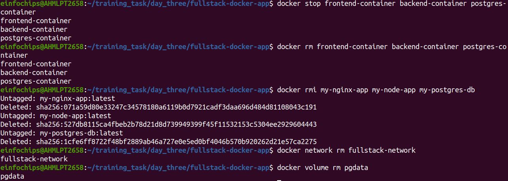

---
