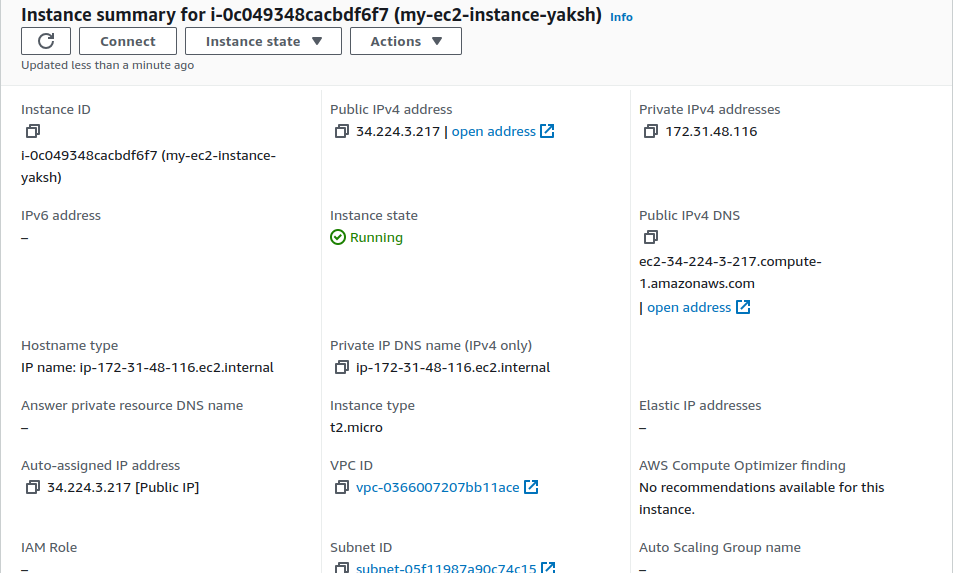
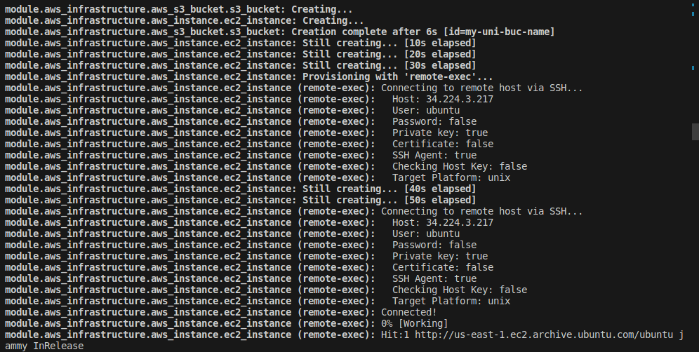
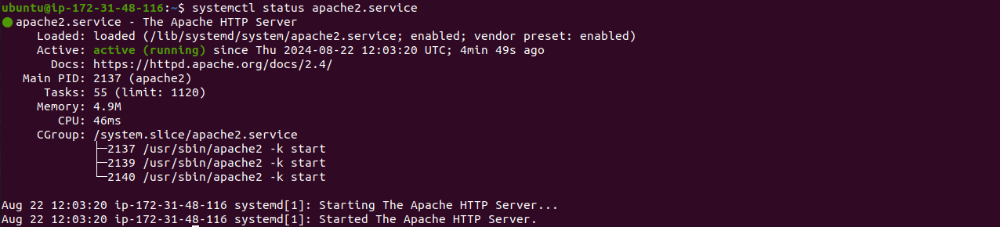
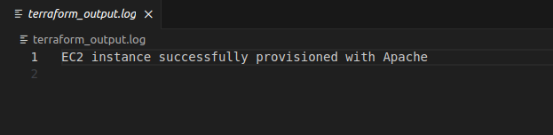
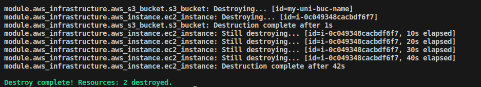
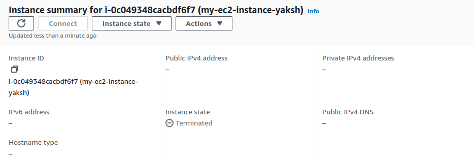

### Project: Advanced Terraform with Provisioners, Modules, and Workspaces

## Project Objective:

+ This project is designed to evaluate participants' understanding of Terraform provisioners, modules, and workspaces. 

+ The project involves deploying a basic infrastructure on AWS using Terraform modules, executing remote commands on the provisioned resources using provisioners, and managing multiple environments using Terraform workspaces.

+ All resources should be within the AWS Free Tier limits.

## Project Overview:

+ Participants will create a Terraform configuration that deploys an EC2 instance and an S3 bucket using a custom Terraform module. 

+ The project will also require the use of Terraform provisioners to execute scripts on the EC2 instance. 

+ Finally, participants will manage separate environments (e.g., dev and prod) using Terraform workspaces.

## Specifications:

### 1. Terraform Modules:

+ Create a reusable module to deploy an EC2 instance and an S3 bucket.

+ The EC2 instance should be of type t2.micro, and the S3 bucket should be configured for standard storage.

+ The module should accept input variables for the instance type, AMI ID, key pair name, and bucket name.

+ Outputs should include the EC2 instance’s public IP and S3 bucket’s ARN.

### 2. Terraform Provisioners:

+ Use remote-exec and local-exec provisioners to perform post-deployment actions on the EC2 instance.

+ The remote-exec provisioner should be used to connect to the EC2 instance via SSH and run a script that installs Apache HTTP Server.

+ The local-exec provisioner should be used to output a message on the local machine indicating the deployment status, such as "EC2 instance successfully provisioned with Apache."


### 3. Terraform Workspaces:

+ Implement Terraform workspaces to manage separate environments (e.g., dev and prod).

+ Each workspace should deploy the same infrastructure (EC2 and S3) but with different configurations (e.g., different tags or bucket names).

+ Ensure that the state for each workspace is managed separately to prevent conflicts between environments.

### Key Tasks:

### 1. Module Development:

+ Module Setup: Create a directory for the module (e.g., modules/aws_infrastructure).

```css
├── main.tf
├── modules
│   └── aws_infrastructure
│       ├── main.tf
│       ├── outputs.tf
│       └── variables.tf
```

+ Resource Definitions: Define the resources for an EC2 instance and an S3 bucket within the module.

```hcl
resource "aws_instance" "ec2_instance" {
  ami            = var.ami_id
  instance_type  = var.instance_type
  key_name       = var.key_name

  tags = {
    Name = "my-ec2-instance-yaksh"
  }
}


resource "aws_s3_bucket" "s3_bucket" {
  bucket = var.bucket_name
}

```

+ Variable Inputs: Define input variables for instance type, AMI ID, key pair name, and S3 bucket name.

```hcl
variable "ami_id" {
  description = "AMI ID for the EC2 instance"
  type        = string
}

variable "instance_type" {
  description = "Type of the EC2 instance"
  type        = string
}

variable "key_name" {
  description = "Name of the SSH key pair"
  type        = string
}

variable "bucket_name" {
  description = "Name of the S3 bucket"
  type        = string
}

variable "private_key_path" {
  description = "Path to the private key for SSH access"
  type        = string
}
```

+ Outputs: Define outputs for the EC2 instance's public IP and the S3 bucket's ARN.

```hcl
output "ec2_instance_public_ip" {
  description = "Public IP of the EC2 instance"
  value       = aws_instance.ec2_instance.public_ip
}

output "s3_bucket_arn" {
  description = "ARN of the S3 bucket"
  value       = aws_s3_bucket.s3_bucket.arn
}
```


<br>



<br>

### 2. Main Terraform Configuration:

+ Main Config Setup: In the root directory, create a Terraform configuration that calls the custom module.

+ Backend Configuration: Configure Terraform to use local state storage for simplicity (optional for Free Tier compliance).

### 3. Provisioner Implementation:

+ Remote Execution: Use the remote-exec provisioner to SSH into the EC2 instance and execute a script that installs Apache.

```hcl
 provisioner "remote-exec" {
    inline = [
      "sudo apt-get update",
      "sudo apt-get install -y apache2",
      "sudo systemctl start apache2",
      "sudo systemctl enable apache2"
    ]
    connection {
      type        = "ssh"
      user        = "ubuntu"
      private_key = file(var.private_key_path)
      host        = self.public_ip
    }
  }
```



+ Local Execution: Use the local-exec provisioner to print a confirmation message on the local machine after successful deployment.


```hcl
provisioner "local-exec" {
  command = "echo 'EC2 instance successfully provisioned with Apache' >> terraform_output.log"
}
```

### 4. Workspace Management:

+ Workspace Creation: Create Terraform workspaces for dev and prod.

+ Environment-Specific Configurations: Customize the EC2 instance tags and S3 bucket names for each workspace to differentiate between environments.

+ Workspace Deployment: Deploy the infrastructure separately in the dev and prod workspaces.

### 5. Validation and Testing:

+ Apache Installation Verification: After the deployment, verify that Apache is installed and running on the EC2 instance by accessing the public IP address in a web browser.

<br>



<br>

+ Workspace Separation: Confirm that each workspace has its own isolated infrastructure and state files.

+ Create and switch to the dev workspace:

```sh
terraform workspace new dev
```

+ Deploy the infrastructure in the dev workspace:

```sh
terraform apply -auto-approve
```

+ Create and switch to the prod workspace:

```sh
terraform workspace new prod
```
+ Deploy the infrastructure in the prod workspace:

```sh
terraform apply -auto-approve
```

+ Provisioner Logs: Review the output from the local-exec provisioner to ensure it indicates successful deployment.




### 6. Resource Cleanup:

+ Destroy Resources: Use terraform destroy to remove the resources in both workspaces.



<br>



<br>


