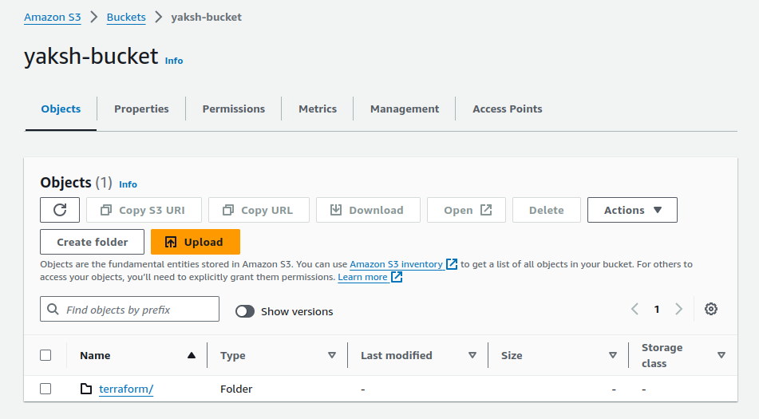

# Project: Automation (IaaC) Terraform on AWS Assessment Project

## Project Overview

+ This capstone project is designed to assess participants' knowledge and practical skills with Terraform, specifically focusing on AWS. The project will require deploying a complete infrastructure using Terraform, emphasizing the usage of state lock, variables, .tfvars files, modules, functions, workspaces, and lifecycle rules. 

+ The deployment will be restricted to AWS Free Tier resources to avoid unnecessary costs.

## Project Objectives

+ Deploy a multi-tier architecture on AWS using Terraform.
+ Implement state locking to manage concurrent changes.
+ Use variables and .tfvars files to parameterize configurations.
+ Create and use Terraform modules to promote reusability and organization.
+ Utilize functions to dynamically configure resources.
+ Manage multiple environments using Terraform workspaces.
+ Implement lifecycle rules to control resource creation, updates, and deletion.

## Project Requirements

### 1. Infrastructure Design

+ The project will involve deploying a basic 3-tier web application architecture, which includes the following components:

1. VPC: Create a Virtual Private Cloud (VPC) with public and private subnets across two availability zones.
2. Security Groups: Define security groups to control inbound and outbound traffic for the application and database tiers.
3. EC2 Instances: Deploy EC2 instances in the public subnets for the web servers (Application Tier).
4. RDS Instance: Deploy an RDS MySQL instance in the private subnet for the database (Database Tier).
5. S3 Bucket: Create an S3 bucket to store static files, with versioning enabled.
6. Elastic IPs: Assign Elastic IPs to the EC2 instances.
7. IAM Role: Create an IAM role with the necessary permissions and attach it to the EC2 instances.

### 2. Terraform State Management

+  Implement remote state storage using an S3 bucket to store the Terraform state file.
+  Use DynamoDB for state locking to prevent concurrent modifications.

### 3. Variables and tfvars


+ Define input variables for resources like VPC CIDR, instance types, database username/password, and S3 bucket names.
+ Use .tfvars files to pass different configurations for environments (e.g., dev.tfvars, prod.tfvars).

### 4. Modules

+ Break down the infrastructure into reusable modules:
    
    + VPC Module: Manage VPC, subnets, and routing tables.
    + EC2 Module: Configure and launch EC2 instances.
    + RDS Module: Set up the RDS MySQL database.
    + S3 Module: Handle S3 bucket creation with versioning.
    + IAM Module: Create and manage IAM roles and policies.

### 5. Functions
+ Use Terraform functions to dynamically configure:
    
    + The names of resources using format and join functions.
    + Subnet CIDRs using cidrsubnet.
    + Lookup values for AMI IDs using lookup function.

### 6. Workspaces

+  Create workspaces for different environments (e.g., development, staging, production).
+  Deploy the infrastructure in each environment using the appropriate workspace.

### 7. Lifecycle Rules

+ Implement lifecycle rules to:
    + Prevent resource deletion: Ensure certain resources, like the RDS database, are not accidentally deleted (prevent_destroy).
    + Ignore changes to specific resource attributes (e.g., S3 bucket tags) using ignore_changes.

### Project Steps

#### Step 1: Setup Remote State and Locking

1. Create an S3 bucket for storing Terraform state.
2. Create a DynamoDB table for state locking.
3. Configure the backend in Terraform to use the S3 bucket and DynamoDB table.

#### Step 2: Develop and Organize Modules

1. Develop separate modules for VPC, EC2, RDS, S3, and IAM.
2. Place each module in a separate directory with main.tf, variables.tf, and outputs.tf.

+ Follow the Below structure

```css
 .
 ├── modules
 │   ├── ec2
 │   │   ├── main.tf
 │   │   ├── outputs.tf
 │   │   └── variables.tf
 │   ├── iam
 │   │   ├── main.tf
 │   │   ├── outputs.tf
 │   │   └── variables.tf
 │   ├── rds
 │   │   ├── main.tf
 │   │   ├── outputs.tf
 │   │   └── variables.tf
 │   ├── sg
 │   │   ├── main.tf
 │   │   ├── outputs.tf
 │   │   └── variables.tf
 │   └── vpc
 │       ├── main.tf
 │       ├── outputs.tf
 │       └── variables.tf
 ├── main.tf
 ├── variables.tf
```


+ For ec2

**```modules/ec2/main.tf```**

```js
resource "aws_instance" "yaksh_app" {
  count                    = var.instance_count
  ami                      = var.ami_id
  instance_type            = var.instance_type
  subnet_id                = element(var.public_subnet_ids, count.index)
  key_name                 = var.key_name
  associate_public_ip_address = true
  security_groups          = [var.security_group_id]

  tags = {
    Name = "yaksh-app-instance-${count.index}"
  }
}
```

**```modules/ec2/varibales.tf```**


```js
variable "ami_id" {
  description = "AMI ID for EC2 instances"
  type        = string
}

variable "instance_type" {
  description = "EC2 instance type"
  type        = string
}

variable "instance_count" {
  description = "Number of EC2 instances"
  type        = number
}

variable "public_subnet_ids" {
  description = "List of public subnet IDs"
  type        = list(string)
}

variable "key_name" {
  description = "Name of the SSH key pair"
  type        = string
  default    = "My_key"
}

variable "security_group_id" {
  description = "Security Group ID for EC2 instances"
  type        = string
}
```

+ For IAM we are going to define only ec2 read policy

**```modules/IAM/main.tf```**

```js
resource "aws_iam_role" "yaksh_ec2_role" {
  name = "yaksh-ec2-role"

  assume_role_policy = jsonencode({
    Version = "2012-10-17"
    Statement = [
      {
        Action    = "sts:AssumeRole"
        Effect    = "Allow"
        Principal = {
          Service = "ec2.amazonaws.com"
        }
      }
    ]
  })

  tags = {
    Name = "yaksh-ec2-role"
  }
}

resource "aws_iam_role_policy_attachment" "yaksh_ec2_policy_attachment" {
  role       = aws_iam_role.yaksh_ec2_role.name
  policy_arn  = "arn:aws:iam::aws:policy/AmazonEC2ReadOnlyAccess"
}
```

**```modules/IAM/outputs.tf```**

```js
output "iam_role_arn" {
  value = aws_iam_role.yaksh_ec2_role.arn
}
```


+ For RDS

**```modules/rds/main.tf```**


```js
resource "aws_db_instance" "yaksh_db" {
  allocated_storage    = 20
  storage_type         = "gp2"
  engine               = "mysql"
  engine_version       = "8.0"
  instance_class       = "db.t3.micro"
  db_name                 = "yakshdb"
  username             = var.db_username
  password             = var.db_password
  vpc_security_group_ids = [aws_security_group.yaksh_db_sg.id]
  db_subnet_group_name = aws_db_subnet_group.yaksh_db_subnet_group.name
  skip_final_snapshot  = true

  tags = {
    Name = "yaksh-db-instance"
  }
|}

resource "aws_db_subnet_group" "yaksh_db_subnet_group" {
  name       = "yaksh-db-subnet-group"
  subnet_ids = var.private_subnet_ids
  tags = {
    Name = "yaksh-db-subnet-group"
  }
}

resource "aws_security_group" "yaksh_db_sg" {
  vpc_id = var.vpc_id

  egress {
    from_port   = 0
    to_port     = 0
    protocol    = "-1"
    cidr_blocks = ["0.0.0.0/0"]
  }

  ingress {
    from_port   = 3306
    to_port     = 3306
    protocol    = "tcp"
    cidr_blocks = ["10.0.0.0/16"]
  }

  tags = {
    Name = "yaksh-db-sg"
  }
}
```
**```modules/rds/varibales.tf```**

```js
variable "db_username" {
  description = "Database username"
  type        = string
  
}

variable "db_password" {
  description = "Database password"
  type        = string
  
}

variable "private_subnet_ids" {
  description = "List of private subnet IDs"
  type        = list(string)
}

variable "vpc_id" {
  description = "ID of the VPC"
  type        = string
}
```

#### Step 3: Define Variables and tfvars Files

1. Define variables in variables.tf files within each module.

```js
variable "vpc_cidr" {
  description = "CIDR block for the VPC"
  default     = "10.0.0.0/16"
}

variable "public_subnet_cidrs" {
  description = "CIDR blocks for public subnets"
  default     = ["10.0.1.0/24", "10.0.2.0/24"]
}

variable "private_subnet_cidrs" {
  description = "CIDR blocks for private subnets"
  default     = ["10.0.3.0/24", "10.0.4.0/24"]
}

variable "availability_zones" {
  description = "List of availability zones"
  default     = ["ap-south-1a", "ap-south-1b"]
}

variable "instance_type" {
  description = "EC2 instance type"
  default     = "t2.micro"
}

variable "ami_id" {
  description = "AMI ID for EC2 instances"
  default     = "ami-0c2af51e265bd5e0e"
}

variable "db_username" {
  description = "Database username"
}

variable "db_password" {
  description = "Database password"
  sensitive   = true
}

variable "s3_bucket_prefix" {
  description = "Prefix for the S3 bucket name"
}

```

2. Create a terraform.tfvars file with default values.

```js
vpc_cidr          = "10.0.0.0/16"
public_subnet_cidrs = ["10.0.1.0/24", "10.0.2.0/24"]
private_subnet_cidrs = ["10.0.3.0/24", "10.0.4.0/24"]
availability_zones = ["ap-south-1a", "ap-south-1b"]
instance_type     = "t2.micro"
ami_id            = "ami-0c2af51e265bd5e0e"
db_username       = "admin"
db_password       = "password"
s3_bucket_prefix  = "yaksh-terraform-bucket"
```


3. Create separate environment-specific .tfvars files (e.g., dev.tfvars, prod.tfvars).

+ dev.tfvars

```js
vpc_cidr          = "10.0.0.0/16"
public_subnet_cidrs = ["10.0.1.0/24", "10.0.2.0/24"]
private_subnet_cidrs = ["10.0.3.0/24", "10.0.4.0/24"]
availability_zones = ["ap-south-1a", "ap-south-1b"]
instance_type     = "t2.micro"
ami_id            = "ami-0c2af51e265bd5e0e"
db_username       = "user"
db_password       = "password"
s3_bucket_prefix  = "yaksh-dev-bucket"
```

+ prod.tfvars

```js
vpc_cidr          = "10.1.0.0/16"
public_subnet_cidrs = ["10.1.1.0/24", "10.1.2.0/24"]
private_subnet_cidrs = ["10.1.3.0/24", "10.1.4.0/24"]
availability_zones = ["ap-south-1a", "ap-south-1b"]
instance_type     = "t3.micro"
ami_id            = "ami-0c2af51e265bd5e0e"
db_username       = "root"
db_password       = "password"
s3_bucket_prefix  = "yaksh-prod-bucket"
```

#### Step 4: Implement Workspaces

1. Initialize Terraform and create workspaces (development, staging, production).

```sh
terraform workspace new dev
terraform workspace new prod
```

2. Deploy infrastructure in each workspace using the appropriate .tfvars file.

```sh
terraform workspace select dev
terraform apply -var-file=dev.tfvars -var="aws_profile=dev"
```

```sh
terraform workspace select prod
terraform apply -var-file=prod.tfvars -var="aws_profile=prod"
```


#### Step 5: Deploy the Infrastructure

1. Use the terraform apply command to deploy the infrastructure in each workspace.


2. Verify the deployment by accessing the EC2 instances and ensuring the application is running.


## Outputs


<br>



<br>


<br>


<br>


<br>


<br>

<hr>


#### Step 6: Implement Lifecycle Rules

1. Modify the Terraform code to add lifecycle rules for critical resources.
2. Apply the changes and verify that the lifecycle rules are in effect.


#### Step 7: Cleanup

1. Destroy the infrastructure in each workspace using terraform destroy.

2. Ensure that resources marked with prevent_destroy are not deleted.


<br>


<br>