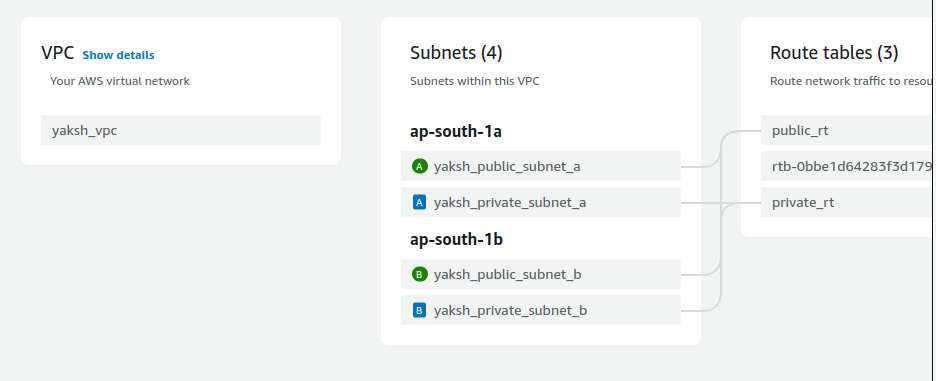
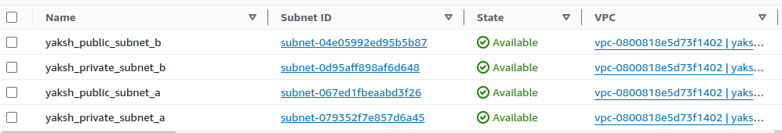
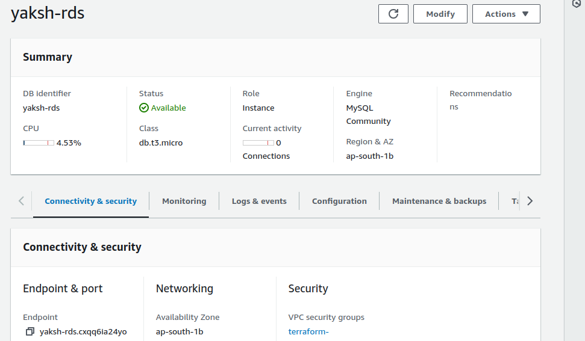
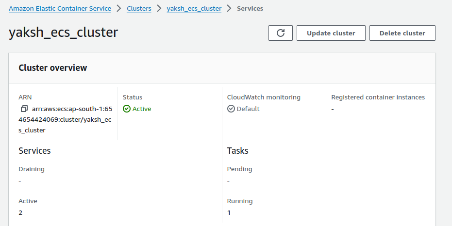
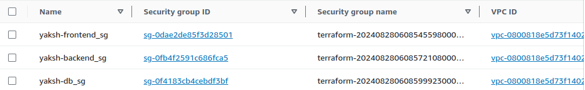
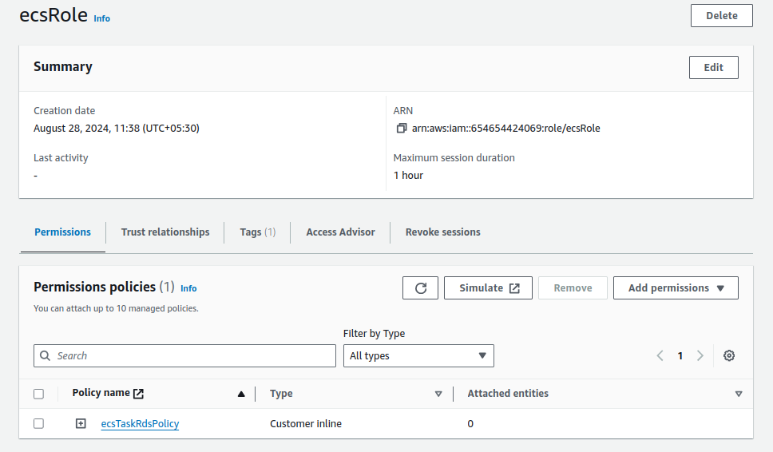
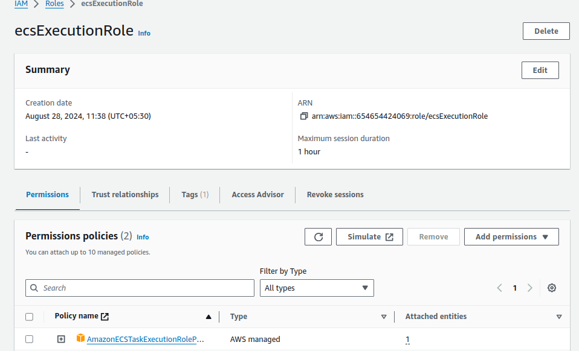
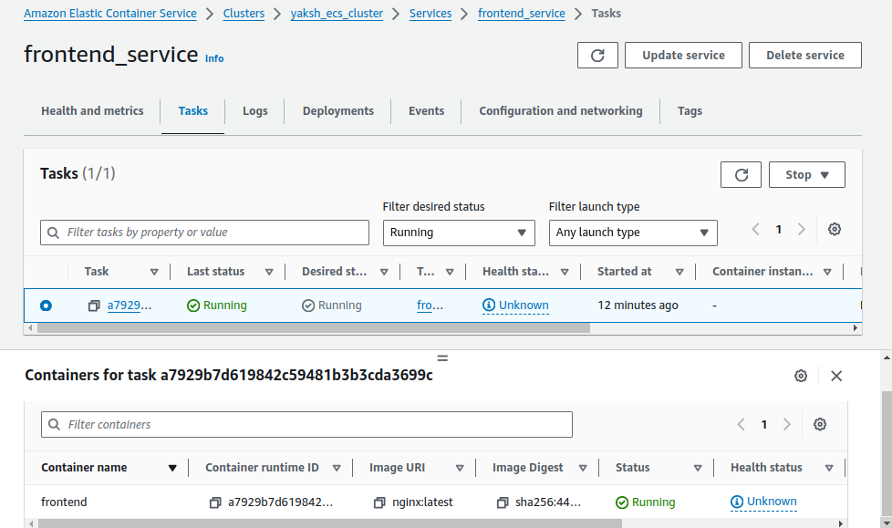
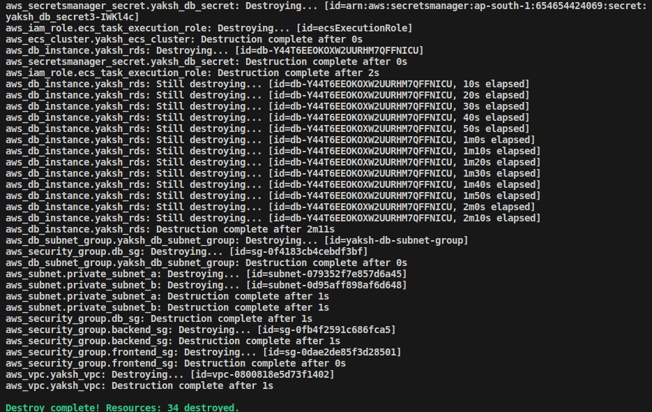

# Project Overview: Deploying a Multi-Tier Web Application Using Amazon ECS (Without Load Balancer and API Gateway)

+ This project is designed to test participants' knowledge of Amazon ECS (Elastic Container Service) by deploying a multi-tier web application on AWS without using a Load Balancer or API Gateway. The project involves setting up an ECS cluster, defining task definitions, creating services, and ensuring proper networking and security configurations using VPC, subnets, security groups, and IAM roles.

## Project Objectives:

+ Set up an ECS Cluster using the Fargate launch type.
+ Deploy a web application consisting of multiple containers (frontend and backend).
+ Implement direct communication between frontend and backend services.
+ Manage ECS tasks, services, and scaling policies.
+ Ensure network security with VPC, subnets, security groups, and IAM roles.

### Project Requirements:

+ ECS Cluster: Create an ECS Cluster using Fargate.
+ Task Definitions: Define task definitions for web and backend services.
+ Services: Create ECS services for each tier (frontend and backend) without using a Load Balancer or API Gateway.
+ Security Groups: Configure security groups to allow traffic between services directly.
+ IAM Roles: Create and assign IAM roles for ECS tasks.
+ VPC and Networking: Create a VPC with public and private subnets, ensuring proper routing of traffic without a NAT gateway.
+ Secrets Management: Use AWS Secrets Manager or SSM Parameter Store to manage database credentials.
+ Scaling: Implement auto-scaling policies for the ECS services.

## Project Deliverables:

### 1. ECS Cluster Setup

+ Create an ECS cluster using the Fargate launch type.

+ Ensure the cluster is running in a VPC with public and private subnets.

```hcl
# VPC

resource "aws_vpc" "yaksh_vpc" {
  cidr_block = "10.0.0.0/16"
  enable_dns_support = true
  enable_dns_hostnames = true
  tags = {
    Name = "yaksh_vpc"
  }
}

# Public Subnets

resource "aws_subnet" "public_subnet_a" {
  vpc_id     = aws_vpc.yaksh_vpc.id
  cidr_block = "10.0.1.0/24"
  availability_zone = "ap-south-1a"
  map_public_ip_on_launch = true
  tags = {
    Name = "yaksh_public_subnet_a"
  }
}

resource "aws_subnet" "public_subnet_b" {
  vpc_id     = aws_vpc.yaksh_vpc.id
  cidr_block = "10.0.3.0/24"
  availability_zone = "ap-south-1b"
  map_public_ip_on_launch = true
  tags = {
    Name = "yaksh_public_subnet_b"
  }
}

# Private Subnets

resource "aws_subnet" "private_subnet_a" {
  vpc_id     = aws_vpc.yaksh_vpc.id
  cidr_block = "10.0.2.0/24"
  availability_zone = "ap-south-1a"
  tags = {
    Name = "yaksh_private_subnet_a"
  }
}

resource "aws_subnet" "private_subnet_b" {
  vpc_id     = aws_vpc.yaksh_vpc.id
  cidr_block = "10.0.4.0/24"
  availability_zone = "ap-south-1b"
  tags = {
    Name = "yaksh_private_subnet_b"
  }
}

# Internet Gateway

resource "aws_internet_gateway" "yaksh_igw" {
  vpc_id = aws_vpc.yaksh_vpc.id
  tags = {
    Name = "yaksh_igw"
  }
}

# Route Table for Public Subnets

resource "aws_route_table" "public_rt" {
  vpc_id = aws_vpc.yaksh_vpc.id

  route {
    cidr_block = "0.0.0.0/0"
    gateway_id = aws_internet_gateway.yaksh_igw.id
  }

  tags = {
    Name = "public_rt"
  }
}

# Elastic IP for NAT Gateway

resource "aws_eip" "nat_eip" {
  tags = {
    Name = "nat-eip"
  }
}

# NAT Gateway

resource "aws_nat_gateway" "nat_gateway" {
  allocation_id = aws_eip.nat_eip.id
  subnet_id     = aws_subnet.public_subnet_a.id # NAT Gateway should be in a public subnet

  tags = {
    Name = "nat-gateway"
  }
}

# Route Table for Private Subnets

resource "aws_route_table" "private_rt" {
vpc_id = aws_vpc.yaksh_vpc.id

  route {
    cidr_block = "0.0.0.0/0"
    nat_gateway_id = aws_nat_gateway.nat_gateway.id
  }

  tags = {
    Name = "private_rt"
  }
}

# Associate Public Subnets with Route Table

resource "aws_route_table_association" "public_subnet_a_association" {
  subnet_id      = aws_subnet.public_subnet_a.id
  route_table_id = aws_route_table.public_rt.id
}

resource "aws_route_table_association" "public_subnet_b_association" {
  subnet_id      = aws_subnet.public_subnet_b.id
  route_table_id = aws_route_table.public_rt.id
}

# Associate Private Subnets with Route Table

resource "aws_route_table_association" "private_subnet_a_association" {
  subnet_id      = aws_subnet.private_subnet_a.id
  route_table_id = aws_route_table.private_rt.id
}

resource "aws_route_table_association" "private_subnet_b_association" {
  subnet_id      = aws_subnet.private_subnet_b.id
  route_table_id = aws_route_table.private_rt.id
}
```



<br>



### 2. Task Definitions

+ Create task definitions for two services:

    + Frontend Service: A container running an NGINX server serving static content.
    + Backend Service: A container running a Python Flask API connected to an RDS instance.

+ Define CPU and memory requirements for each container.

+ Configure environment variables and secrets for connecting to the database.


```hcl
resource "aws_ecs_cluster" "yaksh_ecs_cluster" {
  name = "yaksh_ecs_cluster"
}

resource "aws_ecs_task_definition" "frontend_task" {
  family                   = "frontend"
  network_mode             = "awsvpc"
  requires_compatibilities = ["FARGATE"]
  cpu                      = "256"
  memory                   = "512"

  container_definitions = jsonencode([{
    name      = "frontend"
    image     = "nginx:latest"
    cpu       = 256
    memory    = 512
    essential = true
    portMappings = [
      {
        containerPort = 80
        hostPort      = 80
      }
    ]
  }])
}

resource "aws_ecs_task_definition" "backend_task" {
  family                   = "backend"
  network_mode             = "awsvpc"
  requires_compatibilities = ["FARGATE"]
  cpu                      = "256"
  memory                   = "512"
  execution_role_arn       = aws_iam_role.ecs_task_execution_role.arn

  container_definitions = jsonencode([{
    name      = "backend"
    image     = "python:3.9-slim"
    cpu       = 256
    memory    = 512
    essential = true
    portMappings = [
      {
        containerPort = 5000
        hostPort      = 5000
      }
    ]
    environment = [
      {
        name  = "DATABASE_URL"
        value = "jdbc:mysql://${aws_db_instance.yaksh_rds.endpoint}:${aws_db_instance.yaksh_rds.port}/mydb"
      }
    ]
    secrets = [
      {
        name      = "DB_PASSWORD"
        valueFrom = aws_secretsmanager_secret.yaksh_db_secret.arn
      }
    ]
  }])
}

resource "aws_ecs_service" "frontend_service" {
  name            = "frontend_service"
  cluster         = aws_ecs_cluster.yaksh_ecs_cluster.id
  task_definition = aws_ecs_task_definition.frontend_task.arn
  desired_count   = 1
  launch_type     = "FARGATE"

  network_configuration {
    subnets          = [aws_subnet.public_subnet_a.id, aws_subnet.public_subnet_b.id]
    security_groups  = [aws_security_group.frontend_sg.id]
    assign_public_ip = true
  }
}

resource "aws_ecs_service" "backend_service" {
  name            = "backend_service"
  cluster         = aws_ecs_cluster.yaksh_ecs_cluster.id
  task_definition = aws_ecs_task_definition.backend_task.arn
  desired_count   = 1
  launch_type     = "FARGATE"

  network_configuration {
    subnets          = [aws_subnet.private_subnet_a.id, aws_subnet.private_subnet_b.id]
    security_groups  = [aws_security_group.backend_sg.id]
    assign_public_ip = false
  }
}
```

### 3. RDS Instance Setup

+ Launch an RDS instance using the free tier template with MySQL.

+ Ensure the RDS instance is in a private subnet, accessible only by the backend service.

+ Store database credentials in AWS Secrets Manager or SSM Parameter Store.

```hcl
resource "aws_db_subnet_group" "yaksh_db_subnet_group" {
  name       = "yaksh-db-subnet-group"
  subnet_ids = [aws_subnet.private_subnet_a.id, aws_subnet.private_subnet_b.id]
  tags = {
    Name = "yaksh-db-subnet-group"
  }
}

resource "aws_db_instance" "yaksh_rds" {
  identifier           = "yaksh-rds"
  engine               = "mysql"
  instance_class       = "db.t3.micro"
  allocated_storage    = 20
  username             = "admin"
  password             = var.db_password
  db_subnet_group_name = aws_db_subnet_group.yaksh_db_subnet_group.name
  vpc_security_group_ids = [aws_security_group.db_sg.id]
  skip_final_snapshot  = true

  tags = {
    Name = "yaksh-rds"
  }
}
```



### 4. ECS Services Setup

+ Deploy the frontend and backend services using ECS.

+ Ensure that the frontend service can communicate directly with the backend service using the backend service's private IP or DNS name.

```hcl
resource "aws_ecs_cluster" "yaksh_ecs_cluster" {
  name = "yaksh_ecs_cluster"
}

resource "aws_ecs_task_definition" "frontend_task" {
  family                   = "frontend"
  network_mode             = "awsvpc"
  requires_compatibilities = ["FARGATE"]
  cpu                      = "256"
  memory                   = "512"

  container_definitions = jsonencode([{
    name      = "frontend"
    image     = "nginx:latest"
    cpu       = 256
    memory    = 512
    essential = true
    portMappings = [
      {
        containerPort = 80
        hostPort      = 80
      }
    ]
  }])
}

resource "aws_ecs_task_definition" "backend_task" {
  family                   = "backend"
  network_mode             = "awsvpc"
  requires_compatibilities = ["FARGATE"]
  cpu                      = "256"
  memory                   = "512"
  execution_role_arn       = aws_iam_role.ecs_task_execution_role.arn

  container_definitions = jsonencode([{
    name      = "backend"
    image     = "python:3.9-slim"
    cpu       = 256
    memory    = 512
    essential = true
    portMappings = [
      {
        containerPort = 5000
        hostPort      = 5000
      }
    ]
    environment = [
      {
        name  = "DATABASE_URL"
        value = "jdbc:mysql://${aws_db_instance.yaksh_rds.endpoint}:${aws_db_instance.yaksh_rds.port}/mydb"
      }
    ]
    secrets = [
      {
        name      = "DB_PASSWORD"
        valueFrom = aws_secretsmanager_secret.yaksh_db_secret.arn
      }
    ]
  }])
}

resource "aws_ecs_service" "frontend_service" {
  name            = "frontend_service"
  cluster         = aws_ecs_cluster.yaksh_ecs_cluster.id
  task_definition = aws_ecs_task_definition.frontend_task.arn
  desired_count   = 1
  launch_type     = "FARGATE"

  network_configuration {
    subnets          = [aws_subnet.public_subnet_a.id, aws_subnet.public_subnet_b.id]
    security_groups  = [aws_security_group.frontend_sg.id]
    assign_public_ip = true
  }
}

resource "aws_ecs_service" "backend_service" {
  name            = "backend_service"
  cluster         = aws_ecs_cluster.yaksh_ecs_cluster.id
  task_definition = aws_ecs_task_definition.backend_task.arn
  desired_count   = 1
  launch_type     = "FARGATE"

  network_configuration {
    subnets          = [aws_subnet.private_subnet_a.id, aws_subnet.private_subnet_b.id]
    security_groups  = [aws_security_group.backend_sg.id]
    assign_public_ip = false
  }
}
```




### 5. Networking and Security

+ Set up VPC with public subnets for the frontend service and private subnets for the backend service and RDS.

+ Create security groups to:

    + Allow the frontend service to communicate with the backend service.
    
    + Allow the backend service to connect to the RDS instance.

```hcl
# Security Group for Frontend Service

resource "aws_security_group" "frontend_sg" {
  vpc_id = aws_vpc.yaksh_vpc.id

  ingress {
    from_port   = 80
    to_port     = 80
    protocol    = "tcp"
    cidr_blocks = ["0.0.0.0/0"]
  }

  egress {
    from_port   = 0
    to_port     = 0
    protocol    = "-1"
    cidr_blocks = ["0.0.0.0/0"]
  }

  tags = {
    Name = "yaksh-frontend_sg"
  }
}


# Security Group for Backend Service
resource "aws_security_group" "backend_sg" {
  vpc_id = aws_vpc.yaksh_vpc.id

  ingress {
    from_port   = 5000
    to_port     = 5000
    protocol    = "tcp"
    security_groups = [aws_security_group.frontend_sg.id]
  }

  egress {
    from_port   = 0
    to_port     = 0
    protocol    = "-1"
    cidr_blocks = ["0.0.0.0/0"]
  }

  tags = {
    Name = "yaksh-backend_sg"
  }
}

# Security Group for RDS

resource "aws_security_group" "db_sg" {
  vpc_id = aws_vpc.yaksh_vpc.id

  ingress {
    from_port   = 3306
    to_port     = 3306
    protocol    = "tcp"
    security_groups = [aws_security_group.backend_sg.id]
  }

  egress {
    from_port   = 0
    to_port     = 0
    protocol    = "-1"
    cidr_blocks = ["0.0.0.0/0"]
  }

  tags = {
    Name = "yaksh-db_sg"
  }
}
```


+ Ensure that the frontend service is accessible from the internet while restricting access to the backend service.

+ Create IAM roles and policies for ECS tasks to allow access to S3, Secrets Manager, and other required services.

```hcl
resource "aws_iam_role" "ecs_task_execution_role" {
  name = "ecsExecutionRole"

  assume_role_policy = jsonencode({
    Version = "2012-10-17",
    Statement = [
      {
        Action    = "sts:AssumeRole",
        Effect    = "Allow",
        Principal = {
          Service = "ecs-tasks.amazonaws.com"
        }
      }
    ]
  })

  tags = {
    Name = "ecsExecutionRole"
  }
}

# Attach the Amazon ECS Task Execution IAM Policy to the Role
resource "aws_iam_role_policy_attachment" "ecs_task_execution_policy" {
  role      = aws_iam_role.ecs_task_execution_role.name
  policy_arn = "arn:aws:iam::aws:policy/service-role/AmazonECSTaskExecutionRolePolicy"
}

# Additional Policy for Secrets Manager Access
resource "aws_iam_role_policy" "ecs_task_execution_secrets_policy" {
  name   = "ecsTaskExecutionSecretsPolicy"
  role   = aws_iam_role.ecs_task_execution_role.id
  policy = jsonencode({
    Version = "2012-10-17",
    Statement = [
      {
        Effect   = "Allow",
        Action   = [
          "secretsmanager:GetSecretValue"
        ],
        Resource = "arn:aws:secretsmanager:us-west-2:326151034032:secret:yashm_db_secret3-*"
      }
    ]
  })
}

# IAM Role for ECS Tasks (Optional, if tasks need additional permissions)

resource "aws_iam_role" "ecs_task_role" {
  name = "ecsRole"

  assume_role_policy = jsonencode({
    Version = "2012-10-17",
    Statement = [
      {
        Action    = "sts:AssumeRole",
        Effect    = "Allow",
        Principal = {
          Service = "ecs-tasks.amazonaws.com"
        }
      }
    ]
  })

  tags = {
    Name = "ecsRole"
  }
}

# Policy for ECS Tasks to Access RDS (Example)

resource "aws_iam_role_policy" "ecs_task_rds_policy" {
  name   = "ecsTaskRdsPolicy"
  role   = aws_iam_role.ecs_task_role.id
  policy = jsonencode({
    Version = "2012-10-17",
    Statement = [
      {
        Effect   = "Allow",
        Action   = [
          "rds:DescribeDBInstances",
          "rds:Connect"
        ],
        Resource = "*"
      }
    ]
  })
}
```



<br>




### 6. Scaling and Monitoring

+ Implement auto-scaling policies based on CPU and memory usage for both services.

+ Set up CloudWatch alarms to monitor service performance and trigger scaling events.

### 7. Deployment and Validation

+ Deploy the multi-tier web application using the ECS services.

+ Validate the communication between the frontend and backend services.



### 8. Resource Cleanup

+ Once the deployment is validated, ensure that all AWS resources are properly terminated:
    
    + Stop and delete ECS tasks and services.
    
    + Delete the ECS cluster.
    
    + Terminate the RDS instance.
    
    + Clean up any associated S3 buckets, IAM roles, and security groups

