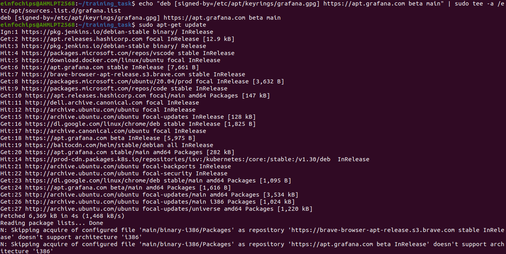
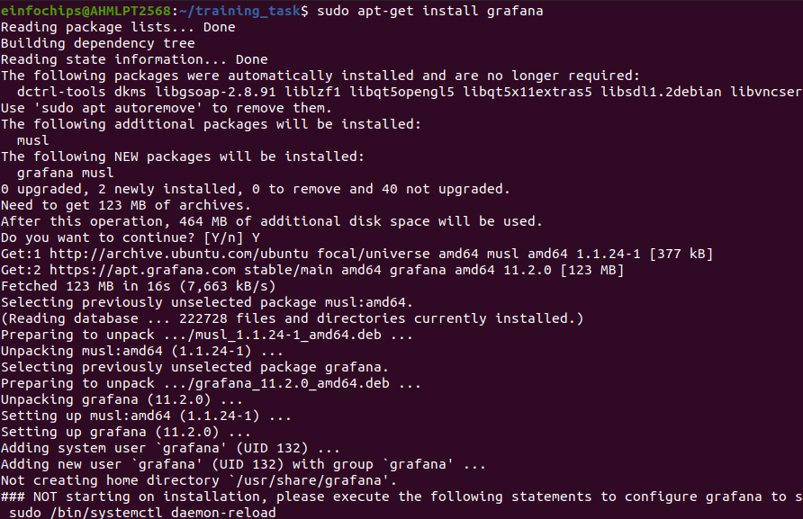
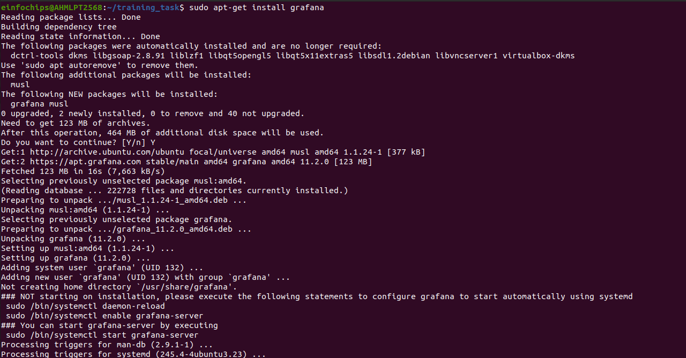
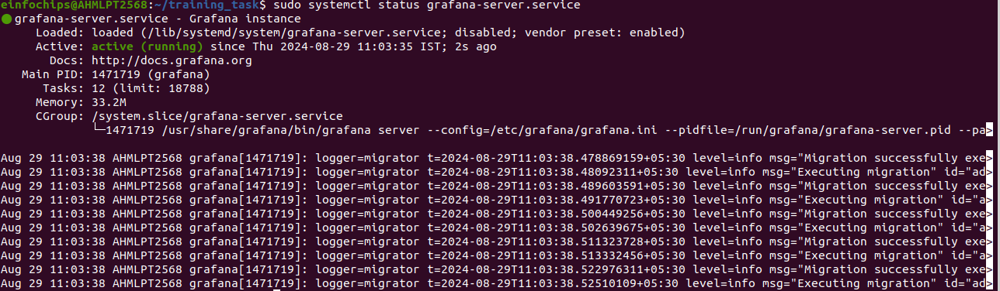
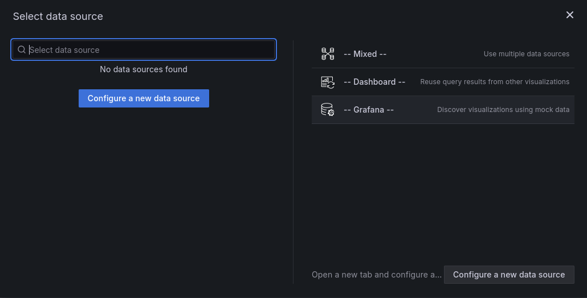
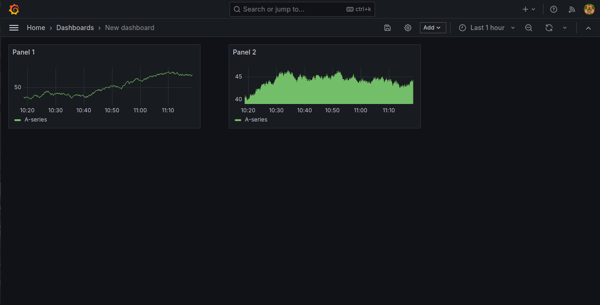

# TASK 1- Installation of Grafana

### Step :1 

+ Install the prerequisite packages:

+ (Prerequisite packages are software components or dependencies that are required for the installation or execution of a primary package, application, or software)

```sh
sudo apt-get install -y apt-transport-https software-properties-common wget
```

+ Import the GPG key:

(Based on the provided search results, a GPG (GNU Privacy Guard) key is a cryptographic key used for encryption, decryption, signing, and verification of data and communications.)

```sh
sudo mkdir -p /etc/apt/keyrings/

wget -q -O - https://apt.grafana.com/gpg.key | gpg --dearmor | sudo tee /etc/apt/keyrings/grafana.gpg > /dev/null
```



+ To add a repository for stable releases, run the following command:

```sh
echo "deb [signed-by=/etc/apt/keyrings/grafana.gpg] https://apt.grafana.com stable main" | sudo tee -a /etc/apt/sources.list.d/grafana.list
```

+ Run the following command to update the list of available packages:

```sh
sudo apt-get update
```

+ To install Grafana OSS, run the following command:

```sh
# Installs the latest OSS release:

sudo apt-get install grafana
```



+ To install Grafana Enterprise, run the following command:

```sh
sudo apt-get install grafana-enterprise
```




+ Verify installation 

```sh
grafana-cli --version
```


+ Now once it get installed start the server using

```sh
sudo systemctl start grafana-server.service
```

+ And Then verify using 

```sh
sudo systemctl status grafana-server.service
```




+ Then redirect to http://localhost:3000/login to see running grafana and login using admin credentials

+ Then we will create a sample dashboard 


+ Then next step is to selection of dataset



+ And a demo dashboard will look like

