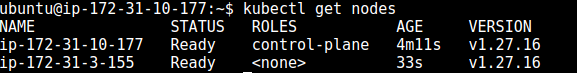

# TASK 1- Installation of Grafana

### Step :1 

+ Install the prerequisite packages:

+ (Prerequisite packages are software components or dependencies that are required for the installation or execution of a primary package, application, or software)

```sh
sudo apt-get install -y apt-transport-https software-properties-common wget
```

+ Import the GPG key:

(Based on the provided search results, a GPG (GNU Privacy Guard) key is a cryptographic key used for encryption, decryption, signing, and verification of data and communications.)

```sh
sudo mkdir -p /etc/apt/keyrings/

wget -q -O - https://apt.grafana.com/gpg.key | gpg --dearmor | sudo tee /etc/apt/keyrings/grafana.gpg > /dev/null
```


+ To add a repository for stable releases, run the following command:

```sh
echo "deb [signed-by=/etc/apt/keyrings/grafana.gpg] https://apt.grafana.com stable main" | sudo tee -a /etc/apt/sources.list.d/grafana.list
```

+ Run the following command to update the list of available packages:

```sh
sudo apt-get update
```

+ To install Grafana OSS, run the following command:

```sh
# Installs the latest OSS release:

sudo apt-get install grafana
```


+ To install Grafana Enterprise, run the following command:

```sh
sudo apt-get install grafana-enterprise
```


+ Verify installation 

```sh
grafana-cli --version
```


+ Now once it get installed start the server using

```sh
sudo systemctl start grafana-server.service
```

+ And Then verify using 

```sh
sudo systemctl status grafana-server.service
```


+ Then redirect to http://localhost:3000/login to see running grafana and login using admin credentials

+ Then we will create a sample dashboard 


+ Then next step is to selection of dataset


+ And a demo dashboard will look like


<hr>

# Task 2 : Connection of worker node with master using kubeadm


# Kubernetes Cluster Setup

This guide outlines the steps to set up a Kubernetes cluster using containerd as the container runtime and Calico for networking. Follow these instructions on both the Control Plane node and Worker nodes.

## Prerequisites

- Ubuntu 20.04 or later
- Access to all nodes (Control Plane and Worker nodes)
- Root or sudo access on all nodes

## 1. Install Packages on All Nodes

### Log in to Each Node

1. **Control Plane Node**

    ```sh
    ssh user@control-plane-node
    ```

2. **Worker Nodes**

    ```sh
    ssh user@worker-node-1
    ssh user@worker-node-2
    ```

### Configure Containerd

1. **Create Configuration File:**

    ```sh
    cat <<EOF | sudo tee /etc/modules-load.d/containerd.conf
    overlay
    br_netfilter
    EOF
    ```

2. **Load Modules:**

    ```sh
    sudo modprobe overlay
    sudo modprobe br_netfilter
    ```

3. **Set System Configurations:**

    ```sh
    cat <<EOF | sudo tee /etc/sysctl.d/99-kubernetes-cri.conf
    net.bridge.bridge-nf-call-iptables = 1
    net.ipv4.ip_forward = 1
    net.bridge.bridge-nf-call-ip6tables = 1
    EOF
    sudo sysctl --system
    ```

4. **Install containerd:**

    ```sh
    sudo apt-get update && sudo apt-get install -y containerd.io
    ```

5. **Create and Generate Default Configuration:**

    ```sh
    sudo mkdir -p /etc/containerd
    sudo containerd config default | sudo tee /etc/containerd/config.toml
    sudo systemctl restart containerd
    ```

6. **Verify containerd is Running:**

    ```sh
    sudo systemctl status containerd
    ```

7. **Disable Swap:**

    ```sh
    sudo swapoff -a
    ```

8. **Install Dependency Packages:**

    ```sh
    sudo apt-get update && sudo apt-get install -y apt-transport-https curl
    ```

9. **Add Kubernetes GPG Key and Repository:**

    ```sh
    curl -fsSL https://pkgs.k8s.io/core:/stable:/v1.27/deb/Release.key | sudo gpg --dearmor -o /etc/apt/keyrings/kubernetes-apt-keyring.gpg
    cat <<EOF | sudo tee /etc/apt/sources.list.d/kubernetes.list
    deb [signed-by=/etc/apt/keyrings/kubernetes-apt-keyring.gpg] https://pkgs.k8s.io/core:/stable:/v1.27/deb/ /
    EOF
    sudo apt-get update
    ```

10. **Install Kubernetes Packages:**

    ```sh
    sudo apt-get install -y kubelet kubeadm kubectl
    sudo apt-mark hold kubelet kubeadm kubectl
    ```

## 2. Initialize the Cluster on the Control Plane Node

1. **Initialize Kubernetes:**

    ```sh
    sudo kubeadm init --pod-network-cidr 192.168.0.0/16 --kubernetes-version 1.27.11
    ```

2. **Set kubectl Access:**

    ```sh
    mkdir -p $HOME/.kube
    sudo cp -i /etc/kubernetes/admin.conf $HOME/.kube/config
    sudo chown $(id -u):$(id -g) $HOME/.kube/config
    ```

3. **Test Access:**

    ```sh
    kubectl get nodes
    ```

## 3. Install the Calico Network Add-On

1. **Apply Calico Manifest:**

    ```sh
    kubectl apply -f https://raw.githubusercontent.com/projectcalico/calico/v3.25.0/manifests/calico.yaml
    ```

2. **Check Node Status:**

    ```sh
    kubectl get nodes
    ```

## 4. Join Worker Nodes to the Cluster

1. **Create Join Command on Control Plane Node:**

    ```sh
    kubeadm token create --print-join-command
    ```

2. **Run Join Command on Each Worker Node:**

    ```sh
    sudo kubeadm join <control-plane-endpoint>
    ```

3. **Verify Cluster Status on Control Plane Node:**

    ```sh
    kubectl get nodes
    ```

    Note: It may take a few moments for all nodes to become ready.
---



