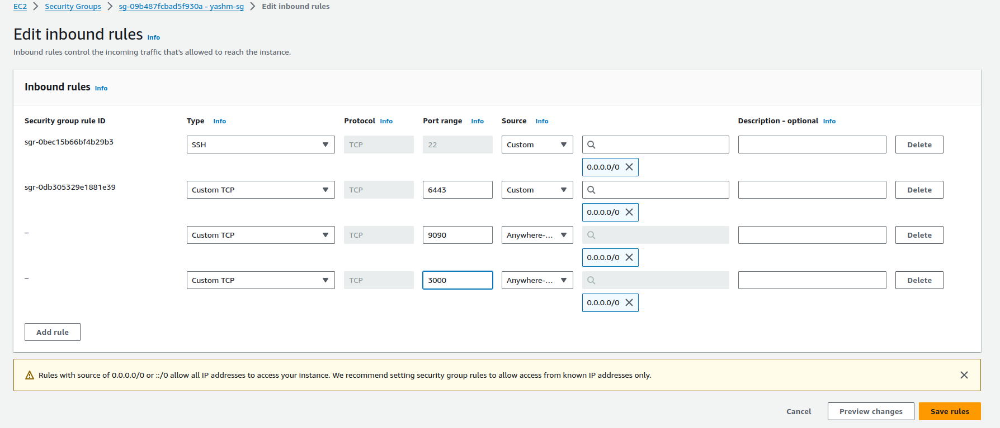
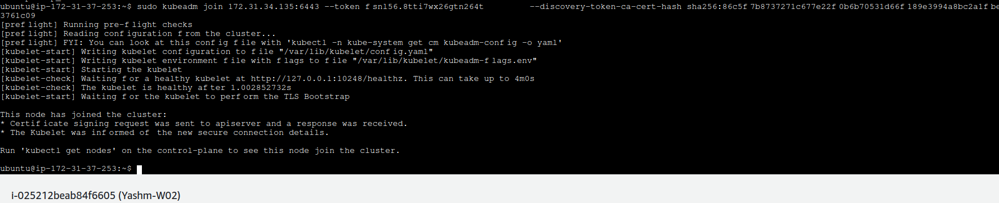
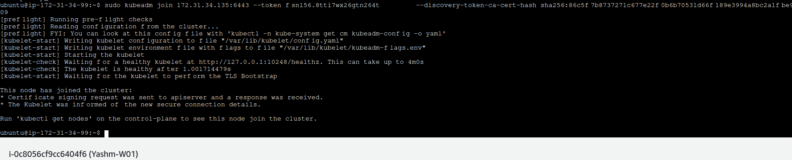
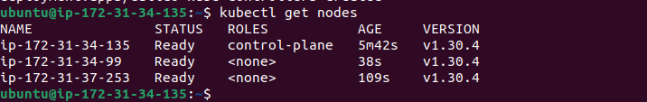
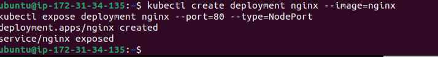
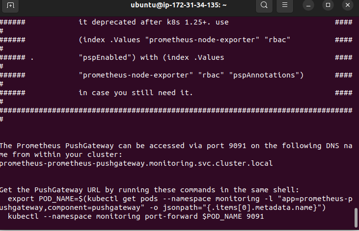
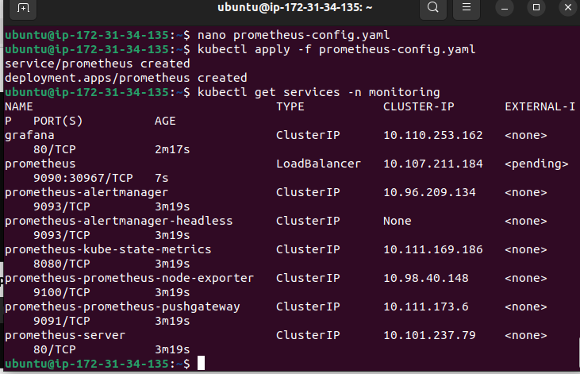
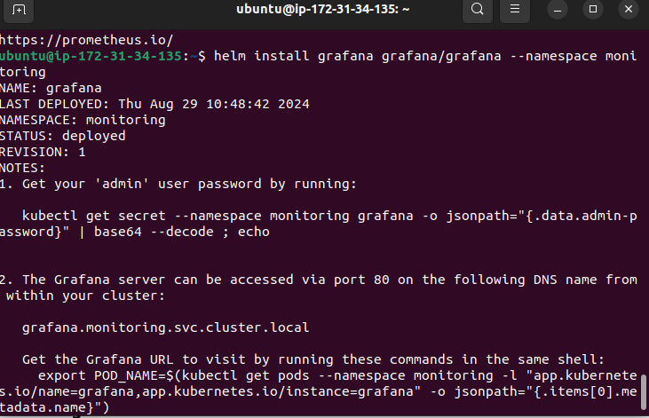
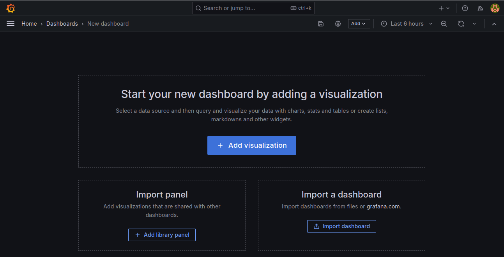
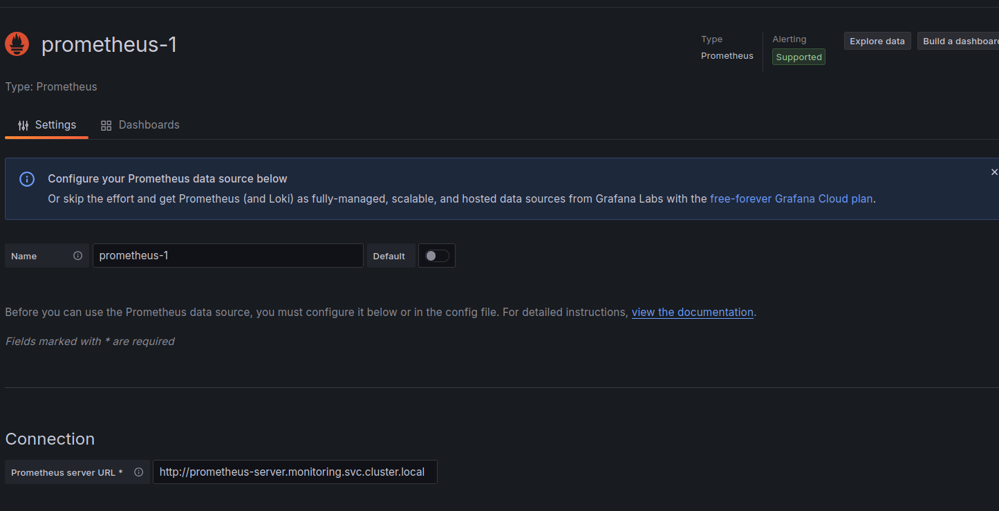

## 1. Launch AWS EC2 Instances

## *i)  Launch Instances*

1. **Log into AWS Management Console**.

2. **Navigate to EC2 Dashboard**.

3. **Click “Launch Instance”**.

4. **Choose Amazon Machine Image (AMI)**:
   - Select an Ubuntu Server 20.04 LTS AMI or another preferred version.

5. **Choose Instance Type**:
   
   - Select `t2.micro` (eligible for free tier).

6. **Configure Instance**:
   
   - Set number of instances to `3`.
   
   - Ensure instances are in the same VPC and availability zone.

7. **Add Storage**:
   
   - Accept default settings or adjust as needed.

8. **Add Tags**:
   
   - Optional but recommended to tag instances.

9. **Configure Security Group**:
   
   - Create a new security group with the following rules:
   
     - **SSH**: Port 22 (source: your IP or 0.0.0.0/0)
   
     - **Kubernetes API**: Port 6443 (source: custom IP or 0.0.0.0/0 for testing)
   
     - **Prometheus**: Port 9090 (source: 0.0.0.0/0 or specific IP)
   
     - **Grafana**: Port 3000 (source: 0.0.0.0/0 or specific IP)
   
    

10. **Review and Launch**:
   
    - Review your configuration and click “Launch”.
   
    - Select or create a key pair to access the instances.
    
## *ii) Connect to Instances*

1. **Get Public IP Addresses**:

   - From the EC2 Dashboard, note the public IPs of all instances.

2. **SSH into Instances**:

   - Use your key pair to SSH:

    ```bash
    ssh -i "your-key.pem" ubuntu@<public-ip>
    ```

3. **Update Package Manager**:

   ```bash
   sudo apt update && sudo apt upgrade -y
   ```

## **2. Set Up a Kubernetes Cluster**

## *i) Install Dependencies*

1. **Install Docker**:

```bash
sudo apt install docker.io -y

sudo systemctl enable docker

sudo systemctl start docker
```

2. **Install Kubeadm, Kubelet, and Kubectl**:

```bash

sudo apt install -y apt-transport-https ca-certificates curl

curl -s https://packages.cloud.google.com/apt/doc/apt-key.gpg | sudo apt-key add -

echo "deb https://apt.kubernetes.io/ kubernetes-xenial main" | sudo tee /etc/apt/sources.list.d/kubernetes.list

sudo apt update

sudo apt install -y kubelet kubeadm kubectl

sudo apt-mark hold kubelet kubeadm kubectl

```

## *b. Initialize the Kubernetes Cluster (Master Node)*

1. **Initialize the Cluster**:

```bash
sudo kubeadm init --pod-network-cidr=10.244.0.0/16
```

2. **Set Up Kubernetes Configuration for kubectl**:

```bash
mkdir -p $HOME/.kube
sudo cp -i /etc/kubernetes/admin.conf $HOME/.kube/config
sudo chown $(id -u):$(id -g) $HOME/.kube/config
```

3. **Install a Pod Network Addon** (Flannel):
   
```bash
kubectl apply -f https://raw.githubusercontent.com/coreos/flannel/master/Documentation/kube-flannel.yml
```

## *iii) Join Worker Nodes*

1. **On Each Worker Node**:

- Execute the join command from the output of `kubeadm init` on the master node.
 
> Worker node 1:



> Worker node 2:



 
 2. **Verify Cluster Status**:

```bash
kubectl get nodes
```


3. **Deploy a Sample Application**:
   
```bash
kubectl create deployment nginx --image=nginx
kubectl expose deployment nginx --port=80 --type=NodePort
```

> On Master node



## **3. Deploy Prometheus on Kubernetes**

## *i). Create Namespace*

```bash
kubectl create namespace monitoring
```

## *b. Deploy Prometheus*

1. **Using Helm** (if Helm is installed):

### Install Helm:
     
```bash
curl https://raw.githubusercontent.com/helm/helm/main/scripts/get-helm-3 
```
   
### Add Prometheus Helm Repository:

```bash
helm repo add prometheus-community https://prometheus-community.github.io/helm-charts

helm repo update
```
    
+ Install Prometheus:
    
```bash
helm install prometheus prometheus-community/prometheus --namespace monitoring
```



<br>

2. **Manually Using Kubernetes Manifests**:
   
+  **Create Prometheus Configurations** 

```yml
apiVersion: v1
kind: Service
metadata:
name: prometheus
namespace: monitoring
spec:
ports:
- port: 9090
    targetPort: 9090
selector:
    app: prometheus
type: LoadBalancer
---
apiVersion: apps/v1
kind: Deployment
metadata:
name: prometheus
namespace: monitoring
spec:
replicas: 1
selector:
    matchLabels:
    app: prometheus
template:
    metadata:
    labels:
        app: prometheus
    spec:
    containers:
    - name: prometheus
        image: prom/prometheus
        args:
        - --config.file=/etc/prometheus/prometheus.yml
        - --storage.tsdb.path=/prometheus
        - --web.console.libraries=/usr/share/prometheus/console_libraries
        - --web.console.templates=/usr/share/prometheus/consoles
        ports:
        - name: web
        containerPort: 9090
        volumeMounts:
        - name: config-volume
        mountPath: /etc/prometheus
        - name: storage-volume
        mountPath: /prometheus
    volumes:
    - name: config-volume
        configMap:
        name: prometheus-config
    - name: storage-volume
        emptyDir: {}
```

+ **Apply Configurations**:
```bash
kubectl apply -f prometheus-config.yaml
```

## *iii) Verify Prometheus*

1. **Check Prometheus Service**:

```bash
kubectl get services -n monitoring
```

   
2. **Access Prometheus**:

+ Use port-forwarding for local access:
     
```bash
kubectl port-forward svc/prometheus -n monitoring 9090:9090
```
+ Open `http://localhost:9090` in your browser.

## **4. Deploy Grafana on Kubernetes**

## *i) Deploy Grafana*

1. **Using Helm**:

+ **Install Grafana**:
     
```bash
helm install grafana grafana/grafana --namespace monitoring
```




```bash

helm install grafana grafana/grafana \
    --namespace monitoring \
    --create-namespace \
    --set service.type=NodePort \
    --set service.nodePort=30000

```
  
## *ii) Configure Grafana*

1. **Access Grafana**:

+ Use port-forwarding for local access:

```bash
kubectl port-forward svc/grafana -n monitoring 3000:3000
```
+ Open `http://localhost:3000` in your browser.

2. **Log In to Grafana**:
 
   - Default username: `admin`
   - Default password: `admin`



3. **Add Prometheus as a Data Source**:
   - Go to **Configuration** > **Data Sources** > **Add data source**.
   - Select **Prometheus** and set the URL to `http://prometheus.monitoring.svc.cluster.local:9090`.
   
  

## *5. Create and Configure Custom Dashboards*

## *i) Create Dashboards*

1. **Add Panels for Metrics**:

+ Create panels to visualize metrics like CPU usage, memory usage, pod status, etc.
   
+ Use Prometheus queries to populate the panels (e.g., `container_cpu_usage_seconds_total`).

2. **Save Dashboards**:

+ After creating dashboards, click **Save** and name your dashboard.

3. **Share Dashboard URLs**:

+ Use the **Share** option to get URLs or export JSON configurations.


## **6. Clean Up Resources**

### *i) Delete Kubernetes Resources*

1. **Delete Prometheus and Grafana**:

```bash
   helm uninstall prometheus --namespace monitoring
   helm uninstall grafana --namespace monitoring
   kubectl delete namespace monitoring
```

2. **Delete Sample Application**:

```bash
   kubectl delete deployment nginx
   kubectl delete service nginx
```

## *ii) Terminate EC2 Instances*

1. **Go to EC2 Dashboard**.

2. **Select Instances**:

+ Select all instances you launched for the project.

3. **Terminate Instances**:

+ Click **Actions** > **Instance State** > **Terminate**.

### *iii) Clean Up Security Groups and Other Resources*

1. **Delete Security Groups**:

+ Go to **Security Groups** and delete the ones created for the project (if not in use by other resources).

2. **Check for Other Resources**:

+ Ensure no leftover resources (e.g., EBS volumes, snapshots).

