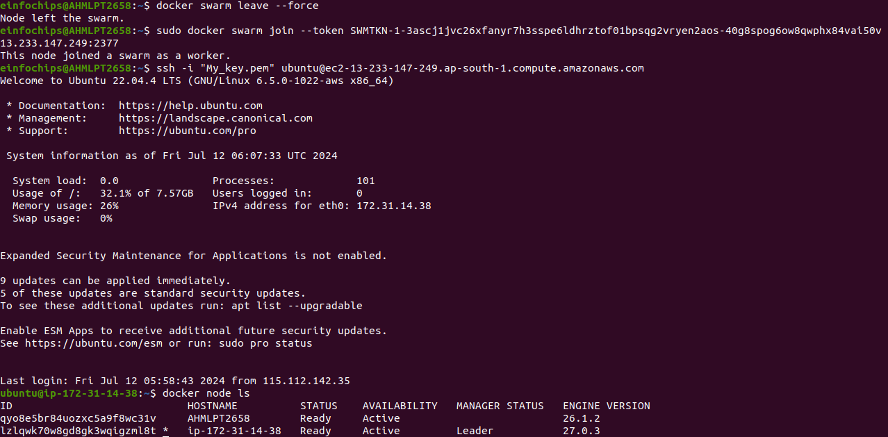
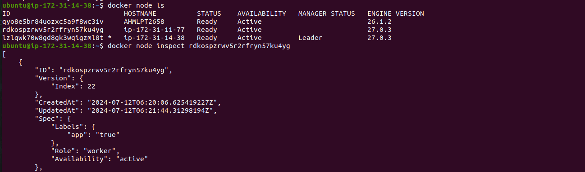

## Docker Swarm

##### Docker Swarm is a container orchestration tool that allows you to manage a cluster of Docker nodes as a single logical system. It provides several benefits, such as scalability, high availability, load balancing, and simplified deployment. Here are some use cases and examples of how Docker Swarm can be utilized:

### 1. High Availability Web Application

#### Use Case: Deploying a web application that requires high availability and redundancy.

### Example:

+ Create a Swarm cluster with multiple manager and worker nodes.
+ Deploy a replicated service for the web application.
+ Docker Swarm ensures that if one node fails, another node takes over, maintaining the application's availability.


### Steps:

+ Initialize Swarm

```bash
docker swarm init --advertise-addr <MANAGER-IP>
```

+ Add Worker Nodes: On each worker node

```bash
docker swarm join --token <WORKER-TOKEN> <MANAGER-IP>:2377
```

+ Deploy a Web Application:

```bash
docker service create --name webapp --replicas 3 -p 80:80 nginx
```

+ Check Service Status:

```bash
docker service ls
```

### 2.Continuous Integration/Continuous Deployment (CI/CD) Pipeline

#### Use Case: Automating the deployment of applications with a CI/CD pipeline.

### Example:

+ Use Docker Swarm to deploy applications automatically when new code is committed.
+ Integrate with CI/CD tools like Jenkins, GitLab CI, or GitHub Actions.

### Steps:

+ Initialize Swarm and Deploy Jenkins:

```bash
docker swarm init
docker service create --name jenkins --replicas 1 -p 8080:8080 jenkins/jenkins
```

+ Configure Jenkins to Deploy to Swarm:

  + Set up Jenkins with necessary plugins for Docker and Docker Swarm.

  + Create a Jenkins pipeline that builds Docker images and deploys them to the Swarm cluster.

+ Automate Deployment:

  +  Configure Jenkins to trigger builds and deployments on code changes.


### 3. Load Balancing and Scaling Services

#### Use Case: Distributing traffic across multiple instances of a service for load balancing and scaling.

#### Example:

+ Deploy a service with multiple replicas.
+ Docker Swarm automatically load balances requests across these replicas.

### Steps:

+ Initialize Swarm:

```bash
docker swarm init
```

+ Deploy a Service with Load Balancing:

```bash
docker service create --name myservice --replicas 5 -p 8080:80 nginx
```

+ Scale the Service:

```bash
docker service scale myservice=10
```

### 4. Microservices Architecture

#### Use Case: Deploying a microservices-based application with multiple interdependent services.

### Example:

+ Use Docker Swarm to manage the deployment and scaling of each microservice.

+ Ensure communication between services through the Swarm network.


### Steps:

+ Initialize Swarm:

```bash
docker swarm init
```

+ Deploy Microservices:

```bash
docker service create --name service1 --replicas 3 -p 5000:5000 my_microservice1
docker service create --name service2 --replicas 2 -p 5001:5001 my_microservice2
```

+ Ensure Services Communicate:

  + Use Docker Swarm's service discovery to enable communication between services using their service names.

### Docker Logs
+ To view the logs of a container, you can use the following command:

```bash
docker logs <container_name_or_id>
```

# Project 01

### Objectives:

+ Create and manage Docker volumes for data persistence.
+ Set up a Docker network for container communication.
+ Use Docker Compose to manage multi-container applications.
+ View and manage Docker logs.
+ Deploy the application using Docker Swarm.

### Project Outline:

1. Create Docker Volumes
2. Create a Docker Network
3. Write a Docker Compose File
4. Deploy the Application with Docker Compose
5. Manage Docker Logs
6. Deploy the Application Using Docker Swarm


### Step 1: Create Docker Volumes

+ Docker volumes are used to persist data generated by and used by Docker containers.

```bash
docker volume create wordpress_data
```
```bash
docker volume create mysql_data
```

### Step 2: Create a Docker Network

+ Create a custom network for the containers to communicate.

```bash
docker network create wordpress_network
```

### Step 3: Write a Docker Compose File

+ Create a docker-compose.yml file to define and manage the services


```yml
version: '3.3'

services:
  db:
    image: mysql:5.7
    volumes:
      - mysql_data:/var/lib/mysql
    networks:
      - wordpress_network
    environment:
      MYSQL_ROOT_PASSWORD: example
      MYSQL_DATABASE: wordpress
      MYSQL_USER: wordpress
      MYSQL_PASSWORD: wordpress

  wordpress:
    image: wordpress:latest
    volumes:
      - wordpress_data:/var/www/html
    networks:
      - wordpress_network
    ports:
      - "8000:80"
    environment:
      WORDPRESS_DB_HOST: db:3306
      WORDPRESS_DB_USER: wordpress
      WORDPRESS_DB_PASSWORD: wordpress
      WORDPRESS_DB_NAME: wordpress

volumes:
  mysql_data:
  wordpress_data:

networks:
  wordpress_network:
```


### Step 4: Deploy the Application with Docker Compose

+ Run the following command to start the services defined in the docker-compose.yml file.

```bash
docker-compose up -d
```

+Verify that the containers are running.
```bash
docker-compose ps
```

+ Access the WordPress setup by navigating to http://localhost:8000.


## Output


---


### Step 5: Manage Docker Logs

+ View logs for a specific service.

```bash
docker-compose logs wordpress
```

+ Follow logs for real-time updates.
```bash
docker-compose logs -f wordpress
```


### Step 6:Deploy the Application Using Docker Swarm

+ Docker Swarm is a native clustering and orchestration tool for Docker.

   + Initialize Docker Swarm.

```bash
docker swarm init
```

+ Convert the Docker Compose file to a Docker Stack file, docker-stack.yml.

```yml
version: '3.3'

services:
  db:
    image: mysql:5.7
    volumes:
      - mysql_data:/var/lib/mysql
    networks:
      - wordpress_network
    environment:
      MYSQL_ROOT_PASSWORD: example
      MYSQL_DATABASE: wordpress
      MYSQL_USER: wordpress
      MYSQL_PASSWORD: wordpress
    deploy:
      replicas: 1

  wordpress:
    image: wordpress:latest
    volumes:
      - wordpress_data:/var/www/html
    networks:
      - wordpress_network
    ports:
      - "8000:80"
    environment:
      WORDPRESS_DB_HOST: db:3306
      WORDPRESS_DB_USER: wordpress
      WORDPRESS_DB_PASSWORD: wordpress
      WORDPRESS_DB_NAME: wordpress
    deploy:
      replicas: 1

volumes:
  mysql_data:
  wordpress_data:

networks:
  wordpress_network:
```

+ Deploy the stack using Docker Swarm.

```bash
docker stack deploy -c docker-stack.yml wordpress_stack
```

+ Verify the stack is running.

```bash
docker stack services wordpress_stack
```

## Output


####
####

# Project 02

### Objectives:
+ Deploy an application across multiple Docker Swarm worker nodes.

+ Place specific components on designated nodes.

+ Monitor and troubleshoot using Docker logs.

+ Modify and redeploy the application.

### Project Outline:

1. Initialize Docker Swarm and Join Worker Nodes
2. Label Nodes for Specific Component Placement
3. Create a Docker Stack File
4. Deploy the Application
5. Monitor and Troubleshoot Using Docker Logs
6. Modify and Redeploy the Application


### Step 1: Initialize Docker Swarm and Join Worker Nodes

+ On the manager node, initialize Docker Swarm:

```bash
docker swarm init --advertise-addr <MANAGER-IP>
```


+ Join the worker nodes to the swarm. On each worker node, run the command provided by the 

```bash
docker swarm init
```

+ output:

```bash
docker swarm join --token <SWARM-TOKEN> <MANAGER-IP>:2377
```

+ Verify the nodes have joined:
```bash
docker node ls
```

## Output



---


### Step 2: . Label Nodes for Specific Component Placement

+ Label nodes to specify where certain components should run. For example, label a node for the database service:

```bash
docker node update --label-add db=true <NODE-ID>
```

+ Label another node for the application service:

```bash
docker node update --label-add app=true <NODE-ID>
```


+ Verify the labels:

```bash
docker node inspect <NODE-ID>
```

## Output



---

### Step 3: Create a Docker Stack File

+ Create a docker-stack.yml file to define the services and node placement constraints:


```yml
version: '3.8'

services:
  db:
    image: mysql:5.7
    volumes:
      - mysql_data:/var/lib/mysql
    networks:
      - app_network
    environment:
      MYSQL_ROOT_PASSWORD: example
      MYSQL_DATABASE: appdb
      MYSQL_USER: user
      MYSQL_PASSWORD: password
    deploy:
      placement:
        constraints:
          - node.labels.db == true

  app:
    image: your-app-image
    networks:
      - app_network
    ports:
      - "8000:80"
    environment:
      DB_HOST: db
    deploy:
      replicas: 2
      placement:
        constraints:
          - node.labels.app == true
volumes:
  mysql_data:
networks:
  app_network:
```

### Step 4 Deploy the Application

+ Deploy the stack using Docker Swarm:


```bash
docker stack deploy -c docker-stack.yml app_stack

docker stack services app_stack
```


## Output


---

### Step 5: Monitor and Troubleshoot Using Docker Logs

+ Check the logs for the services:
```bash
docker service logs app_stack_db
docker service logs app_stack_app
```


### Step 6: Modify and Redeploy the Application

+ Make modifications to the application or the stack file as needed. For example, change the number of replicas:
```yml
services:
  app:
    deploy:
      replicas: 3
```

+ Update the stack with the new configuration:
```bash
docker stack deploy -c docker-stack.yml app_stack
```
+ Verify the changes:
```bash
docker stack services app_stack
```

## Output


---


#### Note: Here for worker and master node performance i have used two ec2 instance as worker and my local machine as masters


