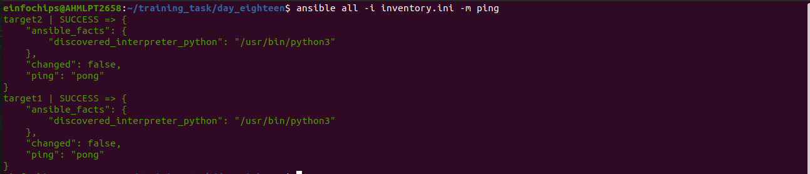

# Project 2


#### Objective: 

+ ***Automate the setup of a multi-tier web application stack with separate database and application servers using Ansible.***

### Problem Statement

### Objective: 

***Automate the deployment and configuration of a multi-tier web application stack consisting of:***

1. Database Server: Set up a MySQL database server on one Ubuntu instance.

2. Application Server: Set up a web server (e.g., Apache or Nginx) on another Ubuntu instance to host a web application.

3. Application Deployment: Ensure the web application is deployed on the application server and is configured to connect to the PostgreSQL database on the database server.

4. Configuration Management: Use Ansible to automate the configuration of both servers, including the initialization of the database and the deployment of the web application.

### Deliverables

1. Ansible Inventory File
        
    + Filename: inventory.ini
        
    + Content: Defines the database server and application server instances, including their IP addresses and connection details.

```ini
[dbserver]
target1 ansible_host=43.20X.1XX.X5 ansible_user=ubuntu ansible_ssh_private_key_file=/home/einfochips/.ssh/My_key.pem

[apserver]
target2 ansible_host=35.X5X.2XX.1X ansible_user=ubuntu ansible_ssh_private_key_file=/home/einfochips/.ssh/My_key.pem
```
+ To verify we will ping both the server using following ad-hoc command 

```sh
ansible all -i inventory.ini -m ping
```

+ where 
    
    + -i used to define inventory file 
    
    + -m used to define module here it is ping module

<br>



<br>

2. Ansible Playbook
    
    + Filename: deploy_multitier_stack.yml
    
    + Content: Automates:

        + The deployment and configuration of the MySQL database server.
        
        + The setup and configuration of the web server.
        
        + The deployment of the web application and its configuration to connect to the database.

3. Jinja2 Template

    + Filename: templates/app_config.php.j2
    
    + Content: Defines a configuration file for the web application that includes placeholders for dynamic values such as database connection details.

4. Application Files
    
    + Filename: files/index.html (or equivalent application files)
    
    + Content: Static or basic dynamic content served by the web application.
