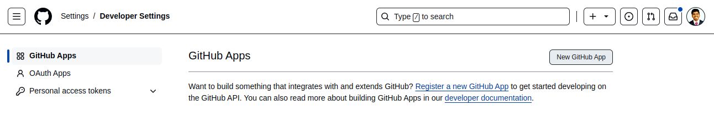
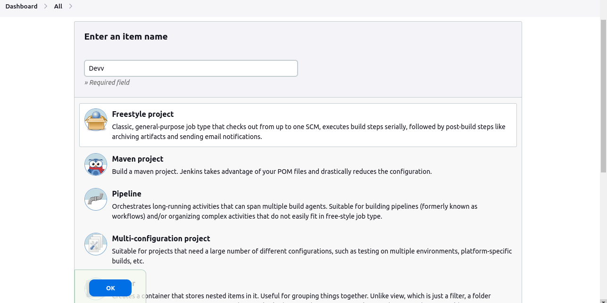
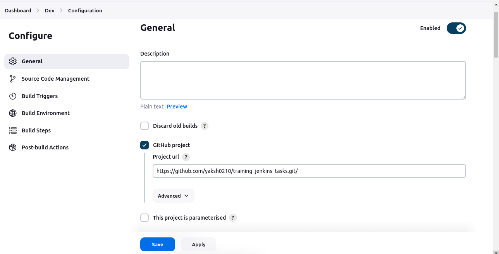
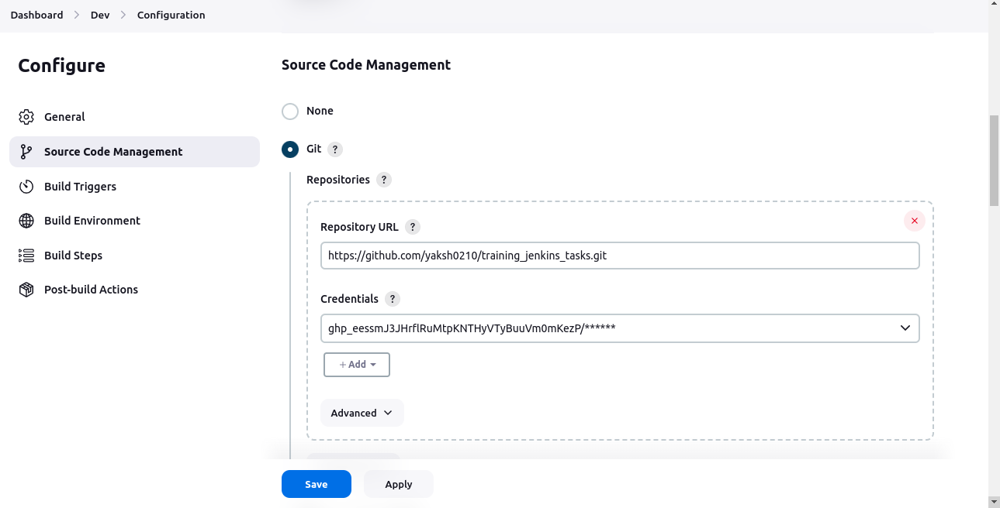
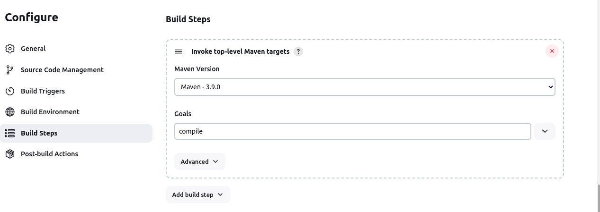
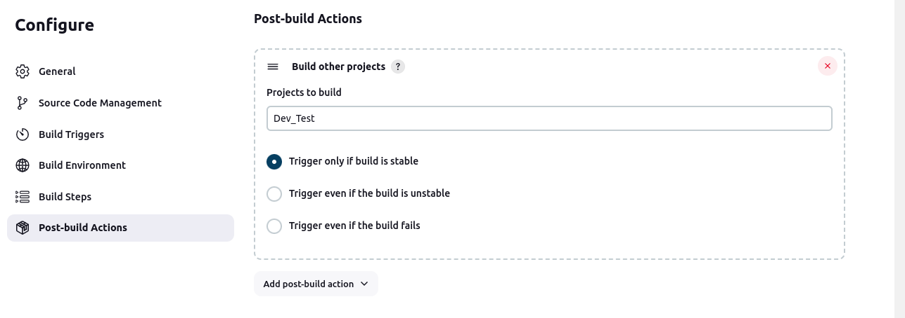
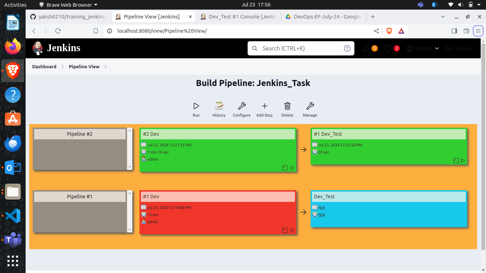

# Tasks:

 

## Task 1:

### Objective:

+ ***Perform a task where you need to Clone a Repo having maven project which you have to run from your private git repository in CI/CD Jenkins pipeline using freestyle method and also perform post build task too***

+ #### ***make one build view as well to see process in graphical way***

 

+ Clone a repository from a given URL :
https://github.com/nkheria/DevOpsClassCodes

+ After cloning a repository first you need to take a necessary repo data and make a copy of that data in your own private folder

+ Then you need to make one private repo and push all the data which you have copied from the cloned repo

+ Now first you need go to github settings and at the bottom left corner you will see a developer setting and you have to visit that 

+ then you have to generate classic tokens from personal access token key

+ Then copy the generated key and save it for future refrence 

+ Run your jenkins on https://localhost:8080 

+ Sign-in into your account and create one free style project name "Dev"

+ After configure the dev file step wise 

#### Step 1: Put your github project url in by selecting github project first 

#### Step 2: Then choose git on source code part and also put the copied credentials over there 

#### Step 3: Then make choice of branch on which you are going to perform your CI/CD operation

#### Step 4: Then chose Maven as we have a project in maven so it should be maven in build steps and put "compile" in Goal section

#### Step 5: Do the same steps and make  another file name "Test" but at the Build steps in Maven here define "test" in Goal section

----

#### Step 6: Now go to Dev file again and select Post build section build another file and select "Test" over there 

 

+ Which means if Dev run stable then it will run Test after it in pipeline style 

+ now go to manage jenkins section and install plugin name "build pipeline" which will give graphical interface to your running pipeline process

+ after that create new view and choose build pipeline view in that 

+ configure pipeline view according to your suitable choice and select what you want to show in output 

 

