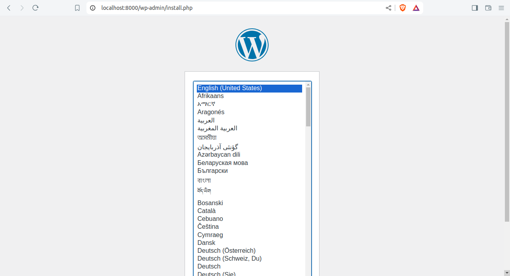
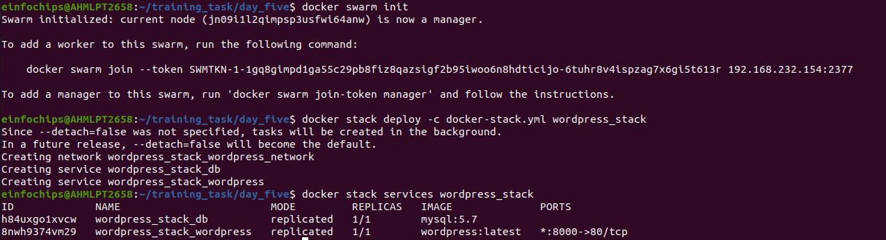
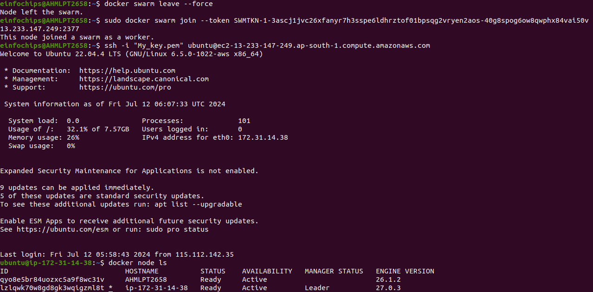
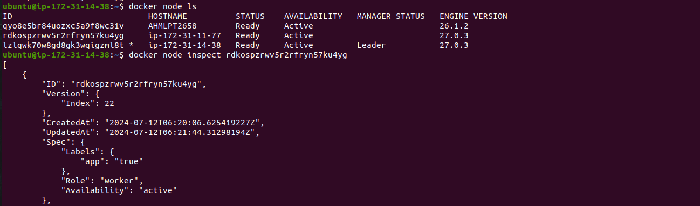

# Project 01

### Objectives:

+ Create and manage Docker volumes for data persistence.
+ Set up a Docker network for container communication.
+ Use Docker Compose to manage multi-container applications.
+ View and manage Docker logs.
+ Deploy the application using Docker Swarm.

### Project Outline:

1. Create Docker Volumes
2. Create a Docker Network
3. Write a Docker Compose File
4. Deploy the Application with Docker Compose
5. Manage Docker Logs
6. Deploy the Application Using Docker Swarm


### Step 1: Create Docker Volumes

+ Docker volumes are used to persist data generated by and used by Docker containers.

```bash
docker volume create wordpress_data
```
```bash
docker volume create mysql_data
```

### Step 2: Create a Docker Network

+ Create a custom network for the containers to communicate.

```bash
docker network create wordpress_network
```

### Step 3: Write a Docker Compose File

+ Create a docker-compose.yml file to define and manage the services


```yml
version: '3.3'

services:
  db:
    image: mysql:5.7
    volumes:
      - mysql_data:/var/lib/mysql
    networks:
      - wordpress_network
    environment:
      MYSQL_ROOT_PASSWORD: example
      MYSQL_DATABASE: wordpress
      MYSQL_USER: wordpress
      MYSQL_PASSWORD: wordpress

  wordpress:
    image: wordpress:latest
    volumes:
      - wordpress_data:/var/www/html
    networks:
      - wordpress_network
    ports:
      - "8000:80"
    environment:
      WORDPRESS_DB_HOST: db:3306
      WORDPRESS_DB_USER: wordpress
      WORDPRESS_DB_PASSWORD: wordpress
      WORDPRESS_DB_NAME: wordpress

volumes:
  mysql_data:
  wordpress_data:

networks:
  wordpress_network:
```


### Step 4: Deploy the Application with Docker Compose

+ Run the following command to start the services defined in the docker-compose.yml file.

```bash
docker-compose up -d
```

+Verify that the containers are running.
```bash
docker-compose ps
```

+ Access the WordPress setup by navigating to http://localhost:8000.


## Output



---


### Step 5: Manage Docker Logs

+ View logs for a specific service.

```bash
docker-compose logs wordpress
```

+ Follow logs for real-time updates.
```bash
docker-compose logs -f wordpress
```


### Step 6:Deploy the Application Using Docker Swarm

+ Docker Swarm is a native clustering and orchestration tool for Docker.

   + Initialize Docker Swarm.

```bash
docker swarm init
```

+ Convert the Docker Compose file to a Docker Stack file, docker-stack.yml.

```yml
version: '3.3'

services:
  db:
    image: mysql:5.7
    volumes:
      - mysql_data:/var/lib/mysql
    networks:
      - wordpress_network
    environment:
      MYSQL_ROOT_PASSWORD: example
      MYSQL_DATABASE: wordpress
      MYSQL_USER: wordpress
      MYSQL_PASSWORD: wordpress
    deploy:
      replicas: 1

  wordpress:
    image: wordpress:latest
    volumes:
      - wordpress_data:/var/www/html
    networks:
      - wordpress_network
    ports:
      - "8000:80"
    environment:
      WORDPRESS_DB_HOST: db:3306
      WORDPRESS_DB_USER: wordpress
      WORDPRESS_DB_PASSWORD: wordpress
      WORDPRESS_DB_NAME: wordpress
    deploy:
      replicas: 1

volumes:
  mysql_data:
  wordpress_data:

networks:
  wordpress_network:
```

+ Deploy the stack using Docker Swarm.

```bash
docker stack deploy -c docker-stack.yml wordpress_stack
```

+ Verify the stack is running.

```bash
docker stack services wordpress_stack
```

## Output




####
####

# Project 02

### Objectives:
+ Deploy an application across multiple Docker Swarm worker nodes.

+ Place specific components on designated nodes.

+ Monitor and troubleshoot using Docker logs.

+ Modify and redeploy the application.

### Project Outline:

1. Initialize Docker Swarm and Join Worker Nodes
2. Label Nodes for Specific Component Placement
3. Create a Docker Stack File
4. Deploy the Application
5. Monitor and Troubleshoot Using Docker Logs
6. Modify and Redeploy the Application


### Step 1: Initialize Docker Swarm and Join Worker Nodes

+ On the manager node, initialize Docker Swarm:

```bash
docker swarm init --advertise-addr <MANAGER-IP>
```


+ Join the worker nodes to the swarm. On each worker node, run the command provided by the 

```bash
docker swarm init
```

+ output:

```bash
docker swarm join --token <SWARM-TOKEN> <MANAGER-IP>:2377
```

+ Verify the nodes have joined:
```bash
docker node ls
```

## Output



---


### Step 2: . Label Nodes for Specific Component Placement

+ Label nodes to specify where certain components should run. For example, label a node for the database service:

```bash
docker node update --label-add db=true <NODE-ID>
```

+ Label another node for the application service:

```bash
docker node update --label-add app=true <NODE-ID>
```


+ Verify the labels:

```bash
docker node inspect <NODE-ID>
```

## Output



---

### Step 3: Create a Docker Stack File

+ Create a docker-stack.yml file to define the services and node placement constraints:


```yml
version: '3.8'

services:
  db:
    image: mysql:5.7
    volumes:
      - mysql_data:/var/lib/mysql
    networks:
      - app_network
    environment:
      MYSQL_ROOT_PASSWORD: example
      MYSQL_DATABASE: appdb
      MYSQL_USER: user
      MYSQL_PASSWORD: password
    deploy:
      placement:
        constraints:
          - node.labels.db == true

  app:
    image: your-app-image
    networks:
      - app_network
    ports:
      - "8000:80"
    environment:
      DB_HOST: db
    deploy:
      replicas: 2
      placement:
        constraints:
          - node.labels.app == true
volumes:
  mysql_data:
networks:
  app_network:
```

### Step 4 Deploy the Application

+ Deploy the stack using Docker Swarm:


```bash
docker stack deploy -c docker-stack.yml app_stack

docker stack services app_stack
```


## Output


---

### Step 5: Monitor and Troubleshoot Using Docker Logs

+ Check the logs for the services:
```bash
docker service logs app_stack_db
docker service logs app_stack_app
```


### Step 6: Modify and Redeploy the Application

+ Make modifications to the application or the stack file as needed. For example, change the number of replicas:
```yml
services:
  app:
    deploy:
      replicas: 3
```

+ Update the stack with the new configuration:
```bash
docker stack deploy -c docker-stack.yml app_stack
```
+ Verify the changes:
```bash
docker stack services app_stack
```

## Output


---


#### Note: Here for worker and master node performance i have used two ec2 instance as worker and my local machine as masters


