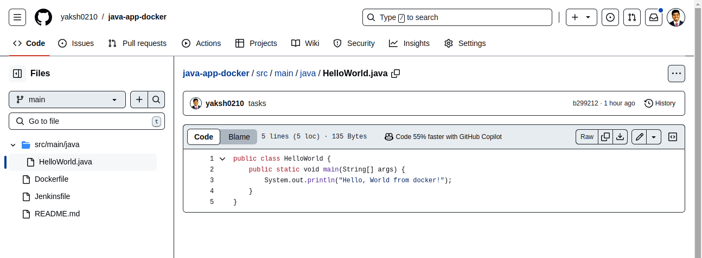
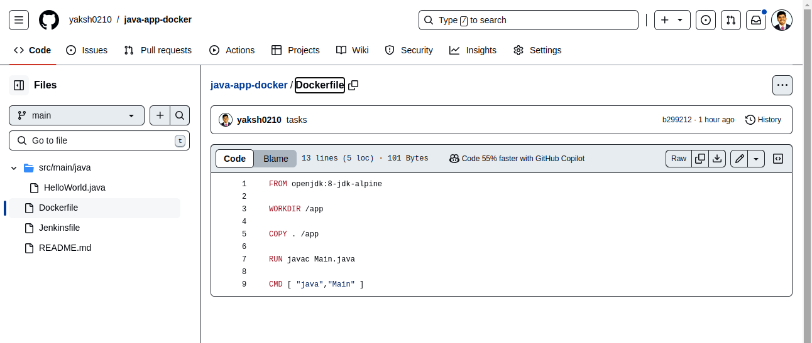
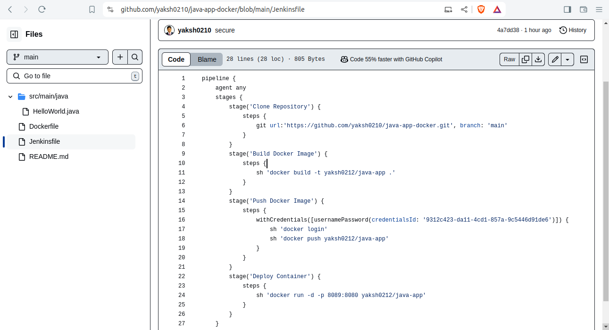

# Project 

## Problem Statement:

***You are tasked with setting up a CI/CD pipeline using Jenkins to streamline the deployment process of a simple Java application. The pipeline should accomplish the following tasks:***

1. ***Fetch the Dockerfile:*** 

    + The pipeline should clone a GitHub repository containing the source code of the Java application and a Dockerfile.

```Dockerfile
FROM openjdk:8-jdk-alpine

WORKDIR /app

COPY . /app

RUN javac Main.java

CMD [ "java","Main" ]
```

2. ***Create a Docker Image:*** 

    + The pipeline should build a Docker image from the fetched Dockerfile.

```s
    sh "docker build -t yaksh0212/java-app ."
```

3. ***Push the Docker Image:*** 

    + The pipeline should push the created Docker image to a specified DockerHub repository.


4. ***Deploy the Container:*** 

    + The pipeline should deploy a container using the pushed Docker image.

```Jenkinsfile
pipeline {
    agent any
    stages {
        stage('Clone Repository') {
            steps {
                git url:'https://github.com/yaksh0210/java-app-docker.git', branch: 'main'
            }
        }
        stage('Build Docker Image') {
            steps {
                sh 'docker build -t yaksh0212/java-app .'
            }
        }
        stage('Push Docker Image') {
            steps {
                withCredentials([usernamePassword(credentialsId: '9312c423-da11-4cd1-857a-9c5446d91de6')]) {
                    sh 'docker login'
                    sh 'docker push yaksh0212/java-app'
                }
            }
        }
        stage('Deploy Container') {
            steps {
                sh 'docker run -d -p 8089:8080 yaksh0212/java-app'
            }
        }
    }
}
```
### Deliverables:

1. ***GitHub Repository: A GitHub repository containing:***


    + The source code of a simple Java application.

    + A Dockerfile for building the Docker image.




<br>



<br>



<br>


2. ***Jenkins Pipeline Script: A Jenkinsfile (pipeline script) that:***

   
   + Clones the GitHub repository.
   
   + Builds the Docker image.
   
   + Pushes the Docker image to DockerHub.
   
   + Deploys a container using the pushed image.

```jenkinsfile
 stage('Build Docker Image') {
            steps {
                sh 'docker build -t yaksh0212/java-app .'
            }
        }
        stage('Push Docker Image') {
            steps {
                withCredentials([usernamePassword(credentialsId: '9312c423-da11-4cd1-857a-9c5446d91de6')]) {
                    sh 'docker login'
                    sh 'docker push yaksh0212/java-app'
                }
            }
```

   
3. ***DockerHub Repository:*** 

    + A DockerHub repository where the Docker images will be stored.***

4. ***Jenkins Setup:***


    + Jenkins installed and configured on a local Ubuntu machine.

    + Required plugins installed (e.g., Git, Docker, Pipeline).


