## Project Overview

+ #### Participants are required to deploy a simple static web application on a Kubernetes cluster using Minikube, set up advanced ingress networking with URL rewriting and sticky sessions, and configure horizontal pod autoscaling to manage traffic efficiently. 

+ #### The project will be divided into stages, with each stage focusing on specific aspects of Kubernetes ingress, URL rewriting, sticky sessions, and autoscaling.


### Requirements and Deliverables

### Stage 1: Setting Up the Kubernetes Cluster and Static Web App

## Step 1: Set Up Minikube:

+ Ensure Minikube is installed and running on the local Ubuntu machine.

#### 1. installation step for minikube

    ```bash 
    sudo apt-get update
    ```
    ```bash    
    sudo apt-get install -y apt-transport-https ca-certificates curl
    ```
#### 2. Add Kubernetes apt repository and key
```bash
curl -fsSL https://pkgs.k8s.io/core:/stable:/v1.30/deb/Release.key | sudo gpg --dearmor -o /etc/apt/keyrings/kubernetes-apt-keyring.gpg
```
```bash
echo 'deb [signed-by=/etc/apt/keyrings/kubernetes-apt-keyring.gpg] https://pkgs.k8s.io/core:/stable:/v1.30/deb/ /' | sudo tee /etc/apt/sources.list.d/kubernetes.list
```

#### 3. Update package lists again

```bash
sudo apt-get update
```

#### 4. Install Kubernetes components

```bash
sudo apt-get install -y kubectl  
```
#### 5. Start minikube

```bash
minikube start
```
## output

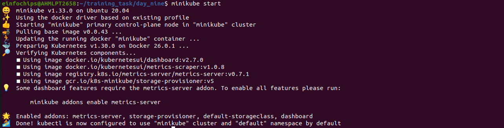

---

#### 6. Verify the Kubernetes cluster is functioning correctly.

```bash
minikube status
```
## Output

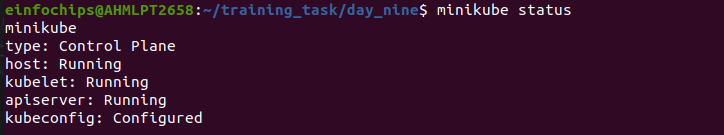

---

## 2. Deploy Static Web App:

+ Create a Dockerfile for a simple static web application (e.g., an HTML page served by Nginx).

+ Before making docker we will create one basic "index.html" file

```html
<!DOCTYPE html>
<html>
  <head>
    <title>My Static Web App</title>
  </head>
  <body>
    <h1>Welcome to my website</h1>
    <p>This is task for day_9</p>
  </body>
</html>
```


+ creating a Dockerfile
```Dockerfile
FROM nginx:alpine

COPY index.html /etc/nginx/html/

EXPOSE 80

CMD ["nginx", "-g", "daemon off;"]
```


+ Build a Docker image for the static web application.

```bash
docker build -t yaksh0212/my-web  .
```

## Output

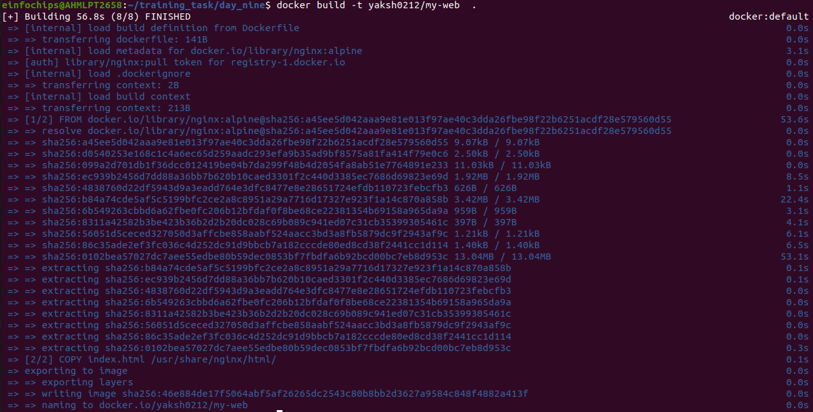


+ Push the Docker image to Docker Hub or a local registry.

## Output

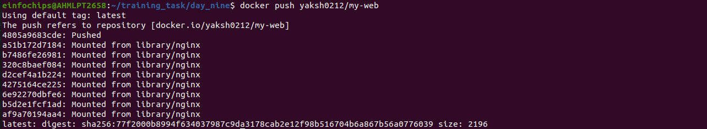


## 3. Kubernetes Deployment:

+ Write a Kubernetes deployment manifest to deploy the static web application.

+ creating a deployment.yml file

```yml
apiVersion: apps/v1
kind: Deployment
metadata:
  name: my-web
spec:
  replicas: 1
  selector:
    matchLabels:
      app: my-web
  template:
    metadata:
      labels:
        app: my-web
    spec:
      containers:
      - name: my-web
        image: yaksh0212/my-web:latest
        ports:
        - containerPort: 80
```

+ Write a Kubernetes service manifest to expose the static web application within the cluster.

+ Creating a "service.yml" file

```yml
apiVersion: v1
kind: Service
metadata:
  name: my-web
spec:
  selector:
    app: my-web
  ports:
  - protocol: TCP
    port: 8080
    targetPort: 80
    nodePort: 30001
  type: NodePort
 
```


+ Apply the deployment and service manifests to the Kubernetes cluster.

```bash
kubectl apply -f deployment.yml
kubectl apply -f service.yml
```

## Output

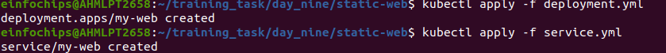

#### Deliverables:

+ Dockerfile for the static web app
+ Docker image URL
+ Kubernetes deployment and service YAML files


## Output

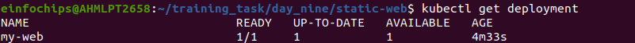

<br>

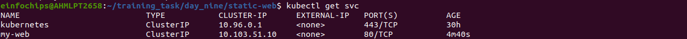


### Stage 2: Configuring Ingress Networking

## 4. Install and Configure Ingress Controller:

+ Install an ingress controller (e.g., Nginx Ingress Controller) in the Minikube cluster.

+ To install the Nginx Ingress Controller, you can use

```bash
minikube addons enable ingress
```

## Output

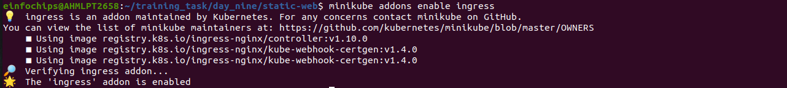

---

+ Verify the ingress controller is running and accessible.

+ To verify that the ingress controller is running and accessible, you can use the following command:

```bash
kubectl get pods -n ingress-nginx
```

## Ouput

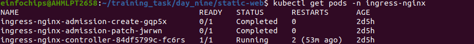

---

## 5. Create Ingress Resource:

+ Write an ingress resource manifest to route external traffic to the static web application.


+ now we will create a ingress-resource.yml file

```yml
apiVersion: networking.k8s.io/v1
kind: Ingress
metadata:
  name: my-web
spec:
  tls:
  - hosts:
    - myweb.local
    secretName: app-secrets
  rules:
  - host: myweb.local
    http:
      paths:
      - path: /
        pathType: Prefix
        backend:
          service:
            name: my-web
            port:
              number: 8080
```

+ Configure advanced ingress rules for path-based routing and host-based routing (use at least two different hostnames and paths).

```bash
sudo nano /etc/hosts
```

+ after redirecting to this path write your custom website name with minikube ip

```bash
192.168.49.2  myweb.local www.myweb.local
```

+ once it create successfully just visit your given name url www.myweb.local to check your output


## Output

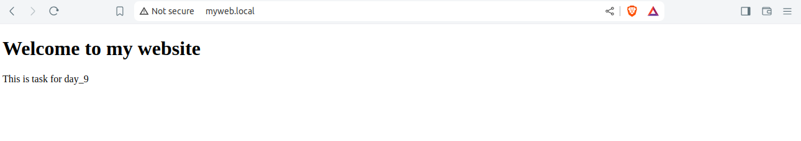

---


+ Implement TLS termination for secure connections.

+ to implement TLS certificate we will create one certificate file 

+ To create a TLS certification perform the following command:


1. Generate RSA Private Key: 

```bash
openssl genpkey -algorithm RSA -out tls.key -pkeyopt rsa_keygen_bits:2048
```

2. Generate Certificate Signing Request (CSR):

```bash
openssl req -new -key tls.key -out tls.csr
```

3. Generate Self-Signed Certificate:

```bash
openssl x509 -req -in tls.csr -signkey tls.key -out tls.crt -days 365
```

4. Create Kubernetes Secret

```bash
kubectl create secret tls app-secrets --cert=tls.crt --key=tls.key 
```

+ this will allow you to attached the self-signed certificate with generated private key and certification  


## Output

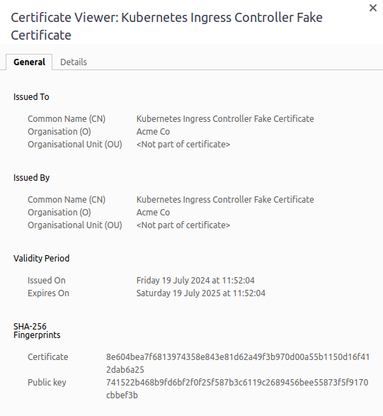


---
<br>

+ Configure URL rewriting in the ingress resource to modify incoming URLs before they reach the backend services.

+ configuring the "ingress-resource file"

+ applying rewriting URL 


```yml
apiVersion: networking.k8s.io/v1
kind: Ingress
metadata:
  name: my-web
  annotations:
    nginx.ingress.kubernetes.io/rewrite-target: /$1
spec:
  tls:
  - hosts:
    - myweb.local
    secretName: app-secrets
  rules:
  - host: myweb.local
    http:
      paths:
      - path: /live
        pathType: Exact
        backend:
          service:
            name: my-web
            port:
              number: 8080
  - host: newweb.local
    http:
      paths:
      - path: /new-path
        pathType: Prefix
        backend:
          service:
            name: my-web
            port:
              number: 8080
```

+ It will define TLS certification for two different hosts as well we can see two different hosts live on the server


## Output

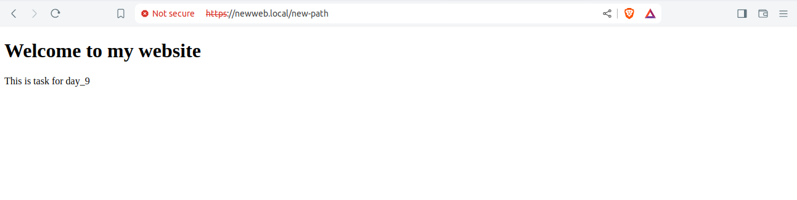

---


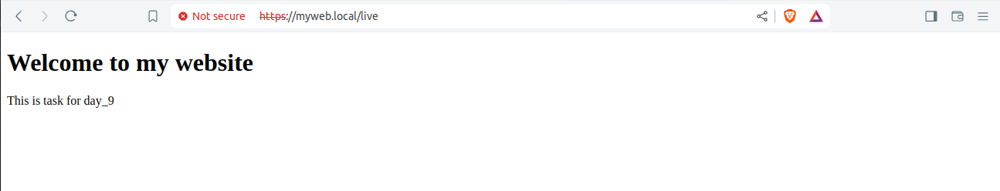


---


#### Deliverables:


+ Ingress controller installation commands/scripts

+ Ingress resource YAML file with advanced routing, TLS configuration, URL rewriting, and sticky sessions


## Final Outputs:


<br>


---

### Stage 3: Implementing Horizontal Pod Autoscaling

## 6. Configure Horizontal Pod Autoscaler:

+ Write a horizontal pod autoscaler (HPA) manifest to automatically scale the static web application pods based on CPU utilization.

+ let first create the "hpa.yml" file

```yml
apiVersion: autoscaling/v2
kind: HorizontalPodAutoscaler
metadata:
  name: my-web
spec:
  scaleTargetRef:
    apiVersion: apps/v1
    kind: Deployment
    name: my-web
  minReplicas: 2
  maxReplicas: 10
  metrics:
  - type: Resource
    resource:
      name: cpu
      target:
        type: Utilization
        averageUtilization: 50
```

## Output

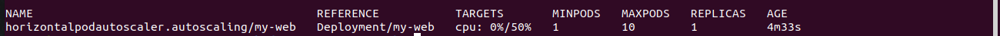


+ Set thresholds for minimum and maximum pod replicas.

```yml
 minReplicas: 2
  maxReplicas: 10
  metrics:
  - type: Resource
    resource:
      name: cpu
      target:
        type: Utilization
        averageUtilization: 50
```


## 7. Stress Testing:

+ Perform stress testing to simulate traffic and validate the HPA configuration.


+ To generate traffic we will use one command which is known as "apache-benches" to generate load on the website

```bash
ab -n 100000 -c 100 https://myweb.local/live
```

+ The command ab -n 100000 -c 100 http://website.com is used to simulate a load test on the specified website (http://website.com). 

+ Here’s a breakdown of the options:

  + -n 1000: specifies the total number of requests to be sent (1000 in this case).

  + -c 100: sets the concurrency level, which means 100 simultaneous requests will be made.

  + http://website.com: the URL being tested

+ Monitor the scaling behavior and ensure the application scales up and down based on the load.

```bash
kubectl get hpa
```

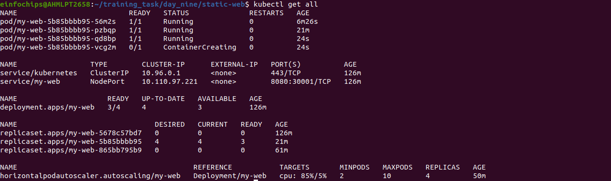


#### Deliverables:

+ Horizontal pod autoscaler YAML file

+ Documentation or screenshots of the stress testing process and scaling behavior


## Output


<br>


---

### Stage 4: Final Validation and Cleanup

## 8. Final Validation:
+ Validate the ingress networking, URL rewriting, and configurations by accessing the web application through different hostnames and paths.

+ Verify the application's availability and performance during different load conditions.


## Finali output for validation:


<br>
<hr>


<br>
<hr>


<br>
<hr>


<br>
<hr>

+ During CPU load it increase the pods by the requirments


## 9. Cleanup:

+ Provide commands or scripts to clean up the Kubernetes resources created during the project (deployments, services, ingress, HPA).

+ to clean-up the deployment

```bash
kubectl delete deployment <deployment-name>
```

+ to clean-up the services

```bash
kubectl delete svc <services-name>
```

+ to clean-up the hpa

```
kubectl delete hpa --all
```

+ note : -- all will going to delete all the horizontalpodautoscalers 


+ At the end stop the minikube 

```bash

minikube stop 
minikube delete

```


#### Deliverables:
+ Final validation report documenting the testing process and results

+ Cleanup commands/scripts


## Final Output For clean-up

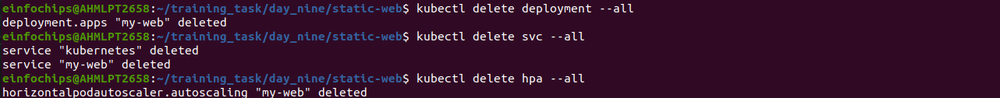


