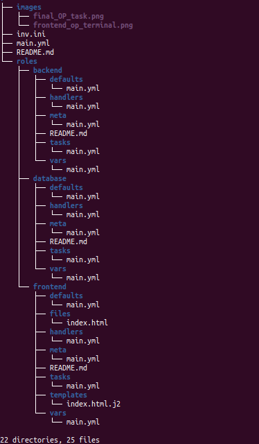
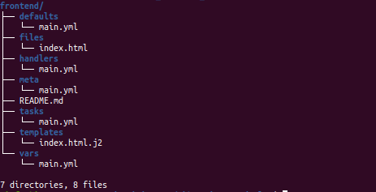
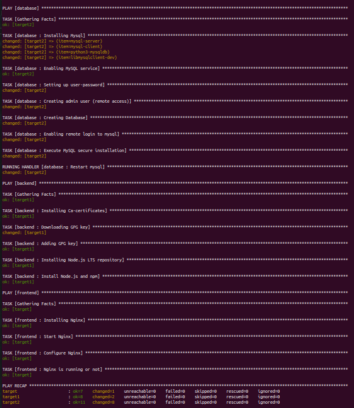

# Project 01

## <center>Problem Statement</center>

***AIM: You are tasked with deploying a three-tier web application (frontend, backend, and database) using Ansible roles. The frontend is an Nginx web server, the backend is a Node.js application, and the database is a MySQL server. Your solution should use Ansible Galaxy roles where applicable and define appropriate role dependencies. The deployment should be automated to ensure that all components are configured correctly and can communicate with each other.***

## <center>Steps and Deliverables</center>

1. Define Project Structure
  
  + Create a new Ansible project with a suitable directory structure to organize roles, playbooks, and inventory files.




2. Role Selection and Creation

+ command to create a role in directory is

```sh
ansible-galaxy ini <role-name>
```


  + Select appropriate roles from Ansible Galaxy for each tier of the application:
    
    + Nginx for the frontend.

    

    + Node.js for the backend.
    

    


    + MySQL for the database.


    


  + Create any custom roles needed for specific configurations that are not covered by the Galaxy roles.

3. Inventory Configuration
  
  + Create an inventory file that defines the groups of hosts for each tier (frontend, backend, database).

```ini
[frontend]
target ansible_host=3X.1XX.X5.X2 ansible_user=ubuntu ansible_ssh_private_key_file=/home/einfochips/.ssh/My_key.pem

[backend]
target1 ansible_host=4X.1XX.X6.X4 ansible_user=ubuntu ansible_ssh_private_key_file=/home/einfochips/.ssh/My_key.pem

[database]
target2 ansible_host=5X.3XX.X4.X1 ansible_user=ubuntu ansible_ssh_private_key_file=/home/einfochips/.ssh/My_key.pem
```
  
  + Ensure proper group definitions and host variables as needed.

4. Playbook Creation
  
  + Create a playbook (deploy.yml) that includes and orchestrates the roles for deploying the application.

```yml
- name: Full Stack Application
  hosts: all
  become: yes
  tasks:
  - name: update_cache
    apt:
      update_cache: yes

- hosts: database
  become: true
  roles:
  - database

- hosts: backend
  become: true
  roles:
  - backend

- hosts: frontend
  become: true
  roles:
  - frontend
```
 
  + Ensure the playbook handles the deployment order and variable passing between roles.

5. Role Customization and Variable Definition

  + Customize the roles by defining the necessary variables in group_vars or host_vars as needed for the environment.
  
  + Ensure sensitive data like database credentials are managed securely.

### First for Frontend role

+ first in the file folder 

```html
<html>
    <head>
        <title>Task_Nineteen</title>
    </head>
    <body>
        <center>
            <h1>Hello from rontend</h1>
        </center>
    </body>
</html>

```

+  then in the tasks/main.yml


```yml
---
- name: Installing Nginx
  apt:
    name: nginx
    state: present
    update_cache: yes

- name: Start Nginx
  systemd:
    name: nginx
    state: started
    enabled: yes
- name: Configure Nginx

  template:
    src: index.html.j2
    dest: /var/www/html/index.html
  notify: Restart Nginx

- name: Nginx is running or not
  service:
    name: nginx
    state: started
    enabled: yes

```

+ Then in handler/main.yml

```yml

---
- name: Restart Nginx
  systemd:
    name: nginx
    state: restarted

```

+ Then for the templates/index.html.j2

```index.html.j2
<html>
    <head>
        <title>Day-Nineteen</title>
    </head>
    <body>
        <center>
            <h1>Hello from Frontend</h1>
        </center>
    </body>
</html>
```


### For the database(Mysql)

+ In tasks/main.yml

```yml
---
- name: Installing Mysql
  package:
      name: "{{item}}"
      state: present
      update_cache: yes
  loop:
    - mysql-server
    - mysql-client
    - python3-mysqldb
    - libmysqlclient-dev
    
- name: Enabling MySQL service
  service:
      name: mysql
      state: started
      enabled: yes

- name: Setting up user-password
  mysql_user:
    name: root
    password: "{{root_password}}"
    login_unix_socket: /var/run/mysqld/mysqld.sock
    host: localhost
    login_user: root
    login_password: ''
    state: present

- name: Creating admin user (remote access)
  mysql_user:
    name: "{{admin_user}}"
    password: "{{admin_password}}"
    priv: '*.*:ALL'
    host: '%'
    append_privs: yes
    login_user: root
    login_password: "{{root_password}}"
    state: present

- name: Creating Database 
  mysql_db:
    name: "{{db_name}}"
    state: present
    login_user: root
    login_password: "{{root_password}}"

- name: Enabling remote login to mysql
  lineinfile:
    path: /etc/mysql/mysql.conf.d/mysqld.cnf
    regex: '^bind-address\s*=\s*127.0.0.1'
    line: 'bind-address = 0.0.0.0'
    backup: yes
  notify:
    - Restart mysql

- name: Execute MySQL secure installation
  expect:
    command: mysql_secure_installation
    responses:
      'Enter password for user root:': "{{ root_password }}"
      'Press y\|Y for Yes, any other key for No': 'Y'
      'Please enter 0 = LOW, 1 = MEDIUM and 2 = STRONG': "{{ password_validation_policy }}"
      'Change the password for root \? \(\(Press y\|Y for Yes, any other key for No\)': 'n'
      'Remove anonymous users\? \(Press y\|Y for Yes, any other key for No\)': 'Y'
      'Disallow root login remotely\? \(Press y\|Y for Yes, any other key for No\)': 'Y'
      'Remove test database and access to it\? \(Press y\|Y for Yes, any other key for No\)': 'Y'
      'Reload privilege tables now\? \(Press y\|Y for Yes, any other key for No\)': 'Y'
  environment:
    MYSQL_PWD: "{{ root_password }}"

```

+ then in vars/main.yml for passing credentials


```yml
root_password: pass@123
admin_user: Admin
admin_password: Admin@123
db_name: sampledb
password_validation_policy: 1
```


### For the Backend (nodejs)

+ In tasks/main.yml

```yml
- name: Installing Ca-certificates
  apt:
    name: ca-certificates
    state: present
    update_cache: yes

- name: Downloading GPG key
  shell: |
    curl -o /tmp/nodesource.gpg.key https://deb.nodesource.com/gpgkey/nodesource.gpg.key
  args:
    warn: false

- name: Adding GPG key
  apt_key:
    file: "/tmp/nodesource.gpg.key"
    state: present

- name: Installing Node.js LTS repository
  apt_repository:
    repo: "deb https://deb.nodesource.com/node_{{ NODEJS_VERSION }}.x {{ ansible_distribution_release }} main"
    state: present
    update_cache: yes

- name: Install Node.js and npm
  apt:
    name:
    - nodejs
    state: present
```

+ In vars/main.yml

```yml
---
NODEJS_VERSION: "16"
ansible_distribution_release: "focal"
```


## Final Output




<br>


