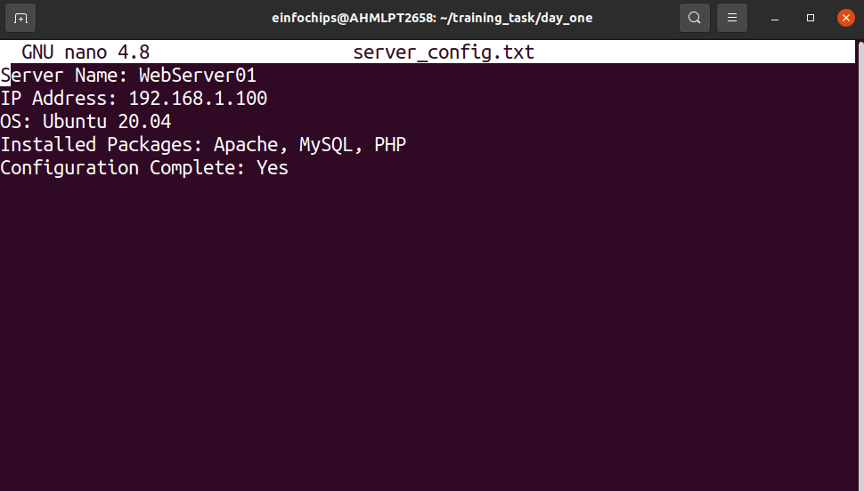
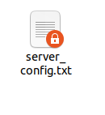
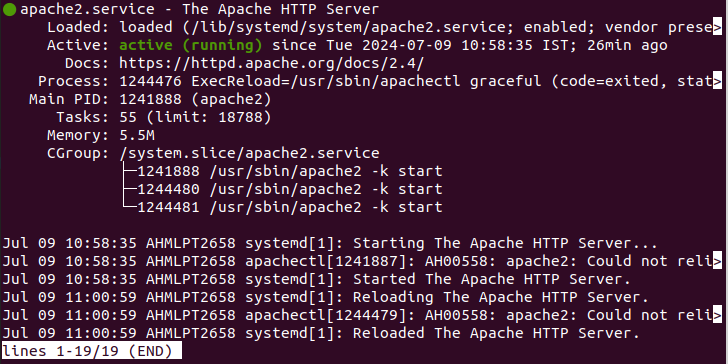
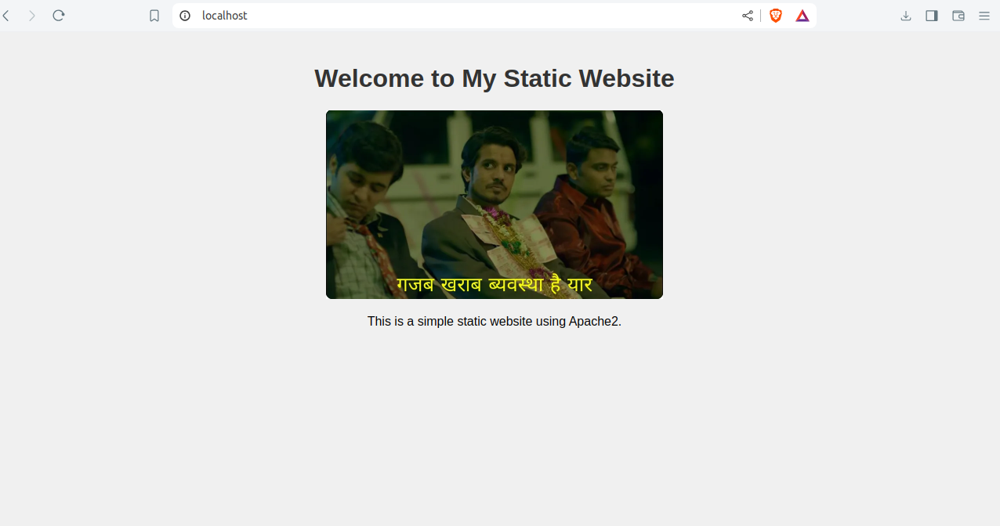

# Project Overview

##### Aim: This project spans various aspects of Linux system administration, including file management, user and group management, service control, process handling, and more. You will be completing tasks that simulate real-world scenarios, providing hands-on experience with Linux commands and configurations.

## Project Breakdown

### Part 1: Creating and Editing Text Files (20 minutes)

> Scenario: You are tasked with documenting the configurations and settings for a new server. You'll use different text editors to create and update these documents.

+ Create a file server_config.txt using Nano:

``` nano server_config.txt ```

+ Add the following content:

```bash
Server Name: WebServer01
IP Address: 192.168.1.100
OS: Ubuntu 20.04
```

+ Edit the same file with Vi:

``` vi server_config.txt ```

+ Append the following text:

``` Installed Packages: Apache, MySQL, PHP ```

+ Further edit the file with Vim:

``` vim server_config.txt ```

+ Add the following text:

``` Configuration Complete: Yes ```

### Output:

--------------------------------------------------------------------- 



--------------------------------------------------------------------- 


### Part 2: User & Group Management (20 minutes)

> Scenario: You need to set up user accounts and groups for a new team joining the project.

+ Add a new user developer:

``` sudo adduser developer ```

### Output:

--------------------------------------------------------------------- 


--------------------------------------------------------------------- 


+ Create a group devteam:

``` sudo groupadd devteam ```

+ Add the user developer to the devteam group:

```sudo usermod -aG devteam developer```

+ Remove the user developer from the devteam group:

```sudo gpasswd -d developer devteam```

+ Changing Permissions and Ownership
+ Change permissions to read/write for the owner and read-only for others:

``` chmod 644 server_config.txt ```

+ Verify the change:

``` ls -l server_config.txt ```

### Output:

--------------------------------------------------------------------- 



--------------------------------------------------------------------- 

+ Change the owner to developer and the group to devteam:

``` sudo chown developer:devteam server_config.txt ```


### Part 4: Controlling Services and Daemons (20 minutes)

> Scenario: Manage the web server service to ensure it is running correctly and starts on boot.

+ Managing Services with systemctl

+ Start the Apache service:

``` sudo systemctl start apache2 ```

### Output:

--------------------------------------------------------------------- 



--------------------------------------------------------------------- 


+ Stop the Apache service:

```sudo systemctl stop apache2```
         
+ Enable the Apache service to start on boot:

```sudo systemctl enable apache2```
         
+ Disable the Apache service:

```sudo systemctl disable apache2```
        
+ Check the status of the Apache service:

```sudo systemctl status apache2```


### Final: Creating and Deploying a Static Website with Apache2

+ Preparation (5 minutes) 
- Ensure you have access to a Linux environment (e.g., virtual machines, EC2 instances, or local installations) with sudo privileges.

#### Activity Breakdown
### Part 1: Installing Apache2 (5 minutes)


+ Open the terminal and run:

```sudo apt update```

+ Install Apache2 by running:

```sudo apt install apache2```  

+ Start the Apache2 service:

```sudo systemctl start apache2```

+ Enable Apache2 to start on boot:

```sudo systemctl enable apache2```

+ Verify Installation
+ Open a web browser and navigate to http://your_server_ip. You should see the Apache2 default page.

### Part 2: Creating the Website (10 minutes)

1. Navigate to the Web Directory

+ Change to the web root directory:

```cd /var/www/html```
    
2. Create a New Directory for the Website
+ Create a directory named mystaticwebsite:

```sudo mkdir mystaticwebsite```
 
+ Change ownership of the directory:

``` sudo chown -R $USER:$USER /var/www/html/mystaticwebsite ```
        
3. Create HTML File
+ Create and edit the index.html file:

```nano /var/www/html/mystaticwebsite/index.html```

+ Add the following content
```html
<!DOCTYPE html>
<html>
<head>
  <title>My Static Website</title>
  <link rel="stylesheet" type="text/css" href="styles.css">
</head>
<body>
  <h1>Welcome to My Static Website</h1>
  <p>This is a simple static website using Apache2.</p>
  <script src="script.js"></script>
</body>
</html>
```  
4. Create CSS File
+ Create and edit the styles.css file:

```nano /var/www/html/mystaticwebsite/styles.css```

+ Add the following content:
```css
body {
  font-family: Arial, sans-serif;
  background-color: #f0f0f0;
  text-align: center;
  margin: 0;
  padding: 20px;
}

h1 {
  color: #333;
}
```
     
5. Create JavaScript File
+ Create and edit the script.js file:

```nano /var/www/html/mystaticwebsite/script.js```

+ Add the following content:
```js
document.addEventListener('DOMContentLoaded', function() {
  console.log('Hello, World!');
});
```
        
6. Add an Image
+ Download or copy an image file (e.g., logo.png) to the website directory:

```cp /home/einfochips/Pictures /var/www/html/mystaticwebsite/logo.png```
    
+ Update index.html to include the image:
```html
<body>
  <h1>Welcome to My Static Website</h1>
  
  <p>This is a simple static website using Apache2.</p>
  <script src="script.js"></script>
</body>
```

### Part 3: Configuring Apache2 to Serve the Website (10 minutes)

1. Create a Virtual Host File
+ Create and edit the virtual host configuration file:

```sudo nano /etc/apache2/sites-available/mystaticwebsite.conf```
        
+ Add the following content:
```bash
<VirtualHost *:80>
  ServerAdmin webmaster@localhost
  DocumentRoot /var/www/html/mystaticwebsite
  ErrorLog ${APACHE_LOG_DIR}/error.log
  CustomLog ${APACHE_LOG_DIR}/access.log combined
</VirtualHost>
```     
2. Enable the New Virtual Host
+ Enable the virtual host configuration:

```sudo a2ensite mystaticwebsite.conf```
        
3. Disable the Default Site
+ Disable the default site configuration:

```sudo a2dissite 000-default.conf```
    
4. Reload Apache2
+ Reload the Apache2 service to apply the changes:

```sudo systemctl reload apache2```
    
5. Test the Configuration
+ Open a web browser and navigate to http://your_server_ip. You should see the static website with the HTML, CSS, JS, and image.

### Output:

--------------------------------------------------------------------- 



--------------------------------------------------------------------- 

