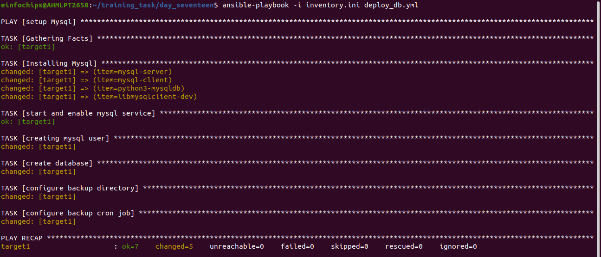

# Project 01

### Deploy a Database Server with Backup Automation

### Objective: 
+ Automate the deployment and configuration of a PostgreSQL database server on an Ubuntu instance hosted on AWS, and set up regular backups.

### Problem Statement

### Objective: 

+ Automate the deployment, configuration, and backup of a PostgreSQL database server on an Ubuntu instance using Ansible.

#### Requirements:

1. ***AWS Ubuntu Instance:*** You have an Ubuntu server instance running on AWS.

2. ***Database Server Deployment:*** Deploy and configure PostgreSQL on the Ubuntu instance.

3. ***Database Initialization:*** Create a database and a user with specific permissions.

4. ***Backup Automation:*** Set up a cron job for regular database backups and ensure that backups are stored in a specified directory.

5. ***Configuration Management:*** Use Ansible to handle the deployment and configuration, including managing sensitive data like database passwords.

### Deliverables

1. ***Ansible Inventory File***
    
    + Filename: inventory.ini
    
    + Content: Defines the AWS Ubuntu instance and connection details for Ansible.

```ini
[web]
target ansible_host=3.1xx.xx.2x ansible_user=ubuntu ansible_ssh_private_key_file=/home/einfochips/.ssh/ansible-worker.pem
```

2. ***Ansible Playbook***
    
    + Filename: deploy_database.yml
    
    + Content: Automates the installation of MySQL, sets up the database, creates a user, and configures a cron job for backups. It also includes variables for database configuration and backup settings.

        + First we will create a step where we perform installation and creating user in database mysql

```yml
- name: setup Mysql on target machine
  hosts: web
  become: yes
  tasks:
  - name: Installing Mysql
    package:
      name: "{{item}}"
      state: present
      update_cache: yes
    loop:
    - mysql-server
    - mysql-client
    - python3-mysqldb
    - libmysqlclient-dev
    become: yes

  - name: start and enable mysql service
    service:
      name: mysql
      state: started
      enabled: yes

  - name: creating mysql user
    mysql_user:
      name: "my_user"
      password: "user123"
      priv: '*.*:ALL'
      host: '%'
      state: present

  handlers:
  - name: Restart mysql
    service:
      name: mysql
      state: restarted
```

+  after that we will set variables and cronjob

+ for variables

```yml
  vars:
    db_name: "my_database"
    db_user: "my_user"
    db_password: "user123"
    backup_dir: "/backup/mysql"
    backup_schedule: "daily"
```

+ for cronjob

```yml
  - name: configure backup cron job
    cron:
      name: "mysql backup"
      minute: "0"
      hour: "2"
      day: "*"
      month: "*"
      weekday: "*"
      job: "mysqldump -u {{ db_user }} -p {{ db_password }} {{ db_name }} > {{ backup_dir }}/{{ db_name }}_{{ backup_schedule }}.sql"
```




<hr>

3. ***Jinja2 Template***
    
    + Filename: templates/pg_hba.conf.j2
    
    + Content: Defines the MySQL configuration file (pg_hba.conf) using Jinja2 templates to manage access controls dynamically.

```jinja

CREATE USER '{{ user.name }}'@'%' IDENTIFIED BY '{{ user.password }}';
GRANT {{ user.privileges }} ON *.* TO '{{ user.name }}'@'%';

```

4. ***Backup Script***
    
    + Filename: scripts/backup.sh
    
    + Content: A script to perform the backup of the PostgreSQL database. This script should be referenced in the cron job defined in the playbook.

```sh
#!/bin/bash

# Set variables

DATABASE_NAME=mydatabase
BACKUP_DIR=/var/backups/mysql
DATE=$(date +"%Y-%m-%d")

# Create backup file name

BACKUP_FILE="${BACKUP_DIR}/${DATABASE_NAME}_${DATE}.sql"

# Dump database to backup file

mysqldump -u myuser -p${database_password} ${DATABASE_NAME} > ${BACKUP_FILE}

# Compress backup file

gzip ${BACKUP_FILE}

# Remove old backups (keep only 7 days)

find ${BACKUP_DIR} -type f -mtime +7 -delete
```


