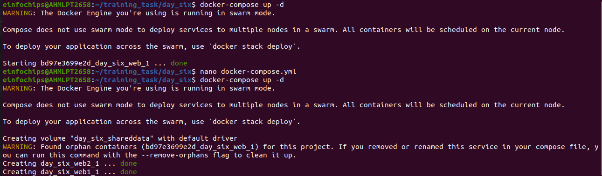
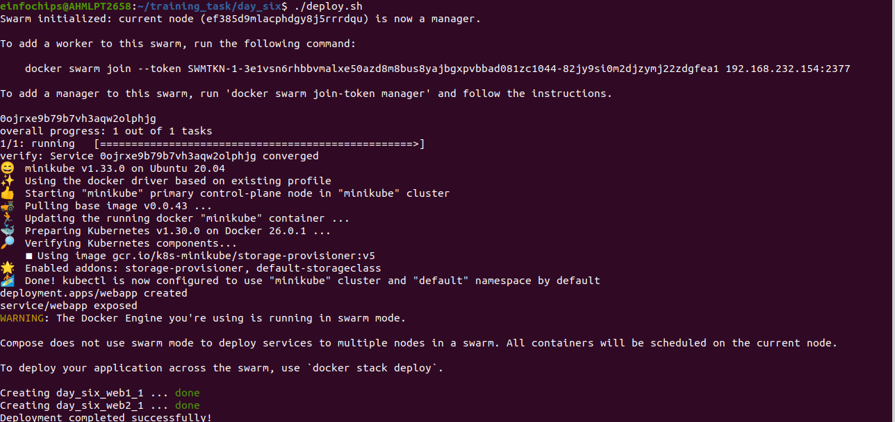
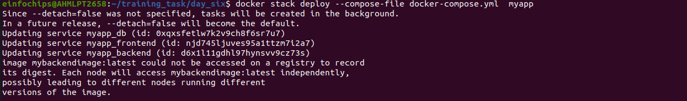

# Project 01 - 1 Hour

### Deploying a Scalable Web Application with Persistent Storage and Advanced Automation
#### Objective: Deploy a scalable web application using Docker Swarm and Kubernetes, ensuring data persistence using a single shared volume, and automate the process using advanced shell scripting.

### Overview:

* Step 1: Set up Docker Swarm and create a service.

* Step 2: Set up Kubernetes using Minikube.

* Step 3: Deploy a web application using Docker Compose.

* Step 4: Use a single shared volume across multiple containers.

* Step 5: Automate the entire process using advanced shell scripting.

### Step 1: Set up Docker Swarm and Create a Service

> 1.1 Initialize Docker Swarm

+ Initialize Docker Swarm

```bash
docker swarm init
```


> 1.2 Create a Docker Swarm Service

+ Create a simple Nginx service in Docker Swarm

```bash
docker service create --name nginx-service --publish 8080:80 nginx
```

### Step 2: Set up Kubernetes Using Minikube

> 2.1 Start Minikube

+ Start Minikube
```bash
minikube start
```

> 2.2 Deploy a Web App on Kubernetes

+ Create a deployment file named webapp-deployment.yaml:

```yml
apiVersion: apps/v1
kind: Deployment
metadata:
  name: webapp
spec:
  replicas: 3
  selector:
    matchLabels:
      app: webapp
  template:
    metadata:
      labels:
        app: webapp
    spec:
      containers:
      - name: webapp
        image: nginx
        ports:
        - containerPort: 80
```

+ Apply the deployment:

```bash
kubectl apply -f webapp-deployment.yaml
```

> 2.3 Expose the Deployment

```bash
kubectl expose deployment webapp --type=NodePort --port=80
```

### Step 3: Deploy a Web Application Using Docker Compose

> 3.1 Create a docker-compose.yml File


```yml
version: '3'
services:
  web:
    image: nginx
    ports:
      - "8080:80"
    volumes:
      - webdata:/usr/share/nginx/html

volumes:
  webdata:
```

> 3.2 Deploy the Web Application

+ Deploy using Docker Compose
```bash
docker-compose up -d
```

## Output


---

### Step 4: Use a Single Shared Volume Across Multiple Containers

> 4.1 Update docker-compose.yml to Use a Shared Volume

```yml
version: '3'
services:
  web1:
    image: nginx
    ports:
      - "8081:80"
    volumes:
      - shareddata:/usr/share/nginx/html
  web2:
    image: nginx
    ports:
      - "8082:80"
    volumes:
      - shareddata:/usr/share/nginx/html

volumes:
  shareddata:
```

> 4.2 Deploy with Docker Compose

+ Deploy using Docker Compose

```bash
docker-compose up -d
```

## Ouput:



<br>


<br>


---


### Step 5: Automate the Entire Process Using Advanced Shell Scripting

+ 5.1 Create a Shell Script deploy.sh

```bash
#!/bin/bash

# Initialize Docker Swarm

docker swarm init

# Create Docker Swarm Service

docker service create --name nginx-service --publish 8080:80 nginx

# Start Minikube

minikube start

# Create Kubernetes Deployment

kubectl apply -f webapp-deployment.yaml

# Expose the Deployment

kubectl expose deployment webapp --type=NodePort --port=80

# Deploy Web App Using Docker Compose

docker-compose -f docker-compose-single-volume.yml up -d

echo "Deployment completed successfully!"
```

> 5.2 Make the Script Executable

+ Make the script executable
```bash
chmod +x deploy.sh
```

> 5.3 Run the Script

+ Run the deployment script

```bash
./deploy.sh
```

## output

---



<br>


<br>


<br>
---


# Project 02 - 1 Hour
#### Comprehensive Deployment of a Multi-Tier Application with CI/CD Pipeline

#### Objective: Deploy a multi-tier application (frontend, backend, and database) using Docker Swarm and Kubernetes, ensuring data persistence using a single shared volume across multiple containers, and automating the entire process using advanced shell scripting and CI/CD pipelines.

### Overview:

+ Step 1: Set up Docker Swarm and create a multi-tier service.
+ Step 2: Set up Kubernetes using Minikube.
+ Step 3: Deploy a multi-tier application using Docker Compose.
+ Step 4: Use a single shared volume across multiple containers.
+ Step 5: Automate the deployment process using advanced shell scripting.

### Step 1: Set up Docker Swarm and Create a Multi-Tier Service

>1.1 Initialize Docker Swarm
 
+ Initialize Docker Swarm
```bash
docker swarm init
```


> 1.2 Create a Multi-Tier Docker Swarm Service

+ Create a docker-compose-swarm.yml file:
```yml
version: '3.7'
services:
  frontend:
    image: nginx
    ports:
      - "8080:80"
    deploy:
      replicas: 2
    volumes:
      - shareddata:/usr/share/nginx/html
  backend:
    image: mybackendimage
    ports:
      - "8081:80"
    deploy:
      replicas: 2
    volumes:
      - shareddata:/app/data
  db:
    image: postgres
    environment:
      POSTGRES_DB: mydb
      POSTGRES_USER: user
      POSTGRES_PASSWORD: password
    deploy:
      replicas: 1
    volumes:
      - dbdata:/var/lib/postgresql/data

volumes:
  shareddata:
  dbdata:
```
> 1.3 Deploy the stack:
+ Deploy the stack using Docker Swarm

```bash
docker stack deploy -c docker-compose-swarm.yml myapp
```

## Output


---

### Step 2: Set up Kubernetes Using Minikube

> 2.1 Start Minikube

+ Start Minikube
```bash
minikube start
```

> 2.2 Create Kubernetes Deployment Files

+ Create frontend-deployment.yaml:

```yml
apiVersion: apps/v1
kind: Deployment
metadata:
  name: frontend
spec:
  replicas: 2
  selector:
    matchLabels:
      app: frontend
  template:
    metadata:
      labels:
        app: frontend
    spec:
      containers:
      - name: frontend
        image: nginx
        ports:
        - containerPort: 80
        volumeMounts:
        - name: shareddata
          mountPath: /usr/share/nginx/html
      volumes:
      - name: shareddata
        persistentVolumeClaim:
          claimName: shared-pvc
```
+ Create backend-deployment.yaml:

```yml
apiVersion: apps/v1
kind: Deployment
metadata:
  name: backend
spec:
  replicas: 2
  selector:
    matchLabels:
      app: backend
  template:
    metadata:
      labels:
        app: backend
    spec:
      containers:
      - name: backend
        image: mybackendimage
        ports:
        - containerPort: 80
        volumeMounts:
        - name: shareddata
          mountPath: /app/data
      volumes:
      - name: shareddata
        persistentVolumeClaim:
          claimName: shared-pvc
```

+ Create db-deployment.yaml:

```yml
apiVersion: apps/v1
kind: Deployment
metadata:
  name: db
spec:
  replicas: 1
  selector:
    matchLabels:
      app: db
  template:
    metadata:
      labels:
        app: db
    spec:
      containers:
      - name: db
        image: postgres
        env:
        - name: POSTGRES_DB
          value: mydb
        - name: POSTGRES_USER
          value: user
        - name: POSTGRES_PASSWORD
          value: password
        volumeMounts:
        - name: dbdata
          mountPath: /var/lib/postgresql/data
      volumes:
      - name: dbdata
        persistentVolumeClaim:
          claimName: db-pvc
```

+ Create shared-pvc.yaml:

```yml
apiVersion: v1
kind: PersistentVolumeClaim
metadata:
  name: shared-pvc
spec:
  accessModes:
  - ReadWriteMany
  resources:
    requests:
      storage: 1Gi

Create db-pvc.yaml:
apiVersion: v1
kind: PersistentVolumeClaim
metadata:
  name: db-pvc
spec:
  accessModes:
  - ReadWriteOnce
  resources:
    requests:
      storage: 1Gi
```
+ Apply the deployments:

```yml
kubectl apply -f shared-pvc.yaml
kubectl apply -f db-pvc.yaml
kubectl apply -f frontend-deployment.yaml
kubectl apply -f backend-deployment.yaml
kubectl apply -f db-deployment.yaml
```

### Step 3: Deploy a Multi-Tier Application Using Docker Compose

> 3.1 Create a docker-compose.yml File
```yml
version: '3'
services:
  frontend:
    image: nginx
    ports:
      - "8080:80"
    volumes:
      - shareddata:/usr/share/nginx/html
  backend:
    image: mybackendimage
    ports:
      - "8081:80"
    volumes:
      - shareddata:/app/data
  db:
    image: postgres
    environment:
      POSTGRES_DB: mydb
      POSTGRES_USER: user
      POSTGRES_PASSWORD: password
    volumes:
      - dbdata:/var/lib/postgresql/data

volumes:
  shareddata:
  dbdata:
```

> 3.2 Deploy the Application

+ Deploy using Docker Compose

```bash
docker-compose up -d
```

### Step 4: Use a Single Shared Volume Across Multiple Containers

+ Update docker-compose.yml as shown in Step 3.1 to use the shareddata volume across the frontend and backend services.

## Output



<br>


<br>


<br>

---