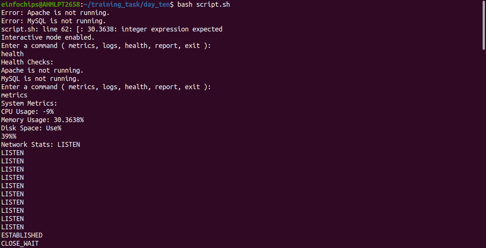

# Project :

##### Project Overview: Develop a comprehensive shell script for sysops to automate system monitoring and generate detailed reports. The script will leverage advanced Linux shell scripting techniques to monitor system metrics, capture logs, and provide actionable insights for system administrators.

## Deliverables:

### 1. Script Initialization:

+ Initialize script with necessary variables and configurations.

```bash
# Script Initialization

SCRIPT_NAME="System Monitoring Script"
SCRIPT_VERSION="1.0"
CONFIG_FILE="monitoring_config.conf"
```

+ Validate required commands and utilities availability.

```bash
#Validate required commands and utilities availability

REQUIRED_COMMANDS=("vmstat" "free" "df" "netstat" "ps" "grep" "awk" "mail")
for COMMAND in "${REQUIRED_COMMANDS[@]}"; do
  if ! command -v "$COMMAND" &> /dev/null; then
    echo "Error: $COMMAND is not installed or not available."
    exit 1
  fi
done
```

### 2. System Metrics Collection:

+ Monitor CPU usage, memory utilization, disk space, and network statistics.

```bash
CPU_USAGE=$(vmstat -a | awk '$12 ~ /[0-9.]+/ { print 100 - $12 }')
MEMORY_USAGE=$(free -m | awk '/Mem:/ { print $3/$2 * 100 }')
DISK_SPACE=$(df -h --output=pcent / | awk '{ print $1 }')
NETWORK_STATS=$(netstat -an | awk '/tcp/ { print $6 }')
```

+ Capture process information including top processes consuming resources.

```bash
TOP_PROCESSES=$(ps -eo pcpu,pmem,cmd --sort=-pcpu | head -n 10)
```

### 3. Log Analysis:

+ Parse system logs (e.g., syslog) for critical events and errors.


+ Generate summaries of recent log entries based on severity.

```bash
# Log Analysis

LOG_FILE="/var/log/syslog"
CRITICAL_EVENTS=$(grep -i "crit|error" "$LOG_FILE" | tail -n 10)
LOG_SUMMARY=$(grep -i "crit|error" "$LOG_FILE" | awk '{ print $1 " " $2 " " $3 }')
```

### 4. Health Checks:

+ Check the status of essential services (e.g., Apache, MySQL).

+ Verify connectivity to external services or databases.

```bash
# Health Checks

ESSENTIAL_SERVICES=("Apache2" "MySQL")
for SERVICE in "${ESSENTIAL_SERVICES[@]}"; do
  if ! systemctl is-active "$SERVICE" &> /dev/null; then
    echo "Error: $SERVICE is not running."
  fi
done

```
### 5. Alerting Mechanism:

+ Implement thresholds for critical metrics (CPU, memory) triggering alerts.

+ Send email notifications to sysadmins with critical alerts.

```bash
# Alerting Mechanism
if [ "$CPU_USAGE" -gt "$CPU_THRESHOLD" ]; then
  echo "CPU usage is critical: $CPU_USAGE%"
  mail -s "CPU Usage Critical" "$SYSADMIN_EMAIL" <<< "CPU usage is critical: $CPU_USAGE%"
fi

if [ "$MEMORY_USAGE" -gt "$MEMORY_THRESHOLD" ]; then
  echo "Memory usage is critical: $MEMORY_USAGE%"
  mail -s "Memory Usage Critical" "$SYSADMIN_EMAIL" <<< "Memory usage is critical: $MEMORY_USAGE%"
fi
```

### 6. Report Generation:

+ Compile all collected data into a detailed report.

+ Include graphs or visual representations where applicable.

```bash
# Report Generation

REPORT_FILE="system_report.txt"
echo "System Report: $(date)" > "$REPORT_FILE"

cat >> "$REPORT_FILE" << EOF
System Metrics:
CPU Usage: $CPU_USAGE%
Memory Usage: $MEMORY_USAGE%
Disk Space: $DISK_SPACE%
Network Stats: $NETWORK_STATS

Top Processes:
$TOP_PROCESSES

Log Analysis:
Critical Events:
$CRITICAL_EVENTS
Log Summary:
$LOG_SUMMARY

Health Checks:
$(for SERVICE in "${ESSENTIAL_SERVICES[@]}"; do
  if systemctl is-active "$SERVICE" &> /dev/null; then
    echo "$SERVICE is running."
  else
    echo "$SERVICE is not running."
  fi
done)
EOF

```


### 7. Automation and Scheduling:

+ Configure the script to run periodically via cron for automated monitoring.

+ Ensure the script can handle both interactive and non-interactive execution modes.

```bash
# Automation and Scheduling

if [ "$INTERACTIVE_MODE" = "true" ]; then
  echo "Interactive mode enabled."
  while true; do
    echo "Enter a command ( metrics, logs, health, report, exit ):"
    read COMMAND
    case $COMMAND in
      metrics)
        echo "System Metrics:"
        echo "CPU Usage: $CPU_USAGE%"
        echo "Memory Usage: $MEMORY_USAGE%"
        echo "Disk Space: $DISK_SPACE%"
        echo "Network Stats: $NETWORK_STATS"
        ;;
      logs)
        echo "Log Analysis:"
        echo "Critical Events:"
        echo "$CRITICAL_EVENTS"
        echo "Log Summary:"
        echo "$LOG_SUMMARY"
        ;;
      health)
        echo "Health Checks:"
        for SERVICE in "${ESSENTIAL_SERVICES[@]}"; do
          if systemctl is-active "$SERVICE" &> /dev/null; then
            echo "$SERVICE is running."
          else
            echo "$SERVICE is not running."
          fi
done
        ;;
      report)
        echo "Generating report..."
        cat "$REPORT_FILE"
        ;;
      exit)
        exit 0
        ;;
      *)
        echo "Invalid command. Try again."
        ;;
    esac
  done
else
  echo "Non-interactive mode enabled."
```


### 8. User Interaction:

+ Provide options for interactive mode to allow sysadmins to manually trigger checks or view specific metrics.

+ Ensure the script is user-friendly with clear prompts and outputs.

```bash
  # Schedule the script to run periodically via cron

  crontab -l | { cat; echo "*/15 * * * * $0"; } | crontab -
```


### Configuration File:


```conf
# Configuration file for System Monitoring Script

# Email address for sysadmin notifications
SYSADMIN_EMAIL="yaksh.rawal@einfochips.com"

# Thresholds for critical metrics
CPU_THRESHOLD=80
MEMORY_THRESHOLD=90

# Interactive mode (true/false)
INTERACTIVE_MODE="true"
```


## Output





---

<br>


---