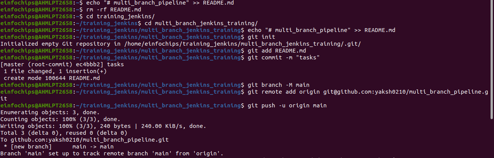
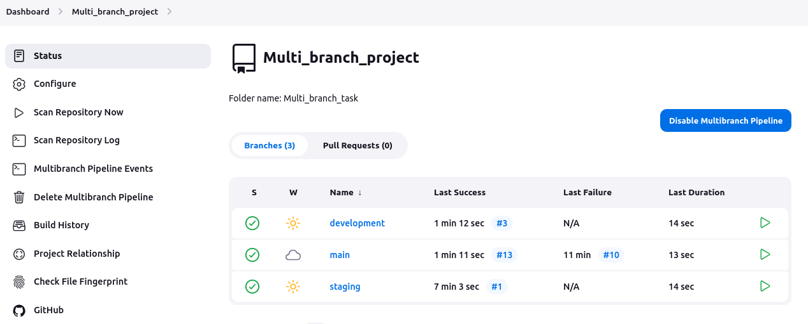

# Multi-Branch Project

## Project Overview

+ Create a simple Java Maven project.

+ Version-control the project using Git with multiple branches.

+ Set up Jenkins multi-branch pipeline for automated build and deployment.

+ Utilize Jenkins environment variables in the Jenkinsfile.

### Project Objectives

+ Version-control using Git.

+ Jenkins multi-branch pipeline setup.

+ Environment variable management using Jenkinsfile.

### Project Deliverables

1. ***Git Repository:***
    
    + Local Git repository initialized.

      

    + Branches: development, staging, and production.
    
      

    + Repository pushed to remote Git server (e.g., GitHub, GitLab, Bitbucket).


2. ***Maven Project:***
    
    + Simple Java Maven project created (HelloWorld application).

+ for main branch

```java
package com.example;

public class App {
    public static void main(String[] args) {
        System.out.println("Hello World!");
    }
}

```
+ for development branch

```java
package com.example;

public class App {
    public static void main(String[] args) {
        System.out.println("Hello World from development!");
    }
}

```
+ for staging branch

```java
package com.example;

public class App {
    public static void main(String[] args) {
        System.out.println("Hello World from staging!");
    }
}

```

+ pom.xml with dependencies and build configurations.

```xml
<?xml version="1.0" encoding="UTF-8"?>
<project xmlns="http://maven.apache.org/POM/4.0.0"
         xmlns:xsi="http://www.w3.org/2001/XMLSchema-instance"
         xsi:schemaLocation="http://maven.apache.org/POM/4.0.0 http://maven.apache.org/POM/4.0.0/maven-4.0.0.xsd">
    <modelVersion>4.0.0</modelVersion>
    <groupId>com.example</groupId>
    <artifactId>multi_branch_jen</artifactId>
    <version>1.0-SNAPSHOT</version>
    <properties>
        <maven.compiler.source>1.8</maven.compiler.source>
        <maven.compiler.target>1.8</maven.compiler.target>
    </properties>
</project>
```

<br>

3. ***Jenkins Setup:***
    
    + Multi-branch pipeline job configured in Jenkins.
    
    + Jenkinsfile defining build and deployment steps.
    
    + Environment variables managed using Jenkins environment variable settings.

    <br>

    