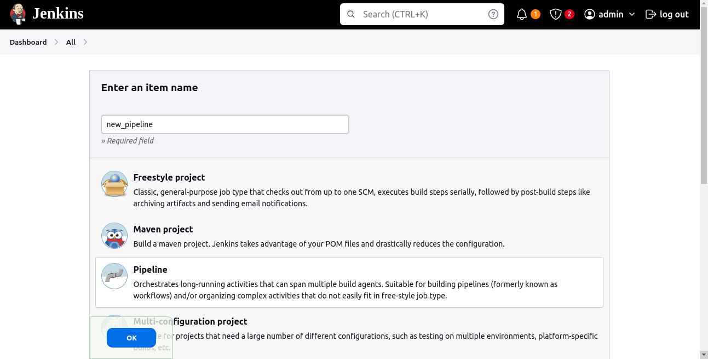
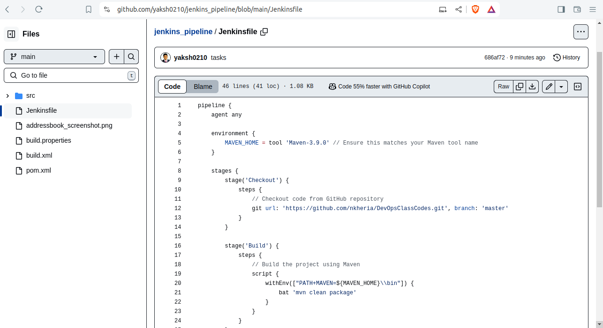
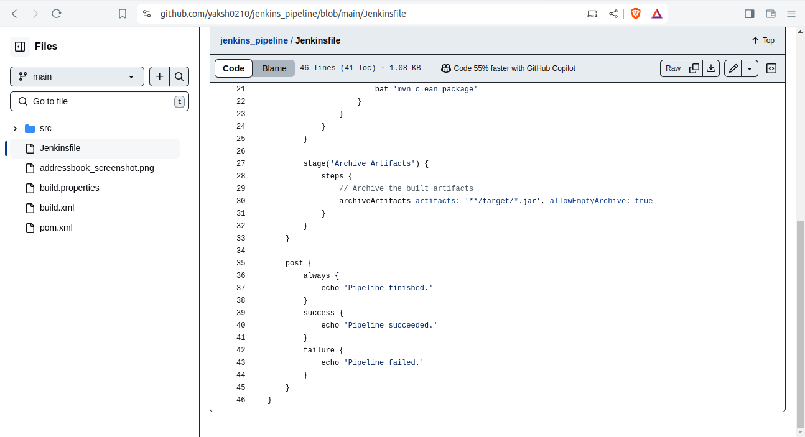
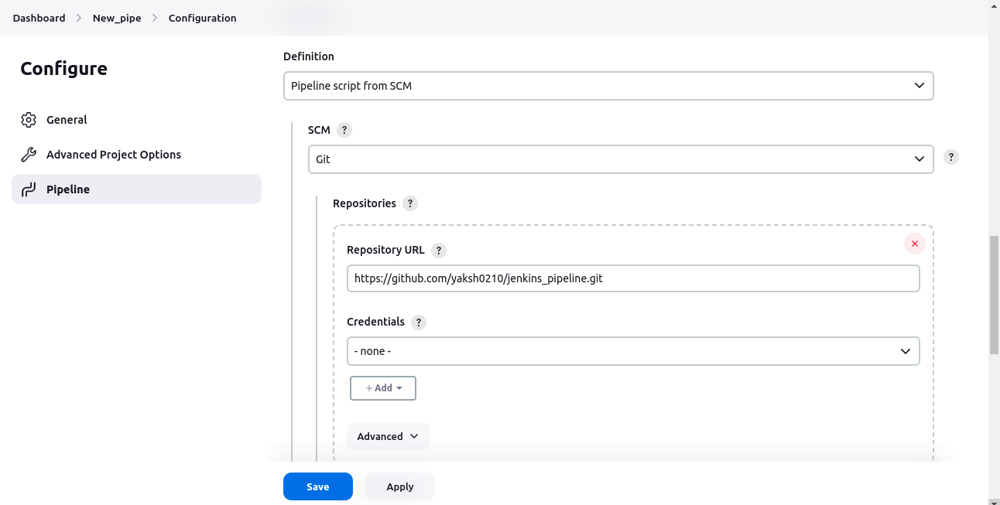
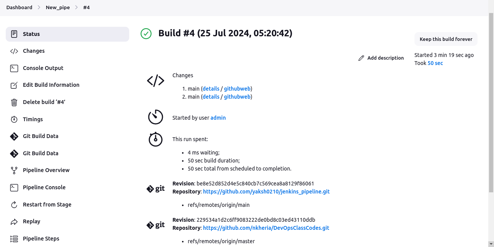
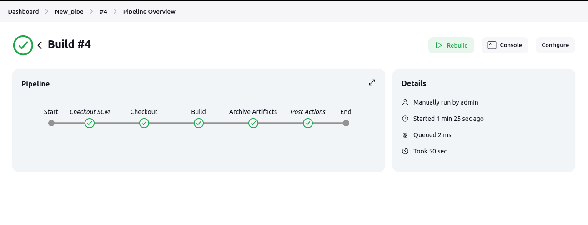

# Project 

## Project Overview

***Your organization is implementing continuous integration (CI) practices to streamline the software development lifecycle. As part of this initiative, you will create a Jenkins declarative pipeline for building a simple Maven project hosted on GitHub. This project aims to automate the build process, ensure code quality, and facilitate continuous delivery (CD).***

### Objectives

+ Create a Jenkins pipeline script using declarative syntax.

```groovy
pipeline {
    agent any
 
    environment {
        MAVEN_HOME = tool 'Maven - 3.9.0' 
        
        // Ensure this matches your Maven tool name
    }
 
    stages {
        stage('Checkout') {
            steps {
        
                // Checkout code from GitHub repository
        
            git url: 'https://github.com/yaksh0210/training_jenkins_tasks.git', branch: 'main'

            }
        }
 
        stage('Build') {
            steps {
        
                // Build the project using Maven
        
                script {
                    withEnv(["PATH+MAVEN=${MAVEN_HOME}\\bin"]) {
                        sh 'mvn clean package'
                    }
                }
            }
        }
 
        stage('Archive Artifacts') {
            steps {
        
                // Archive the built artifacts
        
                archiveArtifacts artifacts: '**/target/*.jar', allowEmptyArchive: true
            }
        }
    }
 
    post {
        always {
            echo 'Pipeline finished.'
        }
        success {
            echo 'Pipeline succeeded.'
        }
        failure {
            echo 'Pipeline failed.'
        }
    }
}
```

+ Clone a Maven project from a specified GitHub repository.


+ Execute the build process and run unit tests.


+ Archive build artifacts.

+ Provide clear feedback on build status through Jenkins' UI and console output.


### Instructions
+ Setup Jenkins Job
  
  + Create a new Jenkins pipeline job.

   

  + Configure the job to pull the Jenkinsfile from the GitHub repository.

+ Create Jenkinsfile

  + Write a declarative pipeline script (Jenkinsfile) that includes the following stages:

    + Clone Repository: Clone the Maven project from the GitHub repository.

    + Build: Execute the Maven build process (mvn clean install).
    
    + Test: Run unit tests as part of the Maven build.
    
    + Archive Artifacts: Archive the build artifacts for future use.


  
  
  <br>
  
  

  <br> 


+ Configure Pipeline Parameters

  + Allow the pipeline to accept parameters such as Maven goals and options for flexibility.

  + Ensure the pipeline can be easily modified for different build configurations.

  <br>
  
  

  <br> 

+ Run the Pipeline

  + Trigger the Jenkins pipeline job manually or set up a webhook for automatic triggering on GitHub repository changes.

  <br>

  

  <br>

  + Monitor the build process through Jenkins' UI and console output.

+ Deliverables

  + Jenkinsfile: A declarative pipeline script with the defined stages and steps.
  
  + Jenkins Job Configuration: Configured Jenkins job that uses the Jenkinsfile from the GitHub repository.
  
  + Build Artifacts: Successfully built and archived artifacts stored in Jenkins.
  
  + Build Reports: Output of the build process, including unit test results, displayed in Jenkins.
  
  + Pipeline Visualization: Visual representation of the pipeline stages and steps in Jenkins, showing the flow and status of each build stage.
  
  ## Output

  
