## Jenkins Download in docker


### step 1: 

+ First we will pull the image of jenkins to successfully have that image in our docker container

```bash
docker pull jenkins/jenkins:lts
```


### step 2:

+ We will use docker run command to run the image of jenkins on defined port


```bash
docker run -p 8080:8080 -p 50000:50000 -v jenkins_home:/var/jenkins_home jenkins/jenkins:lts
```

+ Here we are storing the volume of jenkins using " -v " so that we can store our process done in jenkins in given docker container

<br>

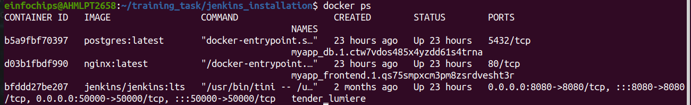


### Step 3: 

+ Once we run the container it will show us the initialpassword which we will use in a jenkins page at initialization or login time 

<br>

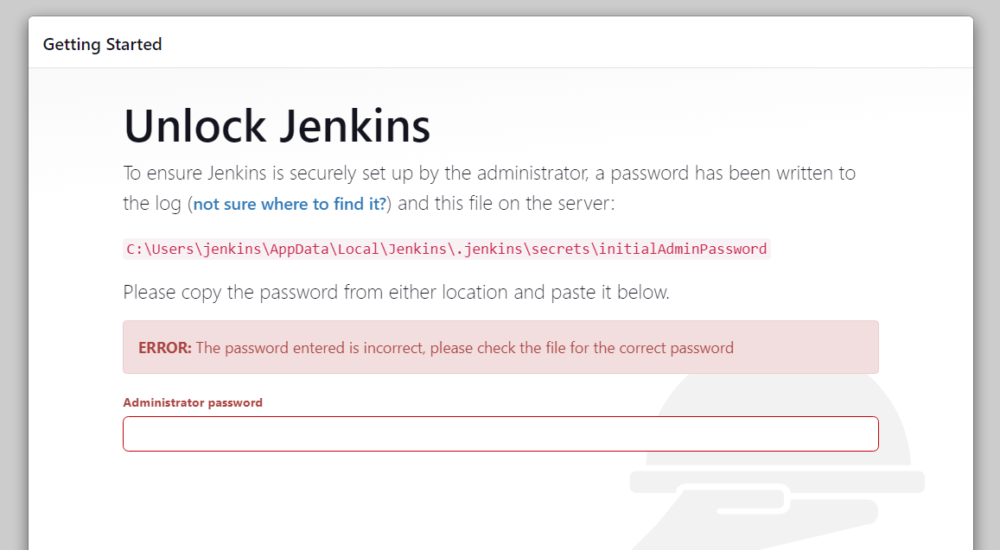


### Step 4: 

+ afterwards it shows the installation page where we have to choose either we want thier "suggested plugin installation" or "customized plugin installation"

<br>

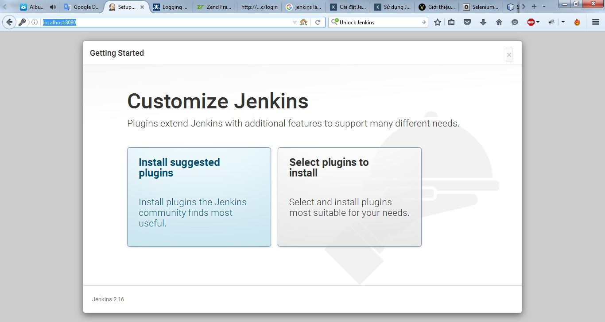


### Step 5: 

+ we will choose suggested plugins if we don't have any specified custiomization for our jenkins


<br>

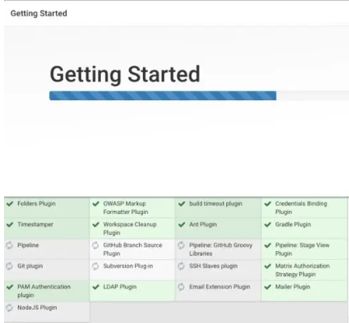


### Step 6: 

+ after that we will have two choice one where we will choose continue as admin and one where we can create a user. Here will continue as admin and we will get an page of login

<br>

 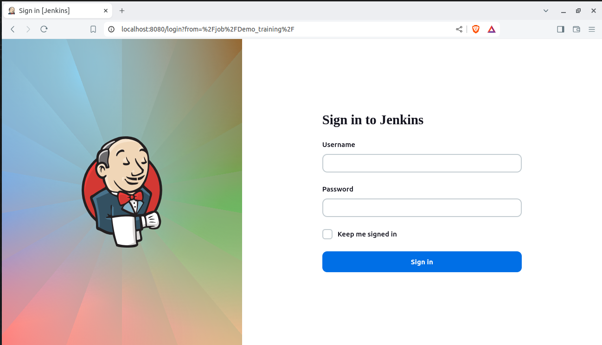


### Step 7:

+ we will perform our first program in it as a freestyle where we will simply fetch one github repo as well as apply cronjob to tasks so it will build project according our cron-job


+ first of all we will create a sample repo to run in github 

<br>

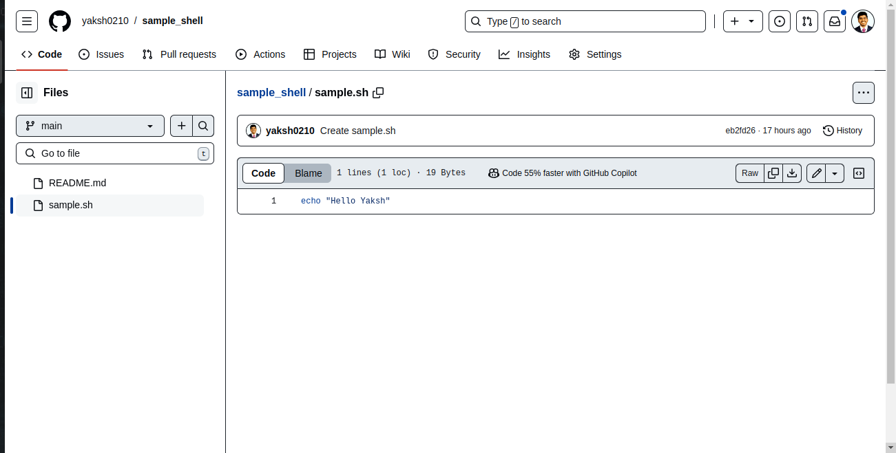

<br>

+ Then you need to visit jenkins and select freestyle first to see a demo deployment

<br>

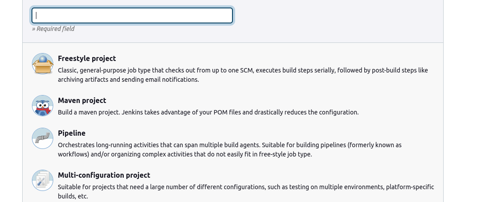

<br>

+ Then we will select github project and put our repo url over there because we are performing the first github freestyle tasks


<br>

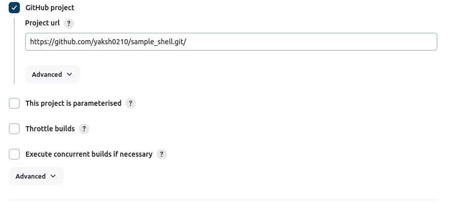

<br>


+ then we will choose git in build step and we will enter our git url there as well as put credentials if required 

+ also we will define the branch through which our pipeline is going to execute

<br>

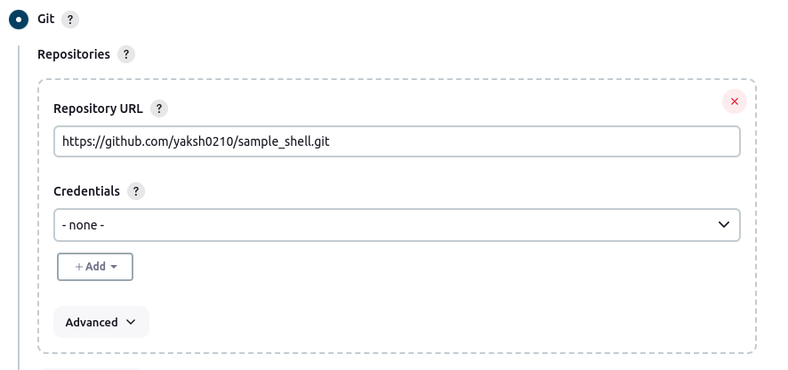

<br>

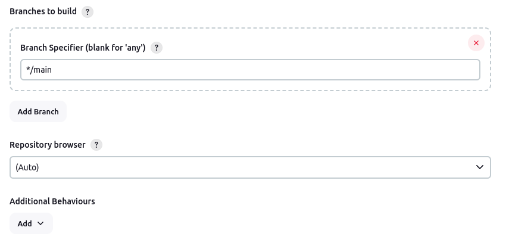

<br>


+ after that we will define a build trigger where we setup a cronjob where we define the build should run at every 40 min


<br>

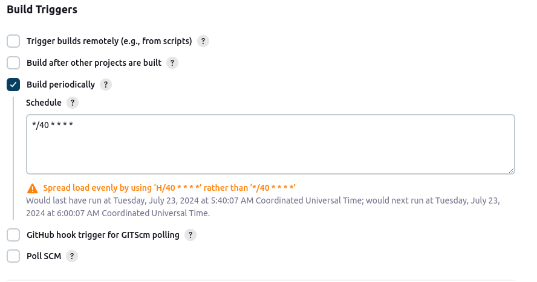

<br>


+ at the end we will define the build step through which we will pass a command to run and we will get output through it 


<br>


<br>

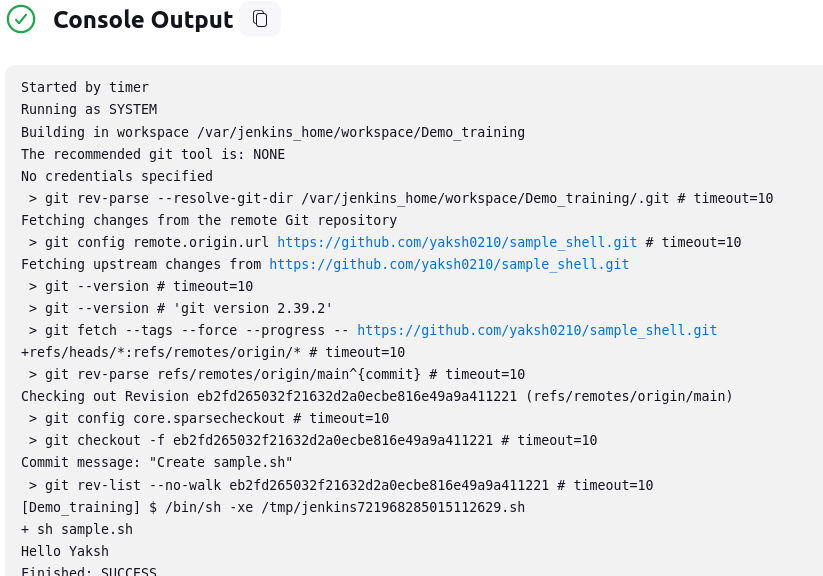

<br>
